> 第一篇：概念速通
>
> 第二篇：使用指南和实践技巧（这一篇只回答**“怎么用”**的问题）
>
> 第三篇：工作流优化

## 一、聊天之前的基本使用

#### 1、启动 Claude Code 以开始会话

cd 到工作目录，输入 `claude` 命令即可启动 Claude Code 跟它开始一次会话，这样启动的 Claude Code 安全、但是会有各种各样的权限弹窗。我们还可以输入 `claude --dangerously-skip-permissions ` 命令来启动 Claude Code 跟它开始一次会话，这样启动的 Claude Code 不会有任何权限弹窗、但是危险

> 我们的项目目录虽然由 Git 管理，有一定的安全保障，但是使用 `claude --dangerously-skip-permissions ` 启动的 Claude Code 可能操作项目目录以外的非 Git 目录，有一定的安全隐患。**实际开发中建议：使用 `claude` 来启动 Claude Code**

#### 2、切换模型及其努力程度

`/model` 命令用来切换模型，即时生效、无需重启 Claude Code：

* Haiku
* Sonnet
* Opus

> **实际开发中建议：简单问答用 Haiku、大多数日常问答用 Sonnet、复杂推理问答用 Opus**

`/effort` 命令用来切换模型的努力程度，即时生效、无需重启 Claude Code：

* low
* medium
* high
* xhigh
* max

> **实际开发中建议：简单问答用 low、大多数日常问答用 medium | high、复杂推理问答用  xhigh | max**

#### 3、切换 Claude Code 的行为模式

`Shift + Tab` 键用来切换 Claude Code 的行为模式，即时生效、无需重启 Claude Code：

* Ask before edits（默认）：Claude Code 一顿思考后会按它的想法直接去**创建或编辑**文件，但是每次创建或编辑文件前都**会弹窗**询问我们是否允许，**最稳健**
* Edit automatically：Claude Code 一顿思考后会按它的想法直接去**创建或编辑**文件，并且每次创建或编辑文件前都**不会弹窗**询问我们是否允许，**最方便**

* Plan mode：Claude Code 一顿思考后**只规划、不执行**，**最适合明确具体目标、拆分详细步骤**

> **实际开发中建议：如果我们自己连任务的【具体目标】都不清晰时、可以先 Plan mode 跟 Claude Code 根据我们的大概目标明确一下具体目标、【避免方向走错】，或者我们自己连任务的【详细步骤】都不清晰时、可以先 Plan mode 跟 Claude Code 根据我们的具体目标拆分一下详细步骤、【做到心里有底】，这样规划完之后再去执行；而如果一个任务我们一眼就能看穿它很小，或者一个大任务我们已经人为明确了具体目标是什么、也已经人为拆分了详细步骤怎么干，那就直接 Edit automatically 开干，Ask before edits 动不动就弹窗反倒影响执行速度，不过最好一个一个小目标、一个一个小步骤让 Claude Code 去执行**

补充：

* Edit automatically 这个行为模式所能关掉的弹窗仅仅是 Claude Code **创建或编辑**文件前的弹窗，也就是说它只针对 **Wirte 工具和 Edit 工具**
* 其它弹窗它是关不掉的，比如“Bash 工具在 A 目录里执行 A 命令”，就肯定还是会弹窗。当然这种情况下，我们可以在弹窗里选择“总是允许 Bash 工具在 A 目录里执行 A 命令”，来关掉这个弹窗。但是这仍然无法避免“Bash 工具在 A 目录里执行 B 命令”的弹窗，也就是说这种“总是允许”的组合场景太多了，我们只能是 Claude Code 弹出来一个就“总是允许”一个
* 如果实在受不了弹窗，那就承担一点风险使用 `claude --dangerously-skip-permissions ` 

## 二、聊天之中的基本使用

#### 1、自然语言的换行输入

* `输入 \ 后回车`可以换行
* `option + 回车`可以换行

 #### 2、输入图片

* `cmd + c、cmd + v` 可以输入图片
* `直接把图片拖进终端`可以输入图片

#### 3、输入 shell 命令

`先输入英文叹号 !，再输入 shell 命令即可，`执行完 shell 命令后会自动退出 shell mode

#### 4、恢复到之前的某次完整会话

`/resume` 命令用来恢复到之前的某次完整会话，这在重启 Claude Code 后需要在之前的某次会话里继续聊天时或者回顾历史会话时非常有用

#### 5、打断某轮对话

`esc` 键用来打断某轮对话，这在 Claude Code 回答过程中我们突然改变了主意想打断它时非常有用

#### 6、压缩对话上下文

`/compact` 命令用来压缩对话上下文，这在我们发现 Claude Code 的回答开始变傻变慢时非常有用（当然对话上下文使用量超过 95% 的时候，Claude Code 会自动压缩）

## 三、聊天之后的基本使用

#### 1、清空对话上下文

`/clear` 命令用来清空对话上下文，比如我们在同一个工作目录里执行完了任务 A，然后要去执行任务 B，但是任务 B 和任务 A 一点关系都没有，那就可以清空对话上下文后再执行任务 B。这样一来，我们就不用退出 Claude Code 后再重启，任务 B 的第一轮对话也是从一个空的对话上下文开始了

#### 2、导出所有对话

`/export [${path}/${filename}.md]` 命令用来导出所有对话，比如我们想把这一次的所有对话分享给别人看，或者我们有一个很长的任务、想把这一次的所有对话持久化下来、作为后续会话的对话上下文输入

#### 3、关闭 Claude Code 以结束会话

`/exit` 命令用来关闭 Claude Code 以结束会话，比如我们需要重启 Claude Code，或者切换到另外一个工作目录

## 四、用户提示词的使用

* 用户提示词模板

> **以前模型还不够强的时候，是“我们教 AI 怎么做”，因此“步骤”部分很重要**
> **现在模型已经很强了，开始转变为“我们告诉 AI 要什么”，因此“目标”部分更重要**

```markdown
## 背景（给“新员工”说下上下文）
......

## 目标（给“新员工”说下要干什么）
......

## 步骤（给“新员工”说下该怎么干）
......

## 示例（给“新员工”举个例子，更形象直白、更容易理解）
......

## 约束（给“新员工”定点禁令，别多事、别乱搞）
......

## 反馈（让“新员工”有问题及时反馈，别闷着憋到 deadline 再崩盘，早发现早预防）
......
```

* 用户提示词示例

```markdown
## 背景
* 文档类型：”报价表处理“目录里全是 excel 文档
* 文档定位：
	* ”每日个人报价表“目录里是某一天多个采购员对他们所负责商品的报价文档，所以会有多份文档
	* ”每日合并报价表“目录里是把每一天多个采购员的报价文档合并后生成的最终报价文档，所以也会有多份文档
* 文档细节：
	* ”每日个人报价表“目录里的每份文档其实来源于同一份初始文档，也就是说前面几列的内容大家都是一样的，只有后面包含”价格“的那几列不同、是由相应的采购员各自填写的
	* ”每日合并报价表“目录里的一份文档其实就是保持前面几列的内容不动，然后把多个采购员的”价格“列给合并进来

## 目标
合并多个采购员的每日报价表，生成统一的合并报价表

## 步骤
* 第一步：从”每日个人报价表“目录里任选一份文档作为《最终合并报价表》，这份《最终合并报价表》的名字里加个”\_合并“
* 第二步：然后把剩余文档里其它采购员的”价格“列，根据采购员的名字一一对应合并进《最终合并报价表》里，前面几列不要动保持原样
* 第三步：把所有”价格“列里的数据合并到”所有价格“列，同一行商品不可能存在多个采购员的价格列都有数据的情况，“所有价格”列确保内容横向和竖向居中
* 第四步：把《最终合并报价表》移动到”每日合并报价表“，如果”每日合并报价表“名字重复了，则用新文件覆盖旧文件
* 第五步：移除”每日个人报价表“目录里的所有文件

## 示例
比如每份价格表前几列都是【商品名称】、【商品类型】、【规格】，采购员张三负责一部分商品，那他的报价表里就只有【张三价格】这一列有数据，采购员李四负责一部分商品，那他的报价表里就只有【李四价格】这一列有数据，那么《最终合并报价表》里就是【张三价格】列和《李四价格》列都有数据，并且【所有价格】列的数据就是【张三价格】列、【李四价格】列合并进去的

## 约束
* 千万不要自己创建一份 excel，因为这会丢失人家 excel 的样式，千万不要丢失人家 excel 的样式
* 千万不要删除”每日合并报价表“里的文件

## 反馈
有任何疑问或信息不足，及时提问，别直接假设、别盲目干活

合并报价表
```

## 五、CLAUDE.md 的使用

也有作用域

## 六、MCP Servers 的使用

#### 1、MCP Servers 的作用域

**① 本地级 `local`**

* 生效范围：只对**本机上的本项目**生效

* Git 追踪：Git **不会**追踪

* 存储位置：用户目录下的 .claude.json 文件里的 projects 字段里的 mcpServers 字段里 **`~/.claude.json -> projects -> mcpServers`**

  ```json
  {
    // 所有的项目
    "projects": {
      // AILearning 这个项目
      "/Users/yiyi/Desktop/AILearning": {
        // 这个项目所有的 mcpServers
        "mcpServers": {
          // fetch 这个 mcpServer
          "fetch": {
            "command": "uvx",
            "args": ["mcp-server-fetch"]
          },
          // weather-mcp-server 这个 mcpServer
          "weather-mcp-server": {
            "command": "uv",
            "args": [
              "--directory",
              "../my_mcp_servers/weather-mcp-server",
              "run",
              "weather-mcp-server.py"
            ],
            "disabled": false,
            "autoApprove": ["get_current_weather", "get_daily_forecast"],
            "timeout": 60,
            "transportType": "stdio"
          }
        }
      }
    }
  }
  ```

**② 项目级 `project`**

* 生效范围：对**所有设备上的本项目**生效

* Git 追踪：Git **会**追踪

* 存储位置：项目根目录下的 .mcp.json 文件里的 mcpServers 字段里 **`${root}/.mcp.json -> mcpServers`**

  ```json
  {
    // 所有的 mcpServers
    "mcpServers": {
      // fetch 这个 mcpServer
      "fetch": {
        "command": "uvx",
        "args": ["mcp-server-fetch"]
      },
      // weather-mcp-server 这个 mcpServer
      "weather-mcp-server": {
        "command": "uv",
        "args": [
          "--directory",
          "../my_mcp_servers/weather-mcp-server",
          "run",
          "weather-mcp-server.py"
        ],
        "disabled": false,
        "autoApprove": ["get_current_weather", "get_daily_forecast"],
        "timeout": 60,
        "transportType": "stdio"
      }
    }
  }
  ```

**③ 用户级 `user`**

* 生效范围：对**本机上的所有项目**生效

* Git 追踪：Git **不会**追踪

* 存储位置：用户目录下的 .claude.json 文件里的 mcpServers 字段里 **`~/.claude.json -> mcpServers`**

  ```json
  {
    // 所有的 mcpServers
    "mcpServers": {
      // fetch 这个 mcpServer
      "fetch": {
        "command": "uvx",
        "args": ["mcp-server-fetch"]
      },
      // weather-mcp-server 这个 mcpServer
      "weather-mcp-server": {
        "command": "uv",
        "args": [
          "--directory",
          "../my_mcp_servers/weather-mcp-server",
          "run",
          "weather-mcp-server.py"
        ],
        "disabled": false,
        "autoApprove": ["get_current_weather", "get_daily_forecast"],
        "timeout": 60,
        "transportType": "stdio"
      }
    }
  }
  ```

#### 2、安装、使用别人的 MCP Servers

MCP Servers 市场：[GitHub 搜索](https://github.com/)、[mcpmarket 一个国内市场](https://mcpmarket.cn/)、[mcp.so 一个国外市场](https://mcp.so/zh)，这里以 fetch 这个 mcpServer 为例，它用来抓取网页内容并转换成 Markdown 格式输出

###### 2.1 安装

**① 方式一：根据安装教程，我们直接去手动修改相应【存储位置】的【mcpServers 字段】，注意作用域**

有的安装教程会给我们提供下图这样的配置，我们只需要把这个配置复制粘贴到相应【存储位置】的【mcpServers 字段】里。一定要想清楚把这个 mcpServer 安装到什么作用域，别把环境搞得乱七八糟，这里选择安装到项目级

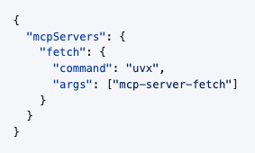

```json
// /Users/yiyi/Desktop/AILearning/01_ClaudeCode/mcp_server_demo/.mcp.json

{
  "mcpServers": {
    "fetch": {
      "command": "uvx",
      "args": ["mcp-server-fetch"]
    }
  }
}
```

**② 方式二：根据安装教程，我们执行 shell 命令来安装，注意作用域**

有的安装教程会给我们提供下面这样的 shell 命令，我们只需要执行 shell 命令，Claude Code 就会自动把配置添加到相应【存储位置】的【mcpServers 字段】里。一定要想清楚把这个 mcpServer 安装到什么作用域，别把环境搞得乱七八糟，这里选择安装到项目级

```shell
# 命令格式
claude mcp add <mcp-server-name> [options] -- <command> [args]

# 安装到本地级
claude mcp add fetch -- uvx mcp-server-fetch
claude mcp add fetch --scope local -- uvx mcp-server-fetch

# 安装到项目级
claude mcp add fetch --scope project -- uvx mcp-server-fetch

# 安装到用户级
claude mcp add fetch --scope user -- uvx mcp-server-fetch
```

```json
// /Users/yiyi/Desktop/AILearning/01_ClaudeCode/mcp_server_demo/.mcp.json

{
  "mcpServers": {
    "fetch": {
      "command": "uvx",
      "args": ["mcp-server-fetch"]
    }
  }
}
```

**③ 方式三：把安装教程的 URL 发给 Claude Code，让它帮我们安装，注意作用域**

如果我们不想看安装教程，那就可以费点 token 把安装教程的 URL 发给 Claude Code，它会读取安装教程并帮我们安装，当然最终还是把配置添加到相应【存储位置】的【mcpServers 字段】里。一定要想清楚把这个 mcpServer 安装到什么作用域，别把环境搞得乱七八糟，这里选择安装到项目级

```markdown
安装这个 mcp server、安装到项目级：https://github.com/modelcontextprotocol/servers/tree/main/src/fetch
```

```json
// /Users/yiyi/Desktop/AILearning/01_ClaudeCode/mcp_server_demo/.mcp.json

{
  "mcpServers": {
    "fetch": {
      "command": "uvx",
      "args": ["mcp-server-fetch"]
    }
  }
}
```

**④ 确认一下 MCP Server 是否安装成功**

重启 Claude Code（第一篇里我们说过 MCP Servers 是在 Claude Code 启动时加载并连接的），输入 `/mcp` 命令应该就能看到我们刚安装的 MCP Server 了

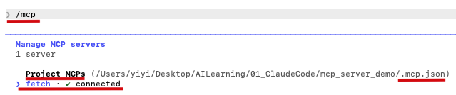

###### 2.2 使用

使用的时候我们不需要刻意去揣摩该输入什么用户提示词才能触发这个 MCP Server，我们只需要知道这个 MCP Server 是干啥的，用户提示词里大概有点相关信息就可以了。至于会不会触发这个 MCP Server 主要取决于编写这个 MCP Server 的人有没有把元数据写好、大模型能否把我们的意图匹配到这个 MCP Server

```markdown
// 用户提示词

抓取这个网页：https://www.qweather.com//weather/xihu-101210113.html
```

```markdown
// Claude Code 回复

Calling fetch…
Called fetch

成功抓取，以下是杭州西湖区当前天气：                                                            
2026-04-18 09:34
  ┌──────────┬────────────┐
      项目         数据    
  ├──────────┼────────────┤      
      天气         中雨     
  ├──────────┼────────────┤        
      气温         10°      
  ├──────────┼────────────┤
      风力       东北风 3级
  └──────────┴────────────┘                  
今天白天中雨，夜晚转晴，比昨天凉爽很多。
```

#### 3、编写、安装、使用自己的 MCP Servers

接下来我们自己编写一个 weather-mcp-server 用用，它用来根据经纬度查询当天的天气、根据经纬度查询未来 7 天的天气

###### 3.1 编写

* 首先要知道开发 MCP Server 跟编程语言无关，Python、TypeScript、Kotlin、Java、Swift、OC、Dart、Go、Rust 等都可以用来开发 MCP Server，只不过目前最主流的是 Python、TypeScript，因为它们的官方维护最成熟、社区示例也最多，这里我们选择 Python

* 全局安装 Python 并添加环境变量，macOS 自带的 Python 是 3.9，但是开发 MCP Server 要求 Python 3.10+，这里我们安装 Python 3.12

  ```shell
  brew install python@3.12
  ```

  ```shell
  echo 'export PATH="/usr/local/opt/python@3.12/libexec/bin:$PATH"' >> ~/.zshrc 
  
  source ~/.zshrc
  ```

* 全局安装 uv，Python 的包管理工具（类似于 npm 是 Node.js 的包管理工具）

  > **① uvx 是 uv 附带的运行工具，uv 负责安装包，uvx 负责运行已经发布到 PyPI 这个中央仓库的包**
  >
  > **② 此外 uv 还有一个子命令 run，可以用来运行本地计算机上的包：uv --directory ${/ABSOLUTE/PATH/TO/PARENT/FOLDER/MCP_SERVER_FOLDER} run ${mcp_server}.py**
  >
  > **③ npx 是 npm 附带的运行工具，npm 负责安装包，npx 负责运行已经发布到 npm registry 这个中央仓库的包**
  >
  > **④ 此外我们还可以用 node 来运行本地计算机上的包：node ${/ABSOLUTE/PATH/TO/PARENT/FOLDER/MCP_SERVER_FOLDER/mcp_server.js}**

  ```shell
  curl -LsSf https://astral.sh/uv/install.sh | sh
  ```

* cd 到项目的父目录

  ```shell
  cd /Users/yiyi/Desktop/AILearning/01_ClaudeCode/my_mcp_servers
  ```

* 创建一个名为 weather-mcp-server 的项目

  ```shell
  uv init weather-mcp-server
  ```

* cd 到项目的根目录

  ```shell
  cd weather-mcp-server
  ```

* 给当前项目创建一个 Python 虚拟环境，这样一来给当前项目安装的包就只会安装进当前项目，而不用安装到全局 Python 环境里，避免跟其它项目出现依赖版本冲突

  ```shell
  uv venv
  ```

* 激活并进入虚拟环境

  ```shell
  source .venv/bin/activate
  ```

* 给当前项目安装依赖：用 Python 开发 MCP Server 时的辅助开发库 Python SDK

  ```shell
  uv add "mcp[cli]"
  ```

* 给当前项目安装依赖：Python 的 HTTP 请求库，用来请求天气接口

  ```shell
  uv add httpx
  ```

* 给当前项目创建一个 weather-mcp-server.py 文件，MCP Server 的代码就会编写在这个文件里

  ```shell
  touch weather-mcp-server.py
  ```

* 编写 weather-mcp-server 的代码

  ```python
  # 导入 httpx，用来请求天气接口
  import httpx
  # 导入 FastMCP，用来创建 MCP Server
  from mcp.server.fastmcp import FastMCP
  
  
  # ── 创建 MCP Server ───────────────────────────────────────────────────────────
  # "weather-mcp-server" 是 MCP Server 的名字，编排器会用这个名字识别该服务
  mcpServer = FastMCP("weather-mcp-server")
  
  
  # ── 常量 ──────────────────────────────────────────────────────────────────────
  # Open-Meteo 是一个开源、免费、无需鉴权的天气 API
  OPEN_METEO_BASE_URL = "https://api.open-meteo.com/v1/forecast"
  
  # WMO 标准的天气代码 --> 中文描述的映射表
  # Open-Meteo API 返回的天气状况是一个符合 WMO 标准的数字代码而不是文字，比如 1
  # 如果没有这个映射表的话，当前 MCP Server 里的工具返回给编排器的结果就是“天气：1”，编排器会把“天气：1”传递给模型，虽然模型最终也能理解“天气：1”的含义，但是不如“天气：基本晴朗”来得清晰直接
  # 所以我们把这个映射关系在 MCP Server 内部做掉，让工具返回的结果对人和模型都开箱即读
  WMO_CODE_MAP = {
      0:  "晴天",
      1:  "基本晴朗",
      2:  "局部多云",
      3:  "阴天",
      45: "雾",
      48: "冻雾",
      51: "小毛毛雨",
      53: "中毛毛雨",
      55: "大毛毛雨",
      61: "小雨",
      63: "中雨",
      65: "大雨",
      71: "小雪",
      73: "中雪",
      75: "大雪",
      77: "冰粒",
      80: "小阵雨",
      81: "中阵雨",
      82: "强阵雨",
      85: "小阵雪",
      86: "大阵雪",
      95: "雷暴",
      96: "雷暴伴小冰雹",
      99: "雷暴伴大冰雹",
  }
  
  
  # ── 私有函数 ───────────────────────────────────────────────────────────────────
  def _wmo_to_desc(code: int) -> str:
      """
      将 WMO 标准的天气代码转换为中文描述
  
      参数:
          code: 天气代码
  
      返回:
          中文描述，未知天气代码则返回原始数字
      """
      return WMO_CODE_MAP.get(code, f"未知天气（代码 {code}）")
  
  
  # ── MCP Server 的工具 1：根据经纬度查询当天的天气───────────────────────────────────
  # @mcpServer.tool() 是一个装饰器，@ 后面跟着的就是我们上面创建的 MCP Server 实例，.tool() 固定写法，它的作用就是把当前函数注册到 mcpServer 实例上
  # 一旦注册，当前函数就不再是一个普通的 Python 函数，而是一个可供编排器调用的工具
  # 并且 mcpServer 实例还会把当前函数的函数名、参数&参数类型、docstring（也就是 """xxx""" 部分）生成工具的使用说明（即元数据）暴露给外界，这样一来模型就知道什么时候该调用当前工具、该给当前工具传递什么参数
  @mcpServer.tool()
  def get_current_weather(latitude: float, longitude: float) -> str:
      """
      根据经纬度查询当天的天气
  
      参数:
          latitude: 纬度，范围 -90 ~ 90（正数为北纬）
          longitude: 经度，范围 -180 ~ 180（正数为东经）
  
      返回:
          格式化后的天气文本，包含气温、风速、风向、天气状况、白天/夜晚
      """
      # API 需要接收的参数
      params = {
          "latitude": latitude,
          "longitude": longitude,
          "current_weather": "true",
          "timezone": "auto",
      }
  
      # 发起 HTTP 请求并获取响应
      response = httpx.get(OPEN_METEO_BASE_URL, params=params, timeout=30)
      # 非 2xx 状态码时抛出异常
      response.raise_for_status()
  
      # response 转换成 json
      data = response.json()
      # 获取 json 里的 current_weather 字段
      cw = data["current_weather"]
  
      # 解析各字段
      temp        = cw["temperature"]       # 气温（°C）
      windspeed   = cw["windspeed"]         # 风速（km/h）
      winddeg     = cw["winddirection"]     # 风向（度，0=北，90=东）
      weathercode = cw["weathercode"]       # WMO 天气代码
      is_day      = cw["is_day"]            # 1=白天，0=夜晚
  
      day_night = "白天" if is_day else "夜晚"
      weather_desc = _wmo_to_desc(weathercode)
  
      # 工具的执行结果
      return (
          f"📍 坐标：{data['latitude']}°N, {data['longitude']}°E\n"
          f"🕐 观测时间：{cw["time"]}（{data["timezone"]}）\n"
          f"🌡 气温：{temp}°C\n"
          f"💨 风速：{windspeed} km/h，风向：{winddeg}°\n"
          f"🌤 天气：{weather_desc}\n"
          f"☀️ 昼夜：{day_night}"
      )
  
  # ── MCP Server 的工具 2：根据经纬度查询未来 7 天的天气──────────────────────────────
  @mcpServer.tool()
  def get_daily_forecast(latitude: float, longitude: float) -> str:
      """
      根据经纬度查询未来 7 天的天气
  
      参数:
          latitude: 纬度，范围 -90 ~ 90（正数为北纬）
          longitude: 经度，范围 -180 ~ 180（正数为东经）
  
      返回：
          格式化后的每天的日期、最高/最低气温、天气状况
      """
      # API 需要接收的参数
      params = {
          "latitude": latitude,
          "longitude": longitude,
          "daily": "temperature_2m_max,temperature_2m_min,weathercode",
          "forecast_days": 7,
          "timezone": "auto",
      }
  
      # 发起 HTTP 请求并获取响应
      response = httpx.get(OPEN_METEO_BASE_URL, params=params, timeout=30)
      # 非 2xx 状态码时抛出异常
      response.raise_for_status()
  
      # response 转换成 json
      data  = response.json()
      # 获取 json 里的 daily 字段，包含各数组
      daily = data["daily"]
  
      # 解析各字段
      dates    = daily["time"]                  # 日期列表
      temp_max = daily["temperature_2m_max"]    # 每日最高气温
      temp_min = daily["temperature_2m_min"]    # 每日最低气温
      codes    = daily["weathercode"]           # 每日天气代码
  
      lines = [f"📅 未来 7 天天气预报（{data['timezone']}）\n"]
      for date, tmax, tmin, code in zip(dates, temp_max, temp_min, codes):
          desc = _wmo_to_desc(code)
          lines.append(f"  {date}  {tmin}°C ~ {tmax}°C  {desc}")
  
      # 工具的执行结果
      return "\n".join(lines)
  
  
  # ── 入口 ──────────────────────────────────────────────────────────────────────
  # Python 惯例：只有直接运行该脚本时才执行后续代码，被其它模块 import 时不会执行后续代码
  # 对于 MCP Server 来说，就是防止别人 import 这个文件时意外启动服务器
  if __name__ == "__main__":
      # 启动 MCP Server
      # transport="stdio" 表示 MCP Server 通过标准输入/输出与编排器通信，一般都是这种通信方式，默认就是这种通信方式
      mcpServer.run(transport="stdio")
  ```


###### 3.2 安装

* 以上我们的 weather-mcp-server 就算开发完成了，我们可以选择任意一种方式给 Claude Code 安装，注意作用域。不过除了 Claude Code 这个 Agent 可以安装 MCP Server 以外，Claude App 这个 Agent 也可以安装 MCP Server，这里我们就演示把 weather-mcp-server 安装到 Claude App。找到 Claude App 的配置文件并打开

  ```shell
  open "/Users/yiyi/Library/Application Support/Claude/claude_desktop_config.json"
  ```

* 把下面 Json 里的注释去掉，把 "mcpServers" 这一层复制到 Claude App 的配置文件里，保存

  ```json
  {
    // 所有的 mcpServers
    "mcpServers": {
      // MCP Server 的名字
      "weather-mcp-server": {
        // 因为我们这个 MCP Server 并没有发布到 PyPI 这个中央仓库，是个本地 MCP Server
        // 所以使用 uv ... run ... 来运行
        "command": "uv",
        // 指定 MCP Server 的绝对路径或相对路径，以便 Claude App 能找到它
        "args": [
          "--directory",
          "/Users/yiyi/Desktop/AILearning/01_ClaudeCode/my_mcp_servers/weather-mcp-server",
          "run",
          "weather-mcp-server.py"
        ],
        // 是否禁用当前 MCP Server，默认不禁用
        "disabled": false,
        // 是否自动同意 Claude App 调用当前 MCP Server 里的工具
        // 默认情况下这个数组是空，Claude App 每调用一个工具都会弹窗询问用户是否同意，可以把不想弹窗问用户的工具名都写在这里
        "autoApprove": ["get_current_weather", "get_daily_forecast"],
        // 连接当前 MCP Server 的超时时长，单位秒，默认 60s
        // 如果过了 60s 还没连接上当前 MCP Server，就放弃连接不用当前 MCP Server 了
        "timeout": 60,
        // 表示 MCP Server 通过标准输入/输出与 Claude App 通信，一般都是这种通信方式，默认就是这种通信方式
        "transportType": "stdio"
      }
    }
  }
  ```

* 必须得重启下 Claude App，Claude App 启动时就会读取它的配置文件，会对 "mcpServers" 里的每一个 item 都执行 "command" + "args" 指定的命令，从而把 MCP Server 作为子进程启动起来，并通过 stdio 保持连接，所以只要 Claude App 在运行，我们的 weather-mcp-server 就在后台跑着，随时等待被调用。我们可以在 Connectors 里看到 weather-mcp-server 已经成功启动并连接

  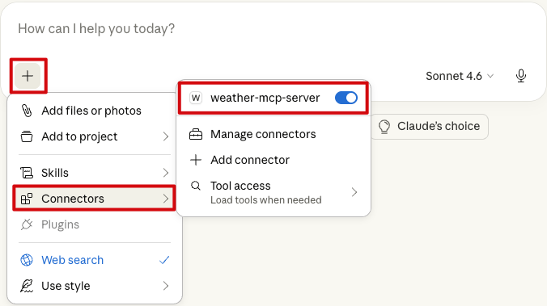

###### 3.3 使用

* 现在就可以去跟模型聊天了，也不需要刻意去揣摩该输入什么用户提示词才能触发 weather-mcp-server，正常聊就行

  | 调用 get_current_weather 工具                               | 调用 get_daily_forecast 工具                                |
  | ----------------------------------------------------------- | ----------------------------------------------------------- |
  | 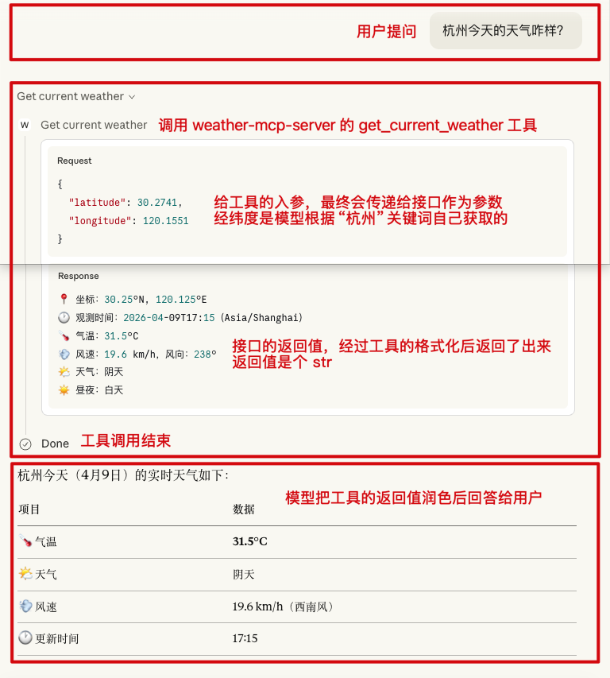 | 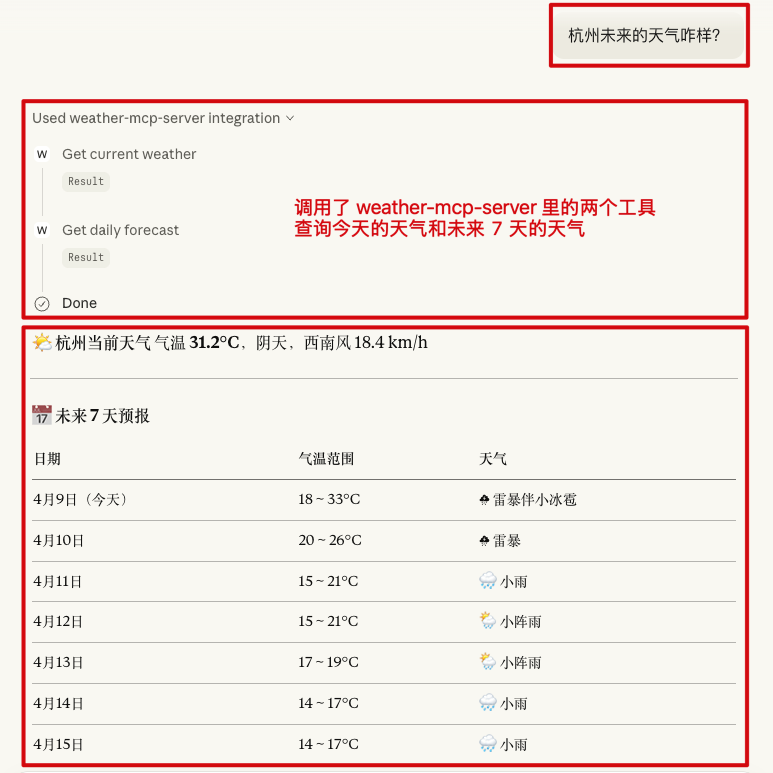 |

## 七、Skills 的使用

#### 1、Skills 的作用域

**① 项目级 `project`**

* 生效范围：对**所有设备上的本项目**生效

* Git 追踪：Git **会**追踪

* 存储位置：项目根目录下的 .claude/skills 目录里 **`${root}/.claude/skills`**

  ```
  ${root}/
  └── .claude/
      └── skills/                 # 所有的 skills
          └── huashu-nuwa/        # huashu-nuwa 这个 skill
              └── SKILL.md
              └── ......
          └── meeting-summary/    # huashu-nuwa 这个 skill
              └── SKILL.md
              └── ......
  ```


**② 用户级 `user`**

* 生效范围：对**本机上的所有项目**生效

* Git 追踪：Git **不会**追踪

* 存储位置：用户目录下的 .claude/skills 目录里 **`~/.claude/skills`**

  ```
  ~/
  └── .claude/
      └── skills/                 # 所有的 skills
          └── huashu-nuwa/        # huashu-nuwa 这个 skill
              └── SKILL.md
              └── ......
          └── meeting-summary/    # huashu-nuwa 这个 skill
              └── SKILL.md
              └── ......
  ```

#### 2、安装、使用别人的 Skills

Skills 市场：[GitHub 搜索](https://github.com/)、[skillmarket 一个国内市场](https://mcpmarket.cn/skills/)、[lobehub 一个国外市场](https://lobehub.com/zh/skills)，这里以 女娲.skill 这个 skill 为例，它用来把任何人蒸馏成一个 skill

###### 2.1 安装

**① 方式一：直接下载源码，我们手动把 skill 复制粘贴到相应【存储位置】的【skills 目录】里，注意作用域**

下载源码，我们只需要把这个 skill （也就是 SKILL.md 所在的目录）复制粘贴到相应【存储位置】的【skills 目录】里。一定要想清楚把这个 skill 安装到什么作用域，别把环境搞得乱七八糟，这里选择安装到项目级

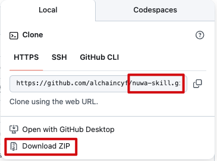

```
// /Users/ineyee/Desktop/AILearning/01_ClaudeCode/skill_demo/.claude/skills/huashu-nuwa

${root}/
└── .claude/
    └── skills/
        └── huashu-nuwa/
            └── SKILL.md
            └── ......
```

**② 方式二：把 skill 的 URL 发给 Claude Code，让它帮我们安装，注意作用域**

如果我们不想手动安装，那就可以费点 token 把 skill 的 URL 发给 Claude Code，它会帮我们安装，当然最终还是把这个 skill （也就是 SKILL.md 所在的目录）复制粘贴到相应【存储位置】的【skills 目录】里。一定要想清楚把这个 skill 安装到什么作用域，别把环境搞得乱七八糟，这里选择安装到项目级

```markdown
安装这个 skill、安装到项目级：https://github.com/alchaincyf/nuwa-skill
```

```
// /Users/ineyee/Desktop/AILearning/01_ClaudeCode/skill_demo/.claude/skills/huashu-nuwa

${root}/
└── .claude/
    └── skills/
        └── huashu-nuwa/
            └── SKILL.md
            └── ......
```

**③ 确认一下 Skills 是否安装成功**

重启 Claude Code（第一篇里我们说过 Skills 是在 Claude Code 启动时加载的），输入 `/skills` 命令应该就能看到我们刚安装的 skill 了

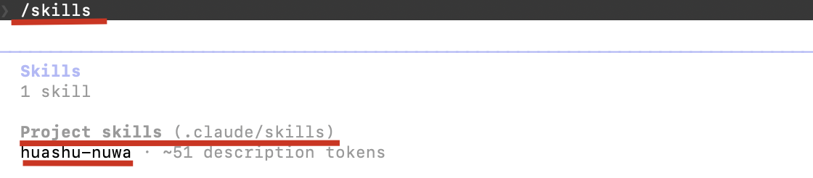

###### 2.2 使用

使用的时候我们不需要刻意去揣摩该输入什么用户提示词才能触发这个 skill，我们只需要知道这个 skill 是干啥的，用户提示词里大概有点相关信息就可以了。至于会不会触发这个 skill 主要取决于编写这个 skill 的人有没有把元数据写好、大模型能否把我们的意图匹配到这个 skill

```markdown
// 用户提示词

蒸馏李玫瑾
```

```
// Claude Code 回复

⏺ Skill(huashu-nuwa)                                                            
  ⎿  Successfully loaded skill
  
⏺ 收到，开始蒸馏李玫瑾。先确认几个细节，了解你的需求方向。      
────────────────────────────────────────────────────────────────────────────────
←  ☐ 聚焦方向  ☐ 本地语料  ✔ Submit  →
蒸馏方向偏向哪个维度？
	1. 全面画像（推荐）                                                         
     犯罪心理学视角 + 家庭教育理论 + 公共表达风格，完整蒸馏
  2. 聚焦：犯罪心理分析                                                    
     重点提炼她分析犯罪动机、人格形成的方法论                                   
❯ 3. 聚焦：家庭教育与育儿                            
     重点提炼她关于0-6岁关键期、情感抚养的核心框架                              
  4. 聚焦：公共表达与说服                                                       
     重点提炼她面对争议时的表达方式和论证逻辑
  5. Type something.                                                            
  6. Chat about this
────────────────────────────────────────────────────────────────────────────────
←  ☐ 聚焦方向  ☐ 本地语料  ✔ Submit  →
你手上有没有李玫瑾的一手素材？                                                                
❯ 1. 没有，走网络搜索                                                         
     从B站、播客、权威媒体采访等渠道采集                                        
  2. 有，我来提供                                                          
     书籍PDF、演讲字幕、访谈文字稿等，质量比网络搜索高                          
  3. Type something.                                 
  4. Chat about this

⏺ 蒸馏成功，li-meijin-perspective.skill 已生成到 .claude/skills 目录下
```

```
// 用户提示词

李玫瑾老师，0~6 岁儿童、育儿关键节点及其核心任务有哪些，以现实生活举例、家长的正反面做法和影响都说一下
或者
/li-meijin-perspective 0~6 岁儿童、育儿关键节点及其核心任务有哪些，以现实生活举例、家长的正反面做法和影响都说一下
```

```markdown
// Claude Code 回复

⏺ Skill(li-meijin-perspective)                                                  
  ⎿  Successfully loaded skill
  
⏺ 我先说一句，我以李玫瑾的视角和你聊，基于她的公开言论和著作推断，不是本人观点，后面我就直接说了。

  ---------------------------------
  你问0到6岁，我把它分成三个阶段。每个阶段有它最核心的任务，错过了，后面要补，代价很大。
  
  ---------------------------------
  **第一阶段：0~1岁 — 建立依恋，让孩子感受到"世界是安全的"**
  这个阶段，孩子什么都不懂，但他感受得到。
  他哭，有没有人来？他饿，有没有人喂？他害怕，有没有人抱？
  这些回应，就是在他心里建一个底座——**这个世界是可以信任的，我是被爱的。**          
                                                                              
  **正面做法**
  孩子哭了，妈妈（或主要抚养人）马上过来，抱起来，轻声说话，眼神对视。**不是每次都要解决问题，但每次都要回应。**
  这个孩子长大，遇到挫折，内心有根。他知道"我可以求助，有人会来"。              
                                                                              
  **反面做法**
  孩子哭，大人说"哭什么哭，哭多了肺活量大"，或者干脆不理，让他哭到睡着。
  或者——这在中国很常见——孩子出生没多久，就交给爷爷奶奶带，父母去城里打工。
  孩子看起来没事，吃得好睡得好。**但他心里是空的。**
  
  你说这有什么影响？你看，我访谈过很多留守儿童长大后出问题的案例。他们青春期特别容易被"第一个对他好的人"带走——可能是网络上的陌生人，可能是帮派，可能是早恋对象。为什么？因为他们从小就缺那个"有人回应我"的感觉，谁给，他就跟谁走。
  
  ---------------------------------
  **第二阶段：1~3岁 — 情感依附，让孩子有"心理根据地"**
  这个阶段，孩子开始走路、说话、探索世界。但他探索的前提是——身后有一个安全的人。
  这个人，就是他的"心理根据地"。
  
  **正面做法**
  孩子摔倒了，妈妈不要马上冲过去大呼小叫，也不要冷漠不理。先看他的反应——他自己爬起来了，你笑着鼓励；他真的疼，你走过去抱抱，说"疼了对吧，没事的"。
  这叫**情绪同频**。孩子感受到：我的感受，有人看见了。
  
  还有一件事很重要——**这个阶段，主要抚养人不能频繁更换。**
  孩子认人了。他认定了妈妈，你突然换成奶奶带，他会有一段时间哭闹、粘人、睡不好。这不是"不乖"，这是依恋断裂的应激反应。
  
  **反面做法**
  很多家庭，孩子1岁多，妈妈要上班了，就把孩子送去老家，或者换人带。大人觉得孩子小，不记事，没关系。
  **这是最大的误解。**
  孩子不记事，不代表没有感受。那种"被抛弃"的感觉，会存在他的情绪记忆里。他说不出来，但他的行为会告诉你——特别粘人，或者特别冷漠，两个极端。
  
  ---------------------------------
  **第三阶段：3~6岁 — 立规矩，让孩子学会"克制自己"**
  这个阶段，是我最强调的。很多家长搞反了顺序——前面该陪的时候不陪，这个阶段该管的时候又不管。
  **3岁之前，重情感；3岁之后，重规则。**
  这个阶段的核心任务，是让孩子学会两件事：**延迟满足和接受"不"**。
  
  **正面做法**
  **场景一：孩子要买玩具，哭闹**
  正确做法不是妥协，也不是打骂，而是——**蹲下来，平静地说"不行"，然后等他哭完。**
  他哭，你不走，但也不妥协。哭完了，你抱抱他，说"我知道你很想要，但今天不买"。
  这个过程，就是在训练他的**情绪调节能力**。他在学：我的愿望不一定能实现，但我的情绪可以被接受，我可以承受失望。
  
  **场景二：孩子打人**
  第一次，你要认真处理，不是打回去，而是**严肃地制止，说清楚后果**。"你打人，小朋友就不跟你玩了。"然后观察他的反应。
  这个阶段立下的规矩，是他一生行为边界的雏形。
  
  **反面做法**
  **溺爱型**：孩子一哭就给，要什么给什么，从不说"不"。
  这个孩子长大，遇到任何挫折都崩溃。因为他从来没有练习过"接受失望"。
  我见过很多大学生，考试没考好，或者失恋，就走极端——不是因为这件事有多严重，而是他的心理承受能力，从来没有被训练过。
  
  **打压型**：孩子犯错就打，情绪激动就吼，从不解释为什么。
  这个孩子表面上"听话"，但他学到的不是规则，是恐惧。他服从的是力量，不是道理。
  等他长大，比你强了，他就不服了。或者他一直压抑，某一天突然爆发。
  
  ---------------------------------
  总结一张表
  ┌─────┬──────────┬─────────────────────┬────────────┬─────────────────────┐
  │ 阶  │  核心任务  │      正面做法        │  反面做法    │      长期影响       │   
  │ 段  │          │                     │            │                     │   
  ├─────┼──────────┼─────────────────────┼────────────┼─────────────────────┤   
  │ 0~1 │ 建立安全感 │ 及时回应哭声，稳定陪伴  │ 不理哭声，  │ 信任感缺失，依赖或  │   
  │ 岁  │           │                     │ 过早分离    │ 回避型人格          │   
  ├─────┼──────────┼─────────────────────┼────────────┼─────────────────────┤ 
  │ 1~3 │ 情感依附  │ 情绪同频，主要抚养人稳定 │ 频繁换人，  │ 依恋断裂，青春期易  │   
  │ 岁  │          │                      │ 情感忽视    │ 被"替代者"吸引      │   
  ├─────┼──────────┼─────────────────────┼────────────┼─────────────────────┤ 
  │ 3~6 │ 立规矩、  │ 温和而坚定地说"不"     │ 溺爱妥协或   │ 要么抗挫力极差，要  │   
  │ 岁  │ 学克制    │ ，训练延迟满足         │ 打压恐吓    │ 么压抑爆发          │   
  └─────┴──────────┴─────────────────────┴────────────┴─────────────────────┘
  
  ---------------------------------
  说白了，这六年，你做的每一件事，都是在给孩子的心里打地基。
  地基打好了，楼盖多高都稳。地基没打好，你后来花多少钱补课、请心理咨询，都是在修一栋歪楼。
  **你现在不陪他，将来你会后悔的。**
```

#### 3、编写、安装、使用自己的 Skills

接下来我们自己编写一个 meeting-summary skill 用用，它用来根据会议内容生成摘要

###### 3.1 编写

* 随便找个地方创建一个文件夹，这个文件夹的名字必须得是 meeting-summary，它就是我们的 skill

* 然后在这个文件夹里创建一个 SKILL.md 文件，名字必须得是 SKILL，扩展名必须得是 .md，skill 的具体内容就写在这个文件里

* skill 的具体内容通常包含【元数据（名字、目标和触发条件） + 步骤 + 示例 + 约束】

  ```markdown
  // 元数据
  // name 必填：skill 的名字，最好是字母、数字、中划线
  // description 必填：skill 的目标和触发条件，目标（给“新员工”说下要干什么），触发条件最好表明”意图触发“而非”关键词触发“
  // disable-model-invocation 可选：是否禁止 Claude 通过触发条件来自动触发 skill，默认 false、即允许
  // user-invocable 可选：是否允许用户通过命令 /skill-name 来手动触发 skill，默认 true、即允许
  // allowed-tools 可选：skill 可用的工具（根据实际场景从 CC 内置工具里选），默认 ALL
  ---
  name: xxx
  description: xxx
  disable-model-invocation: false
  user-invocable: true
  allowed-tools: ALL
  ---
  
  ## 步骤（给“新员工”说下该怎么干）
  ......
  
  ## 示例（给“新员工”举个例子，更形象直白、更容易理解）
  ......
  
  ## 约束（给“新员工”定点禁令，别多事、别乱搞）
  ......
  ```

  ```markdown
  ---
  name: meeting-summary
  description: 根据会议内容生成摘要。当用户表达“会议摘要”、“总结会议”等意图时触发。
  ---
  
  ## 步骤
  理解一下会议内容的全文，生成如下格式的会议摘要：
  - 参会人员
  - 会议主题
  - 会议决议
  
  ## 示例
  会议内容的全文：
  张三：那我们开始吧，今天主要是把下个月社区志愿活动的安排一次性定下来。
  李四：我建议活动放在公园，人多也方便组织。
  王五：可以，不过要提前申请场地，不然可能有风险。
  赵六：场地申请我可以负责，这周内给大家结果。
  孙七：人数最好先有个范围，方便准备物资。
  张三：那就先按 50 人左右来估算吧。
  李四：上次的手套还能用，但垃圾袋需要再买。
  王五：预算要不要设个上限，避免超支。
  张三：预算控制在 1000 以内，优先用现有物资。
  孙七：时间我建议周六上午，天气也不会太热。
  李四：九点集合应该比较合适。
  赵六：我周三前把申请结果同步到群里。
  张三：好，那报名截止时间定在周四晚上。
  王五：周五可以统一分组和采购。
  孙七：我来负责写报名文案和活动当天的合影安排。
  张三：安全方面提醒大家带水，活动结束简单总结一下就行。
  张三：那今天就到这，大家按分工推进。
  
  会议摘要：
  - 参会人员：张三、李四、王五、赵六、孙七
  - 会议主题：统一确定下个月社区志愿活动的地点、时间、人数、预算及分工安排
  - 会议决议：活动定在公园并于周六上午九点举行，按约 50 人规模和 1000 预算执行，由赵六负责场地申请、孙七负责宣传及合影，其余成员配合物资和分组
  
  ## 约束
  “参会人员”、“会议主题”、“会议决议”都只用一句话来表述，不要写多条
  ```


###### 3.2 安装

* 以上我们的 meeting-summary skill 就算编写完成了，我们可以选择任意一种方式给 Claude Code 安装，注意作用域，这里选择安装到项目级，重启 Claude Code 后生效

  ```
  // /Users/ineyee/Desktop/AILearning/01_ClaudeCode/skill_demo/.claude/skills/meeting-summary
  
  ${root}/
  └── .claude/
      └── skills/
          └── meeting-summary/
              └── SKILL.md
  ```

###### 3.3 使用

* 现在就可以去跟模型聊天了，也不需要刻意去揣摩该输入什么用户提示词才能触发 meeting-summary，正常聊就行

  ```
  // 用户提示词
  
  ❯ 生成会议摘要或 /meeting-summary
  
    A：这次公司团建，大家先想想目标是什么。我觉得不能只是简单吃饭唱歌，最好能让不同部门的人真正熟悉起来，尤其是技术和运营平时交流太少。
    B：我同意。上次团建虽然气氛不错，但大家基本还是和自己熟的人待在一起。要不要增加一些分组合作类活动，比如户外定向或者小游戏，让不同部门混合组队？
    C：可以，而且预算也得控制。行政那边给的大概是每人五百以内。如果去太远，交通和住宿费用就会超。我的建议是周边两天一夜，既能放松，也不会太累。
    D：那地点有没有方向？我查了几个方案，像山庄露营、温泉民宿、海边拓展都有人推荐。年轻同事可能更喜欢轻松一点、有拍照氛围感的地方。
    A：我倾向于“半休闲半活动”的形式。白天安排团队挑战，晚上可以烧烤、自由聊天。很多新同事刚入职，其实更需要建立熟悉感。
    B：还有一个问题，时间最好别放月底。月底业务最忙，很多人可能请假或者临时有工作。放在月中周五到周六会比较合适。
    C：那我来整理几个具体方案，包括预算、地点和活动安排，下周开会再定最终版本。
    D：行，我顺便做个匿名问卷，看看大家更想去户外还是偏休闲的路线。
  ```

  ```
  // Claude Code 回复
  
  ⏺ Skill(meeting-summary)
    ⎿  Successfully loaded skill
                                                                                  
  ⏺ - 参会人员：A、B、C、D
    - 会议主题：讨论公司团建的目标、形式、地点、预算及时间安排                    
    - 会议决议：团建定为周边两天一夜、每人 500 以内预算、采用半休闲半活动形式（白天团队挑战、晚上烧烤自由交流），时间避开月底选月中周五至周六，由 C 整理具体方案下周确认、D 发问卷收集偏好
  ```

###### 3.4 References

上面的 meeting-summary skill 已经能用了，但是很快我们发现公司有很多部门，不同部门的会议关注的核心不同，所以输出的会议摘要应该有不同的侧重点，比如人事部门关注“人”、财务部门关注“钱”，那最简单的办法就是在原来的 SKILL.md 文件里加提示词：

```markdown
---
name: meeting-summary
description: 根据会议内容生成摘要。当用户表达“会议摘要”、“总结会议”等意图时触发。
---

根据会议内容中的关键词、讨论重点、角色身份，判断到会议类型是人事会议时走人事会议步骤、判断到会议类型是财务会议时走财务会议步骤、否则走通用会议步骤

## 通用会议步骤
理解一下会议内容的全文，生成如下格式的会议摘要：
- 参会人员
- 会议主题
- 会议决议

## 通用会议示例
会议内容的全文：
张三：那我们开始吧，今天主要是把下个月社区志愿活动的安排一次性定下来。
李四：我建议活动放在公园，人多也方便组织。
王五：可以，不过要提前申请场地，不然可能有风险。
赵六：场地申请我可以负责，这周内给大家结果。
孙七：人数最好先有个范围，方便准备物资。
张三：那就先按 50 人左右来估算吧。
李四：上次的手套还能用，但垃圾袋需要再买。
王五：预算要不要设个上限，避免超支。
张三：预算控制在 1000 以内，优先用现有物资。
孙七：时间我建议周六上午，天气也不会太热。
李四：九点集合应该比较合适。
赵六：我周三前把申请结果同步到群里。
张三：好，那报名截止时间定在周四晚上。
王五：周五可以统一分组和采购。
孙七：我来负责写报名文案和活动当天的合影安排。
张三：安全方面提醒大家带水，活动结束简单总结一下就行。
张三：那今天就到这，大家按分工推进。

会议摘要：
- 参会人员：张三、李四、王五、赵六、孙七
- 会议主题：统一确定下个月社区志愿活动的地点、时间、人数、预算及分工安排
- 会议决议：活动定在公园并于周六上午九点举行，按约 50 人规模和 1000 预算执行，由赵六负责场地申请、孙七负责宣传及合影，其余成员配合物资和分组

## 人事会议步骤
理解一下会议内容的全文，生成如下格式的会议摘要：
- 参会人员
- 会议主题
- 当前人员情况
- 关键问题
- 会议决议
- 后续负责人

重点记录：
- 招聘
- 入离职
- 培训
- 绩效
- 人员安排
- 时间节点
- 责任人

## 人事会议示例
会议内容：
王经理：最近客服团队缺口比较大，需要尽快补人。
HR 小李：目前还缺 3 人，招聘网站已经挂出岗位。
主管小陈：希望有电商经验的人优先。
HR 小李：那薪资范围要不要调整？
王经理：可以适当提高 10%。
主管小陈：最好两周内到岗，不然 618 顶不住。
HR 小李：我会重点筛选有相关经验的候选人。
王经理：培训周期也提前准备一下。

会议摘要：
- 参会人员：王经理、HR 小李、主管小陈
- 会议主题：客服团队招聘与人员补充安排
- 当前人员情况：客服团队存在 3 人缺口，影响即将到来的 618 业务
- 关键问题：招聘速度偏慢，缺少有电商经验的候选人
- 会议决议：客服岗位薪资提高 10%，优先招聘有电商经验人员，目标两周内完成到岗
- 后续负责人：HR 小李负责招聘推进，主管小陈负责培训准备

## 财务会议步骤
理解一下会议内容的全文，生成如下格式的会议摘要：
- 参会人员
- 会议主题
- 核心数据
- 风险问题
- 会议决议
- 预算/金额

重点记录：
- 预算
- 成本
- 收入
- 审批
- 现金流
- 风险控制
- 数据指标

## 财务会议示例
会议内容：
财务总监：市场部下季度申请预算增加。
市场经理：短视频投放成本上涨了。
财务：目前推广 ROI 有下降趋势。
老板：增加预算可以，但要有明确转化目标。
财务：建议先追加 20 万测试。
市场经理：我们会重点投高转化渠道。
老板：月底前复盘效果。

会议摘要：
- 参会人员：财务总监、市场经理、老板
- 会议主题：下季度市场推广预算讨论
- 核心数据：当前推广 ROI 出现下降，短视频渠道投放成本上涨
- 风险问题：预算增加后可能存在转化不达预期风险
- 会议决议：先追加 20 万测试预算，重点投放高转化渠道，并于月底进行效果复盘
- 预算/金额：新增推广预算 20 万元

## 约束
会议摘要的每一项都只用一句话来表述，不要写多条
```

上面的新 meeting-summary skill 肯定能用，但是有一个问题：SKILL.md 文件在不断变臃肿，无论开什么会，都得把一坨不相关的步骤和示例给载入对话上下文，比如技术部就简单开个早会，也得把人事部门和财务部门的提示词全载入对话上下文，浪费 token。**遇到这种场景就可以使用 References 来实现，我们已经知道 Skills 就是按需加载的提示词、可以避免 CLAUDE.md 无限膨胀，而 References 则是按需加载中的按需加载、可以避免 SKILL.md 无限膨胀，再省一波 token。**如下：

```
meeting-summary/
└── SKILL.md                  # 元数据（名字、目标和触发条件） + 路由 + 约束
└── references/
    └── hr_meeting.md         # 步骤 + 示例
    └── finance_meeting.md    # 步骤 + 示例
    └── general_meeting.md    # 步骤 + 示例
```

```markdown
// SKILL.md 文件

---
name: meeting-summary
description: 根据会议内容生成摘要。当用户表达“会议摘要”、“总结会议”等意图时触发。
---

## 路由
#### 人事会议
当会议内容：
- 出现招聘、入职、离职、培训、绩效、考勤等内容
- 出现 HR、人事、招聘主管 等角色
- 重点讨论人员安排与时间节点

读取并使用：./references/hr_meeting.md

## 财务会议
当会议内容：
- 出现预算、报销、成本、利润、ROI、审批等内容
- 出现财务、出纳、CFO 等角色
- 重点讨论金额、成本控制、财务风险

读取并使用：./references/finance_meeting.md

## 通用会议
如果无法明确会议类型，读取并使用：./references/general_meeting.md

## 约束
会议摘要的每一项都只用一句话来表述，不要写多条
```

```markdown
// hr_meeting.md 文件

## 人事会议步骤
理解一下会议内容的全文，生成如下格式的会议摘要：
- 参会人员
- 会议主题
- 当前人员情况
- 关键问题
- 会议决议
- 后续负责人

重点记录：
- 招聘
- 入离职
- 培训
- 绩效
- 人员安排
- 时间节点
- 责任人

## 人事会议示例
会议内容：
王经理：最近客服团队缺口比较大，需要尽快补人。
HR 小李：目前还缺 3 人，招聘网站已经挂出岗位。
主管小陈：希望有电商经验的人优先。
HR 小李：那薪资范围要不要调整？
王经理：可以适当提高 10%。
主管小陈：最好两周内到岗，不然 618 顶不住。
HR 小李：我会重点筛选有相关经验的候选人。
王经理：培训周期也提前准备一下。

会议摘要：
- 参会人员：王经理、HR 小李、主管小陈
- 会议主题：客服团队招聘与人员补充安排
- 当前人员情况：客服团队存在 3 人缺口，影响即将到来的 618 业务
- 关键问题：招聘速度偏慢，缺少有电商经验的候选人
- 会议决议：客服岗位薪资提高 10%，优先招聘有电商经验人员，目标两周内完成到岗
- 后续负责人：HR 小李负责招聘推进，主管小陈负责培训准备
```

```markdown
// finance_meeting.md 文件

## 财务会议步骤
理解一下会议内容的全文，生成如下格式的会议摘要：
- 参会人员
- 会议主题
- 核心数据
- 风险问题
- 会议决议
- 预算/金额

重点记录：
- 预算
- 成本
- 收入
- 审批
- 现金流
- 风险控制
- 数据指标

## 财务会议示例
会议内容：
财务总监：市场部下季度申请预算增加。
市场经理：短视频投放成本上涨了。
财务：目前推广 ROI 有下降趋势。
老板：增加预算可以，但要有明确转化目标。
财务：建议先追加 20 万测试。
市场经理：我们会重点投高转化渠道。
老板：月底前复盘效果。

会议摘要：
- 参会人员：财务总监、市场经理、老板
- 会议主题：下季度市场推广预算讨论
- 核心数据：当前推广 ROI 出现下降，短视频渠道投放成本上涨
- 风险问题：预算增加后可能存在转化不达预期风险
- 会议决议：先追加 20 万测试预算，重点投放高转化渠道，并于月底进行效果复盘
- 预算/金额：新增推广预算 20 万元
```

```markdown
// general_meeting.md 文件

## 通用会议步骤
理解一下会议内容的全文，生成如下格式的会议摘要：
- 参会人员
- 会议主题
- 会议决议

## 通用会议示例
会议内容的全文：
张三：那我们开始吧，今天主要是把下个月社区志愿活动的安排一次性定下来。
李四：我建议活动放在公园，人多也方便组织。
王五：可以，不过要提前申请场地，不然可能有风险。
赵六：场地申请我可以负责，这周内给大家结果。
孙七：人数最好先有个范围，方便准备物资。
张三：那就先按 50 人左右来估算吧。
李四：上次的手套还能用，但垃圾袋需要再买。
王五：预算要不要设个上限，避免超支。
张三：预算控制在 1000 以内，优先用现有物资。
孙七：时间我建议周六上午，天气也不会太热。
李四：九点集合应该比较合适。
赵六：我周三前把申请结果同步到群里。
张三：好，那报名截止时间定在周四晚上。
王五：周五可以统一分组和采购。
孙七：我来负责写报名文案和活动当天的合影安排。
张三：安全方面提醒大家带水，活动结束简单总结一下就行。
张三：那今天就到这，大家按分工推进。

会议摘要：
- 参会人员：张三、李四、王五、赵六、孙七
- 会议主题：统一确定下个月社区志愿活动的地点、时间、人数、预算及分工安排
- 会议决议：活动定在公园并于周六上午九点举行，按约 50 人规模和 1000 预算执行，由赵六负责场地申请、孙七负责宣传及合影，其余成员配合物资和分组
```

###### 3.5 Scripts

**Skills 除了可以按需加载中的按需加载 References，还可以按需加载中的按需执行 Scripts（注意这里是按需执行而非按需加载，也就是说 Scripts 本身的内容不会被载入对话上下文，顶多是它的执行过程或执行结果会少量增加对话上下文），也可以避免 SKILL.md 无限膨胀，再省一波 token。**比如我们的会议内容来自 Whisper 转写，里面会有一大堆时间戳，这对于模型来说是噪音，所以就可以编写一个脚本来预处理掉这些噪音：

```
Whisper 转写的原始输出:
[00:00:01.000 --> 00:00:04.500] 张三：先看一下这个季度的数据。
[00:00:04.500 --> 00:00:07.200] 李四：市场推广费用比上季度增加了将近 30%。

预处理后会议内容:
张三：先看一下这个季度的数据。
李四：市场推广费用比上季度增加了将近 30%。
```

```
meeting-summary/
└── SKILL.md                  # 元数据（名字、目标和触发条件） + 路由 + 约束
└── references/
    └── hr_meeting.md         # 步骤 + 示例
    └── finance_meeting.md    # 步骤 + 示例
    └── general_meeting.md    # 步骤 + 示例
└── scripts/
    └── asr_postprocess.py    # 脚本
```

```markdown
// SKILL.md 文件

---
name: meeting-summary
description: 根据会议内容生成摘要。当用户表达“会议摘要”、“总结会议”等意图时触发。
---

## 输入预处理
如果用户传入的会议内容包含时间戳（格式如 `[00:00:01.000 --> 00:00:05.000]`），说明这是 ASR 原始转写文本，需要先清洗：
1、将内容保存到系统临时文件 `/tmp/asr_input.txt`
2、执行脚本：`python3 ./scripts/asr_postprocess.py /tmp/asr_input.txt -o /tmp/asr_clean.txt`
3、读取 `/tmp/asr_clean.txt` 的内容，作为后续生成摘要的输入
如果输入不含时间戳，跳过此步骤，直接使用原始输入

## 路由
#### 人事会议
当会议内容：
- 出现招聘、入职、离职、培训、绩效、考勤等内容
- 出现 HR、人事、招聘主管 等角色
- 重点讨论人员安排与时间节点

读取并使用：./references/hr_meeting.md

## 财务会议
当会议内容：
- 出现预算、报销、成本、利润、ROI、审批等内容
- 出现财务、出纳、CFO 等角色
- 重点讨论金额、成本控制、财务风险

读取并使用：./references/finance_meeting.md

## 通用会议
如果无法明确会议类型，读取并使用：./references/general_meeting.md

## 约束
会议摘要的每一项都只用一句话来表述，不要写多条
```

```python
// asr_postprocess.py

import argparse           # 用于解析命令行参数
import re                 # 用于正则表达式匹配
import sys                # 用于退出程序
from pathlib import Path  # 用于文件读写

# Whisper 输出的时间戳格式，例如：[00:00:01.000 --> 00:00:05.000]
# \d{2} 匹配两位数字，[.,] 兼容小数点和逗号两种分隔符，\s* 允许箭头两侧有空格
TIMESTAMP_PATTERN = re.compile(
    r"\[\d{2}:\d{2}:\d{2}[.,]\d{3}\s*-->\s*\d{2}:\d{2}:\d{2}[.,]\d{3}\]\s*"
)


def remove_timestamps(input_path: str, output_path: str) -> None:
    """读取转写文件，删除每行的时间戳，将结果写入输出文件（或打印到终端）。"""

    path = Path(input_path)  # 将字符串路径转为 Path 对象，方便后续操作

    # 文件不存在时报错退出，避免后续操作产生误导性错误
    if not path.exists():
        print(f"[错误] 文件不存在: {input_path}", file=sys.stderr)
        sys.exit(1)

    # 读取文件全部内容，指定 UTF-8 编码以兼容中文
    raw_text = path.read_text(encoding="utf-8")

    # 按行处理：对每一行用空字符串替换时间戳，再去除首尾空格
    cleaned_lines = [
        TIMESTAMP_PATTERN.sub("", line).strip()
        for line in raw_text.splitlines()
    ]

    # 过滤掉删除时间戳后变成空行的行（原本只有时间戳、没有内容的行）
    cleaned_lines = [line for line in cleaned_lines if line]

    # 用换行符将所有行重新拼接成完整文本
    output_text = "\n".join(cleaned_lines)

    if output_path:
        # 指定了输出路径，将结果写入文件
        Path(output_path).write_text(output_text, encoding="utf-8")
        print(f"[完成] 结果已保存至: {output_path}")
    else:
        # 未指定输出路径，直接打印到终端
        print(output_text)


def main():
    """解析命令行参数，调用处理函数。"""

    # 创建参数解析器
    parser = argparse.ArgumentParser(
        description="删除 Whisper ASR 转写文本中的时间戳"
    )

    # 必填参数：输入文件路径
    parser.add_argument("input", help="ASR 转写结果文件路径")

    # 可选参数：输出文件路径，不指定则打印到终端
    parser.add_argument("-o", "--output", help="输出文件路径（不指定则打印到终端）")

    # 解析用户传入的参数
    args = parser.parse_args()

    # 调用核心处理函数
    remove_timestamps(args.input, args.output)


# 只有直接运行此脚本时才执行 main()，被其他模块 import 时不执行
if __name__ == "__main__":
    main()
```

## 八、Subagents 的使用

#### 1、Subagents 的作用域

**① 项目级 `project`**

* 生效范围：对**所有设备上的本项目**生效

* Git 追踪：Git **会**追踪

* 存储位置：项目根目录下的 .claude/agents 目录里 **`${root}/.claude/agents`**

  ```
  ${root}/
  └── .claude/
      └── agents/                        # 所有的 agents
          └── startup-analyst.md         # startup-analyst 这个 agent
          └── weekly-report-writer.md    # weekly-report-writer 这个 agent
  ```

**② 用户级 `user`**

* 生效范围：对**本机上的所有项目**生效

* Git 追踪：Git **不会**追踪

* 存储位置：用户目录下的 .claude/agents 目录里 **`~/.claude/agents`**

  ```
  ~/
  └── .claude/
      └── agents/                        # 所有的 agents
          └── startup-analyst.md         # startup-analyst 这个 agent
          └── weekly-report-writer.md    # weekly-report-writer 这个 agent
  ```

#### 2、安装、使用别人的 Subagents

Agents 市场：[GitHub 搜索](https://github.com/)、[wshobson/agents 一个质量不错的开源合集](https://github.com/wshobson/agents/blob/main/docs/agents.md)，这里以 startup-analyst 这个 agent 为例，它是一位经验丰富的创业分析师，专门帮助早期公司（种子轮至 A 轮）进行市场规模评估、财务建模、竞争战略和业务规划

###### 2.1 安装

**① 方式一：直接下载源码，我们手动把 agent 的 .md 文件复制粘贴到相应【存储位置】的【agents 目录】里，注意作用域**

下载源码，我们只需要把这个 agent（也就是那个 .md 文件）复制粘贴到相应【存储位置】的【agents 目录】里。一定要想清楚把这个 agent 安装到什么作用域，这里选择安装到项目级

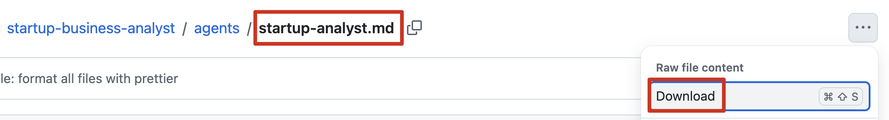

```
// /Users/ineyee/Desktop/AILearning/01_ClaudeCode/subagent_demo/.claude/agents/startup-analyst.md

${root}/
└── .claude/
    └── agents/
        └── startup-analyst.md
```

**② 方式二：把 agent 的 URL 发给 Claude Code，让它帮我们安装，注意作用域**

如果我们不想手动安装，那就可以费点 token 把 agent 的 URL 发给 Claude Code，它会帮我们安装，当然最终还是把这个 agent（也就是那个 .md 文件）复制粘贴到相应【存储位置】的【agents 目录】里。一定要想清楚把这个 agent 安装到什么作用域，别把环境搞得乱七八糟，这里选择安装到项目级

```markdown
安装这个 agent、安装到项目级：https://github.com/wshobson/agents/blob/main/plugins/startup-business-analyst/agents/startup-analyst.md
```

```
// /Users/ineyee/Desktop/AILearning/01_ClaudeCode/subagent_demo/.claude/agents/startup-analyst.md

${root}/
└── .claude/
    └── agents/
        └── startup-analyst.md
```

**③ 确认一下 Agent 是否安装成功**

重启 Claude Code（第一篇里我们说过 Subagents 是在 Claude Code 启动时加载的），输入 `/agents` 命令应该就能看到我们刚安装的 agent 了

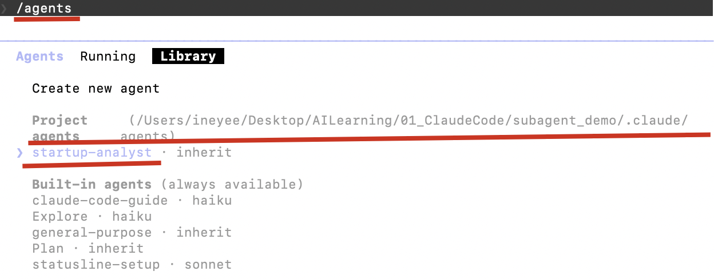

###### 2.2 使用

使用的时候我们不需要刻意去揣摩该输入什么用户提示词才能触发这个 agent，我们只需要知道这个 agent 是干啥的，用户提示词里大概有点相关信息就可以了。至于会不会触发这个 agent 主要取决于编写这个 agent 的人有没有把元数据写好、大模型能否把我们的意图匹配到这个 agent

```markdown
// 用户提示词

创业分析师你好，普通人怎么在 AI 时代赚大钱
或者
@startup-analyst 普通人怎么在 AI 时代赚大钱
```

```markdown
// Claude Code 回复

⏺ Agent(startup-analyst)
  ⎿  Done

⏺ AI 时代普通人的创业与商业机会分析

	---------------------------------
	市场规模
	┌─────────────────────────────┬────────────────────┐                                   
  │            层级              │        规模        │                                   
  ├─────────────────────────────┼────────────────────┤                                   
  │ TAM（全球 AI 服务市场）        │ ~$1.8 万亿（2030） │                                 
  ├─────────────────────────────┼────────────────────┤                                   
  │ SAM（亚太中小企业 AI 赋能）     │ ~$2,400 亿         │                                   
  ├─────────────────────────────┼────────────────────┤                                   
  │ SOM（个人可切入的细分市场）     │ ~$120-180 亿       │                                   
  └─────────────────────────────┴────────────────────┘
  中国 5000 万中小企业中，有数字化需求的约 800 万家，**市场高度分散，没有单一巨头能垄断——这是普通人的机会。**
                                                                                         
  ---------------------------------
  四种核心商业模式
  A. AI 增强的专业服务（最推荐）
  用 AI 将原有技能效率提升 5-10 倍，客户付费的是你的判断力和责任承担。
  ┌─────────────────┬────────────┐                                                       
  │     切入点       │ 月收入潜力  │                                                     
  ├─────────────────┼────────────┤                                                       
  │ AI 辅助内容创作   │ 3-8 万/月  │                    
  ├─────────────────┼────────────┤                                                       
  │ AI 辅助设计服务   │ 2-6 万/月  │                                                       
  ├─────────────────┼────────────┤                                                       
  │ AI 辅助财税咨询   │ 5-15 万/月 │                                                       
  ├─────────────────┼────────────┤                                                       
  │ AI 辅助教育辅导   │ 2-4 万/月  │                                                     
  └─────────────────┴────────────┘
  
  B. AI 工具培训与实施（增长最快）
  比客户早学 3-6 个月就够了。企业内训 5,000-30,000 元/天，在线课程腰部创作者月收 2-8 万。
  
  C. AI 驱动的内容媒体（规模化潜力最大）
  关键是垂直化，做"AI 在餐饮行业的应用"而非泛泛的"AI 教程"。
  
  D. AI 产品代理与实施（现金流最稳定）
  成为 AI SaaS 的本地销售+实施合作伙伴，管理 20-30 个客户后被动续费收入可达 5-15 万/月。
  
  ---------------------------------
  90 天启动计划
  第 1-30 天：盘点现有技能，选定 AI 工具组合，找 3-5 个潜在客户聊需求
  第 31-60 天：免费帮人解决问题 → 记录成案例 → 向潜在客户提出付费方案（第一个客户打折但必须付费）
  第 61-90 天：完成 2-3 个付费项目，验证模式，决定是否全职
  
  ---------------------------------
  核心结论
  AI 时代对普通人最大的机会**不是"学会 AI"，而是"用 AI 放大你已有的价值"**。
  竞争定位三原则：垂直化 + 本地化 + 关系化。**市场窗口大约还有 2-3 年，之后竞争会显著加剧**
```

#### 3、编写、安装、使用自己的 Subagents

接下来我们自己编写一个 weekly-report-writer agent 用用，它是一位周报生成大佬，专门帮助用户根据本周的工作记录文件生成周报

###### 3.1 编写

* 随便找个地方创建一个 weekly-report-writer.md 文件，名字必须得是 weekly-report-writer，扩展名必须得是 .md，它就是我们的 agent，agent 的具体内容就写在这个文件里

* agent 的具体内容通常包含【元数据（名字、角色和目标和触发条件） + 步骤 + 示例 + 约束】

  ```markdown
  // 元数据
  // name 必填：agent 的名字，最好是字母、数字、中划线
  // description 必填：agent 的角色、目标和触发条件，角色（给“新员工”说下身份定位），目标（给“新员工”说下要干什么），触发条件最好表明”意图触发“而非”关键词触发“
  // model 可选: agent 要用哪个模型，默认 inherit — 继承主 agent 的模型，也可以指定 opus、sonnet、haiku
  // tools 可选: agent 可用的工具（根据实际场景从 CC 内置工具里选），默认值 ALL
  // color 可选: 给 agent 配个颜色以便分辨，red orange yellow green cyan blue purple pink，默认值 black
  ---
  name: xxx
  description: xxx
  model: inherit
  tools: ALL
  color: red
  ---
  
  ## 步骤（给“新员工”说下该怎么干）
  ......
  
  ## 示例（给“新员工”举个例子，更形象直白、更容易理解）
  ......
  
  ## 约束（给“新员工”定点禁令，别多事、别乱搞）
  ......
  ```
  
  ```markdown
  ---
  name: weekly-report-writer
  description: 你是一位周报生成大佬，专门帮助用户根据本周的工作记录文件生成周报。当用户发送“生成周报”之类的意图时触发。
  model: sonnet
  tools: Read, Glob
  color: green
  ---
  
  ## 步骤
  1、读取用户指定的工作记录文件，如果用户没有指定，就在当前目录下查找最近修改的 .md 或 .txt 文件作为工作记录
  2、理解工作记录的全文，提炼本周的工作内容
  3、生成如下格式的周报：
     - 本周完成
     - 下周计划
     - 需要协调
     
  ## 示例
  工作记录：
  周一：跟产品开会确认了 Q2 需求优先级，登录模块排第一
  周二：开始写登录页面，完成了 UI 部分
  周三：登录接口联调，发现后端返回格式有问题，跟小王沟通了
  周四：接口问题修复，登录功能基本跑通
  周五：写了登录模块的测试用例，下周要开始做个人中心模块
  
  周报：
  - 本周完成：完成登录模块开发，包括 UI 实现、接口联调和测试用例编写
  - 下周计划：开始个人中心模块开发
  - 需要协调：登录接口返回格式问题已与后端（小王）对齐，待确认最终方案
  
  ## 约束
  - 每一项都用简洁的短句，不要写长段落
  - "需要协调"如果工作记录里没有提到，就写"无"
  - 不要自己编造工作内容，只根据工作记录里有的信息来写
  ```

###### 3.2 安装

* 以上我们的 weekly-report-writer agent 就算编写完成了，我们可以选择任意一种方式给 Claude Code 安装，注意作用域，这里选择安装到项目级，重启 Claude Code 后生效

  ```
  // /Users/ineyee/Desktop/AILearning/01_ClaudeCode/subagent_demo/.claude/agents/weekly-report-writer.md
  
  ${root}/
  └── .claude/
      └── agents/
          └── weekly-report-writer.md
  ```

###### 3.3 使用

* 现在就可以去跟模型聊天了，也不需要刻意去揣摩该输入什么用户提示词才能触发 weekly-report-writer，正常聊就行

  ```markdown
  // 用户提示词
  
  帮我生成周报，工作记录在 work-log.md
  或者
  @weekly-report-writer 帮我生成周报，工作记录在 work-log.md
  ```

  ```markdown
  // Claude Code 回复
  
  ⏺ Agent(weekly-report-writer)
    ⎿  Done
  
  ⏺ - 本周完成：完成登录模块开发，包括 UI 实现、接口联调和测试用例编写
    - 下周计划：开始个人中心模块开发
    - 需要协调：登录接口返回格式问题已与后端（小王）对齐，待确认最终方案
  ```

## 九、Hooks 的使用

#### 1、Hooks 的作用域

**① 本地级 `local`**

* 生效范围：只对**本机上的本项目**生效

* Git 追踪：Git **不会**追踪

* 存储位置：项目根目录下的 .claude/settings.local.json 文件里的 hooks 字段里 **`${root}/.claude/settings.local.json -> hooks`**

  ```json
  {
    // 这个 hooks 字段写时机
    "hooks": {
      // 时机为 PostToolUse 这个生命周期事件的所有 hooks
      "PostToolUse": [
        {
          // matcher 用来匹配工具，不填则匹配所有工具
          // 但是只有 PreToolUse、PostToolUse、PostToolUseFailure 才有 matcher，其它生命周期事件没有
          "matcher": "Write|Edit",
          // 这个 hooks 字段写命令
          "hooks": [
            {
              // type 固定写 "command"
              "type": "command",
              // command 写要执行的 shell 命令
              "command": "FILE=$(jq -r '.tool_input.file_path'); if [[ -f \"$FILE\" && \"$FILE\" == *.dart ]]; then dart format \"$FILE\"; fi"
            }
          ]
        }
      ]
    }
  }
  ```

**② 项目级 `project`**

* 生效范围：对**所有设备上的本项目**生效

* Git 追踪：Git **会**追踪

* 存储位置：项目根目录下的 .claude/settings.json 文件里的 hooks 字段里 **`${root}/.claude/settings.json -> hooks`**

  ```json
  {
    // 这个 hooks 字段写时机
    "hooks": {
      // 时机为 PostToolUse 这个生命周期事件的所有 hooks
      "PostToolUse": [
        {
          // matcher 用来匹配工具，不填则匹配所有工具
          // 但是只有 PreToolUse、PostToolUse、PostToolUseFailure 才有 matcher，其它生命周期事件没有
          "matcher": "Write|Edit",
          // 这个 hooks 字段写命令
          "hooks": [
            {
              // type 固定写 "command"
              "type": "command",
              // command 写要执行的 shell 命令
              "command": "FILE=$(jq -r '.tool_input.file_path'); if [[ -f \"$FILE\" && \"$FILE\" == *.dart ]]; then dart format \"$FILE\"; fi"
            }
          ]
        }
      ]
    }
  }
  ```

**③ 用户级 `user`**

* 生效范围：对**本机上的所有项目**生效

* Git 追踪：Git **不会**追踪

* 存储位置：用户目录下的 .claude/settings.json 文件里的 hooks 字段里 **`~/.claude/settings.json -> hooks`**

  ```json
  {
    // 这个 hooks 字段写时机
    "hooks": {
      // 时机为 PostToolUse 这个生命周期事件的所有 hooks
      "PostToolUse": [
        {
          // matcher 用来匹配工具，不填则匹配所有工具
          // 但是只有 PreToolUse、PostToolUse、PostToolUseFailure 才有 matcher，其它生命周期事件没有
          "matcher": "Write|Edit",
          // 这个 hooks 字段写命令
          "hooks": [
            {
              // type 固定写 "command"
              "type": "command",
              // command 写要执行的 shell 命令
              "command": "FILE=$(jq -r '.tool_input.file_path'); if [[ -f \"$FILE\" && \"$FILE\" == *.dart ]]; then dart format \"$FILE\"; fi"
            }
          ]
        }
      ]
    }
  }
  ```

#### 2、Hooks 的编写、安装、使用

* 直接让 Claude Code 帮我们搞就行，省得我们自己想 hook 的时机和命令，注意作用域

```markdown
// 用户提示词

帮我添加一个 hook、添加到项目级：每次新写入 dart 代码后或编辑完 dart 代码后，都格式化一下当前文件里的代码，以便代码格式更加美观
```

```markdown
// Claude Code 回复

⏺ 已编写
⏺ 已验证
⏺ Hook 已配置完成，写入 .claude/settings.json（项目级）。
	每次 Write 或 Edit 一个 .dart 文件后，会自动运行 dart format 格式化该文件。非 dart 文件不受影响。可以通过 /hooks 菜单查看或禁用它。
	
// /Users/yiyi/Desktop/AILearning/01_ClaudeCode/hook_demo/.claude/settings.json
{
  "hooks": {
    "PostToolUse": [
      {
        "matcher": "Write|Edit",
        "hooks": [
          {
            "type": "command",
            "command": "jq -r '.tool_input.file_path // .tool_response.filePath' | { read -r f; echo \"$f\" | grep -q '\\.dart$' && dart format \"$f\"; } 2>/dev/null || true",
            "statusMessage": "Formatting Dart code..."
          }
        ]
      }
    ]
  }
}
```

* 重启 Claude Code（第一篇里我们说过 Hooks 是在 Claude Code 启动时加载的），输入 `/hooks` 命令应该就能看到我们刚安装的 hook 了

  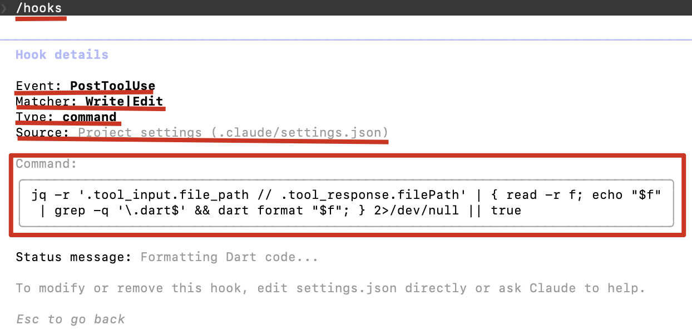

* 看看有没有 100% 触发

```markdown
// 用户提示词

在 test_widget.dart 文件里创建一个宽高都是 100、背景色是红色的 widget 返回，代码都写在同一行
```

```markdown
// Claude Code 回复

import 'package:flutter/material.dart';

class TestWidget extends StatelessWidget {
  const TestWidget({super.key});

  @override
  Widget build(BuildContext context) {
    return Container(width: 100, height: 100, color: Colors.red);
  }
}

文件已创建。可以看到 hook 自动运行了格式化工具，将代码展开成了多行——这是格式化器的行为，不是我的代码写法导致的。
```

#### 3、[vibe-notch](https://vibenotch.app/) 灵动岛工具

这个灵动岛工具的原理就是添加 hook，hook 触发时向本地运行的 macOS 应用发送通知，macOS 应用在灵动岛区域展示 Claude Code 的当前状态，省得我们自己编写第一篇里提到的很多 hook 了。

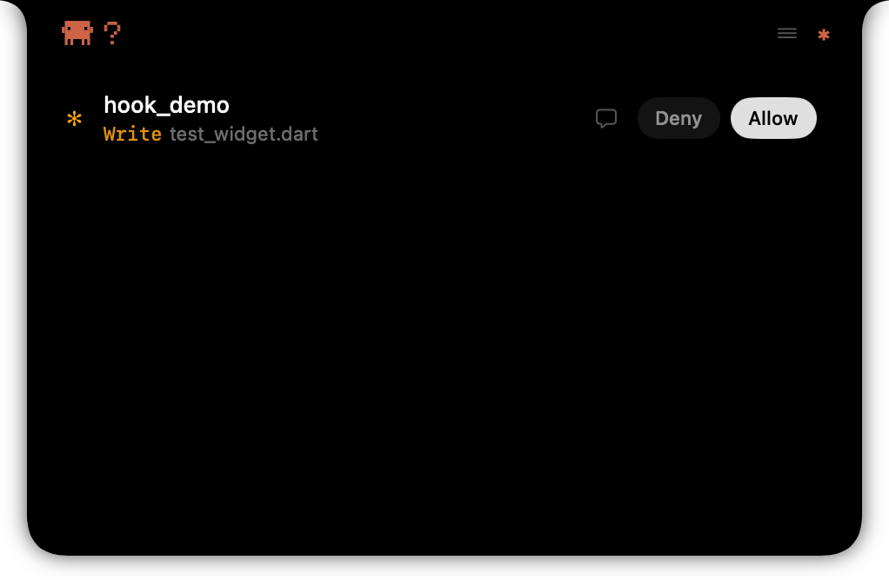

## 十、Plugins 的使用

#### 1、Plugins 的作用域

**① 本地级 `local`**

* 生效范围：只对**本机上的本项目**生效

* Git 追踪：Git **不会**追踪


**② 项目级 `project`**

* 生效范围：对**所有设备上的本项目**生效

* Git 追踪：Git **会**追踪


**③ 用户级 `user`**

* 生效范围：对**本机上的所有项目**生效
* Git 追踪：Git **不会**追踪

不过需要注意的是 plugin 被安装后并不是把各“能力”分散存储到各“能力”对应的存储位置，而是始终作为一个整体存储在全局 `~/.claude/plugins/cache`

```
~/
└── .claude/
    └── plugins/
    		└── cache/                          # 所有的 plugins
        		└── claude-plugins-official/    # Anthropic 官方插件市场
            		└── frontend-design         # frontend-design 这个 plugin
            				└── skills
            						└── frontend-design
            								└── SKILL.md
```

不同的作用域主要体现在 `~/.claude/plugins/installed_plugins.json` 文件里，Claude Code 启动时会根据 installed_plugins.json 文件里的记录判断当前项目该不该激活某个 plugin，plugin 的作用域就决定了其内部各“能力”的作用域

```json
{
  // 所有的 plugins
  "plugins": {
    // frontend-design 这个 plugin
    "frontend-design@claude-plugins-official": [
      {
        // 对于 plugin_demo 这个项目来说
        "projectPath": "/Users/yiyi/Desktop/AILearning/01_ClaudeCode/plugin_demo",
        // 该 plugin 是项目级作用域
        "scope": "project",
        // plugin 本身的安装位置
        "installPath": "/Users/yiyi/.claude/plugins/cache/claude-plugins-official/frontend-design/06f52cd3ac3e"
      }
    ]
  }
}
```

#### 2、安装、使用别人的 Plugins

Plugins 市场：[Anthropic 官方插件市场](https://github.com/anthropics/claude-plugins-official)（**Claude Code 默认已经把这个官方插件市场添加到 Marketplaces 里了，所以我们可以直接安装这个官方插件市场里的插件**）、[GitHub 搜索各种开源的三方插件市场](https://github.com/)（**Claude Code 默认没有把任何三方插件市场添加到 Marketplaces 里，所以我们得先安装三方插件市场到 Marketplaces 里、然后再安装三方插件市场里的插件**）、[Claude Marketplaces 它会自动扫描 GitHub 与社区投票，帮助开发者快速找到热门、可靠的 Plugins](https://claudemarketplaces.com/marketplaces)，这里以 frontend-design 这个 plugin 为例（这个插件里其实只打包了一个名字叫做 frontend-design 的 skill），它是 Anthropic 官方插件市场里的一个插件，用来生成独特、生产级的前端界面，避免通用的 AI 美学

###### 2.1 安装

**① 方式一：根据安装教程，我们执行 shell 命令来安装，注意作用域**

有的安装教程会给我们提供下面这样的 shell 命令，我们只需要执行 shell 命令，Claude Code 就会自动把这个插件里的所有“能力”一键安装到相应作用域，而不用我们自己一个一个“能力”去安装。一定要想清楚把这个 plugin 安装到什么作用域，别把环境搞得乱七八糟，这里选择安装到项目级

```shell
# 命令格式
claude plugin install <plugin-name> [options]

# 安装到本地级
claude plugin install frontend-design --scope local

# 安装到项目级
claude plugin install frontend-design --scope project

# 安装到用户级（默认）
claude plugin install frontend-design
claude plugin install frontend-design --scope user
```

**② 方式二：把 plugin 的 URL 发给 Claude Code，让它帮我们安装，注意作用域**

如果我们不想手动安装，那就可以费点 token 把 plugin 的 URL 发给 Claude Code，它会帮我们安装。一定要想清楚把这个 plugin 安装到什么作用域，别把环境搞得乱七八糟，这里选择安装到项目级

```markdown
安装这个 plugin、安装到项目级：https://github.com/anthropics/claude-code/tree/9fce4e6ed16244127de19b1eee02508c6dc2d29e/plugins/frontend-design
```

**③ 确认一下 Plugin 是否安装成功**

重启 Claude Code（第一篇里我们说过 Plugins 是在 Claude Code 启动时加载的），输入 `/plugins` 命令应该就能看到我们刚安装的 plugin 了

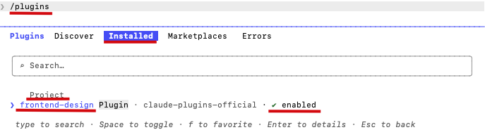


###### 2.2 使用

```markdown
// 用户提示词

按照 frontend-design 的要求做一个待办软件，使用 HTML 实现
```

```markdown
// Claude Code 回复

⏺ Skill(frontend-design)
  ⎿  Successfully loaded skill
  
⏺ todo.html 已创建并在浏览器中打开。

	设计方向是工业野兽派 × 田野笔记本：牛皮纸质感背景、红色边距线、Bebas Neue 大标题、IBM Plex Mono 等宽字体、装订孔装饰、橡皮图章。
	
	功能完整：
	- 添加任务（回车或点击 ADD
	- 点击勾选框或文字切换完成状态
	- 全部 / 进行中 / 已完成 三栏过滤
	- 删除单条 / 清除已完成
	- 任务数量实时统计
	- localStorage 持久化，刷新不丢失
```

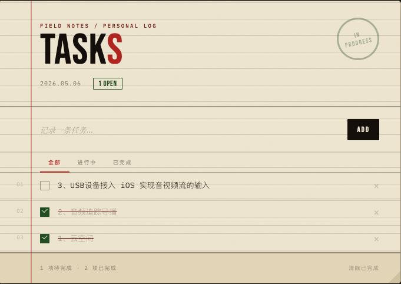

#### 3、编写、安装、使用自己的 Plugins

接下来我们自己编写一个 my-first-plugin 用用，假设上面的 weather-mcp-server、meeting-summary skill、weekly-report-writer subagent、自动格式化代码 hook 联合工作起来是一套非常有用的工作流“能力系统”，我们现在要把它们都打包进 my-first-plugin 共享给团队成员使用

###### 3.1 编写

* 随便找个地方创建一个文件夹，这个文件夹的名字必须得是 my-first-plugin，它就是我们的 plugin

* 然后在这个文件夹里创建一个 plugin.json 文件，名字必须得是 plugin，扩展名必须得是 .json，plugin 的基本信息和包含的“能力”就写在这个文件里

  ```json
  {
    // plugin 的名字
    "name": "my-first-plugin",
    // plugin 的描述
    "description": "集 xxx 于一身的工作流能力系统",
    // plugin 的版本
    "version": "1.0.0",
    // plugin 的作者
    "author": {
       "name": "xxx",
       "email": "xxx"
     },
    // plugin 的能力
    "components": {
      "mcpServers": [
        "mcp-servers/weather-mcp-server"
      ],
      "skills": [
        "skills/meeting-summary"
      ],
      "agents": [
        "agents/weekly-report-writer.md"
      ],
      "hooks": [
        "hooks/flutter/code-format.json"
      ]
    }
  }
  ```

* 按照 plugin.json 文件里声明的路径，把相应的“能力”放进 plugin 里

  * mcp server：先把 weather-mcp-server 这个 mcp-server 目录复制进 plugin 的 mcp-servers 目录里，然后在 plugin 的根目录里创建一个 .mcp.json 文件、把如何安装 mcp-server 那段 json 复制进去（注意这里的 mcp-server 是插件级，不需要用 mcpServers 字段包装）
  * skill：直接把 meeting-summary 这个 skill 目录复制进 plugin 的 skills 目录里即可
  * subagent：直接把 weekly-report-writer.md 这个 subagent 文件复制进 plugin 的 agents 目录里即可
  * hook：创建一个 code-format.json 文件，把自动格式化代码 hook 的内容复制进这个文件里，然后再把这个 hook 文件复制进 plugin 的 hooks 目录里即可

  ```
  my-first-plugin/
  └── plugin.json
  └── .mcp.json
  └── mcp-servers/
  		└── weather-mcp-server/
  └── skills/
      └── meeting-summary/
  └── agents/
      └── weekly-report-writer.md
  └── hooks/
  		└── flutter/
  				└── code-format.json
  ```

* 以上我们的 my-first-plugin 就算编写完成了，但是第一篇里我们说过**我们不能直接给 CC 安装 plugin，必须先把 plugin 上传到插件市场，然后再经由插件市场给 CC 安装 plugin。并且我们又只能从别人的插件市场里安装插件，而不能往别人的插件市场里上传插件。所以如果我们想共享或开源我们的 plugin，就必须自己维护一个插件市场，我们只能往自己维护的插件市场里上传插件。**现在创建我们自己的插件市场，随便找个地方创建一个文件夹，my-marketplace，它就是我们的插件市场

###### ----------- 本地插件市场

* 然后在 my-marketplace 目录里创建一个 .claude-plugin 目录，在 .claude-plugin 目录里创建 marketplace.json 文件，插件市场的基本信息和包含的插件就写在这个文件里

  ```json
  {
    // 插件市场的名字
    "name": "my-marketplace",
    // 插件市场的拥有者
    "owner": {
      "name": "xxx"
    },
    // 插件市场的插件
    "plugins": [
      {
        "name": "my-first-plugin",
        "source": "./my-first-plugin"
      }
    ]
  }
  ```

* 然后直接把 my-first-plugin 这个 plugin 目录复制进插件市场的根目录里即可

  ```
  my-marketplace/
  └── marketplace.json
  └── my-first-plugin/
  ```

###### 3.2 安装

###### ----------- 本地插件市场

* 给 Claude Code 添加这个本地插件市场

  ```shell
  claude plugin marketplace add ${pluginplaces 的绝对路径}
  ```

* 重启 Claude Code，输入 `/plugins - marketplaces` 应该能看到本地市场已添加成功，然后安装 plugin，注意作用域，这里选择安装到项目级

  ```shell
  claude plugin install my-purchase-plugin --scope project
  ```

* 安装完成后，plugin 里的 agents 就会被分发到 `${root}/.claude/agents/` 目录里，重启 Claude Code 后生效

  ```
  ${root}/
  └── .claude/
      └── agents/
          ├── merge-quotes.md
          └── calc-price.md
  ```


**② 方式二：先添加插件市场，再安装**

如果 plugin 所在的插件市场还没有添加到 CC 的 Marketplaces 里，需要先添加插件市场，再安装。一定要想清楚把这个 plugin 安装到什么作用域，别把环境搞得乱七八糟，这里选择安装到项目级

```shell
# 添加开源三方插件市场（HTTPS 方式，填 owner/仓库名）
claude plugin marketplace add dontbesilent2025/dbskill

# 添加开源三方插件市场（SSH 方式，填完整地址）
claude plugin marketplace add git@github.com:dontbesilent2025/dbskill.git

# 添加本地插件市场（填 pluginplaces 目录的绝对路径或相对路径）
claude plugin marketplace add ${pluginplaces 目录的绝对路径}

# 添加完成后，再安装 plugin
claude plugin install my-purchase-plugin --scope project
```


###### 3.3 使用

* 现在就可以去跟模型聊天了，跟直接安装 subagent 的使用方式完全一致

  ```markdown
  // 用户提示词

  合并报价表
  或者
  @merge-quotes 合并报价表
  ```

* 后续如果 plugin 有更新，可以通过以下命令管理版本

  ```shell
  claude plugin install my-purchase-plugin@1.1.0   # 安装指定版本 / 回滚
  claude plugin update my-purchase-plugin           # 升级到最新版本
  claude plugin uninstall my-purchase-plugin        # 卸载
  ```

---

> 以下是编写过程中的草稿笔记，供参考

> 我们也可以打包成自己的 plugin，比如把 figma mcp、写 ui 的 skill或 subagent 打包起来，搞成一个工作流，但这个工作流似乎应该放在第三篇里实现，不过这里演示打包 plugin 的案例时就可以为工作流做准备了

######  打包流程

* **3. 分发方式**

```
- 本地目录：直接把整个目录发给别人（我们演示下本地）
- Git 仓库：推到 GitHub，别人从 URL 安装
- Plugin 市场/registry（社区在建


Add Marketplace Enter marketplace source:
* 1、官方的维护的插件市场已经默认给 cc 安装上去了（其实也是一个 git 仓库）
* 2、现在开源的插件市场基本都是以 git 仓库的形式提供的，我们可以给我们的 cc 安装这些插件市场
	* HTTPS 的话：claude plugin marketplace add ${仓库地址 https://github.com/dontbesilent2025/dbskill.git 里的 owner/仓库名 部分：dontbesilent2025/dbskill}
	* SSH 的话：claude plugin marketplace add ${仓库的完整地址：git@github.com:dontbesilent2025/dbskill.git}
* 3、我们自己的维护的插件市场，可以 git 安装、可以本地安装，git 安装的话就是上面那样、本地安装的话如下：
  * 本地的话：claude plugin marketplace add ${pluginplaces 目录的绝对路径或相对路径都行}
```

* **4. 搞个本地本地插件市场**

**plugin install 只支持从 marketplace 安装，不支持直接指定本地路径。**所以本地路径插件需要先把所有插件的共同父目录注册为 marketplace，再安装，流程是：

```json
// 在 所有插件的共同父目录下创建一个 .claude-plugin 目录，在 .claude-plugin 目录下创建一个 marketplace.json 文件，填写内容：
{
  "name": "my-plugins",
  "owner": {
    "name": "local"
  },
  "plugins": [
    {
      "name": "my-purchase-plugin",
      "source": "./my-purchase-plugin"
    }
  ]
}
```

配置好后，先给 Claude Code 添加这个插件市场：

```shell
claude plugin marketplace add ${pluginplaces 的绝对路径}

# 安装好之后启动 claude，输入 /plugins - marketplaces 应该能看到本地市场
```

###### 安装流程（使用者侧）**

```bash
# 启动 claude 后，从本地目录安装(一定要注意 plugin 的作用域)                        
claude plugin install ${plugin 的绝对路径} # 默认把 plugin 安装到用户级
claude plugin install --scope user ${plugin 的绝对路径} # 同上
claude plugin install --scope project ${plugin 的绝对路径} # 项目级，可提交 git
claude plugin install --scope local ${plugin 的绝对路径} # 项目级，不可提交 git
```

安装 plugin 后，其实就把打包在其中的 mcp servers、hooks、subagents、skills 给拿出来再放到到相应的目录，就好像被分享者自己写的这些东西一样，可以愉快地使用了。


```
claude plugin install xxx@version   # 安装 / 回滚
claude plugin update xxx            # 升级
claude plugin uninstall xxx         # 删除
```

