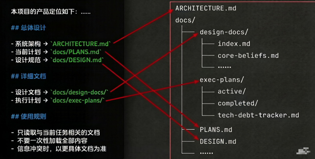
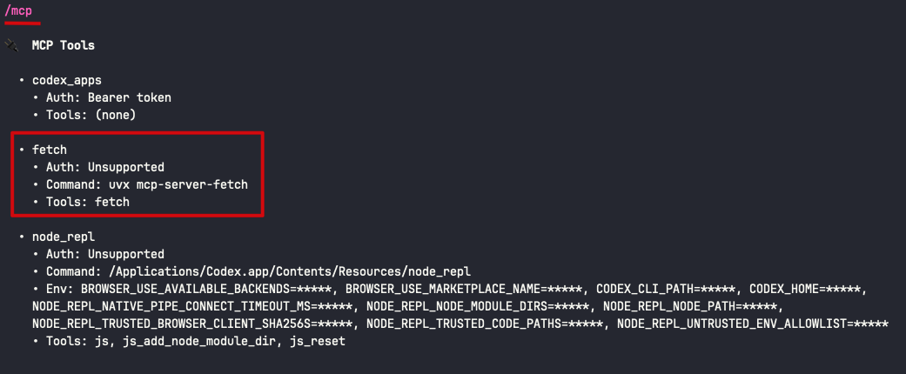

> 第一篇：概念速通
>
> 第二篇：使用指南（这一篇只回答**“怎么用”**的问题）
>
> 第三篇：工作流优化

## 一、聊天之前的基本使用

#### 1、启动 Codex 以开始会话

cd 到工作目录，输入 `codex` 命令即可启动 Codex 跟它开始一次会话，这样启动的 Codex 安全、但是会有各种各样的权限弹窗。我们还可以输入 `codex --dangerously-bypass-approvals-and-sandbox ` 命令来启动 Codex 跟它开始一次会话，这样启动的 Codex 不会有任何权限弹窗、但是危险

> 我们的项目目录虽然由 Git 管理，有一定的安全保障，但是使用 `codex --dangerously-bypass-approvals-and-sandbox` 启动的 Codex 可能操作项目目录以外的非 Git 目录，有一定的安全隐患。**实际开发中建议：使用 `codex` 来启动 Codex**

#### 2、切换模型及努力程度

`/model` 命令用来切换模型和努力程度，即时生效、无需重启 Codex。

模型：

* gpt-5.5
* gpt-5.4
* gpt-5.4-mini

> **实际开发中建议：简单问答用 gpt-5.4-mini、大多数日常问答用 gpt-5.4、复杂推理问答用 gpt-5.5**

努力程度：

* low
* medium
* high
* xhigh

> **实际开发中建议：简单问答用 low、大多数日常问答用 medium | high、复杂推理问答用  xhigh**

#### 3、切换 Codex 的行为模式

`Shift + Tab` 键用来切换 Codex 的行为模式，即时生效、无需重启 Codex：

* Default mode：类似于 Claude Code 的 Edit automatically，一顿思考后会按它的想法直接去**创建或编辑**文件，并且每次创建或编辑文件前都**不会弹窗**询问我们是否允许，**最方便**

* Plan mode：类似于 Claude Code 的 Plan mode，一顿思考后**只规划、不执行**，**最适合明确具体目标、拆分详细步骤**

> **实际开发中建议：如果我们自己连任务的【具体目标】都不清晰时、可以先 Plan mode 跟 Codex 根据我们的大概目标明确一下具体目标、【避免方向走错】，或者我们自己连任务的【详细步骤】都不清晰时、可以先 Plan mode 跟 Codex 根据我们的具体目标拆分一下详细步骤、【做到心里有底】，这样规划完之后再去执行；而如果一个任务我们一眼就能看穿它很小，或者一个大任务我们已经人为明确了具体目标是什么、也已经人为拆分了详细步骤怎么干，那就直接 Edit automatically 开干，不过最好一个一个小目标、一个一个小步骤让 Codex 去执行**

补充：

* Codex 可以读取当前 workspace，Codex 可以创建/编辑当前 workspace 内的文件，Codex 可以运行普通本地命令，这些情况下都不会弹窗
* 但访问互联网，编辑当前 workspace 外部的文件，执行需要跳出 sandbox 的操作，执行某些高风险或受限命令，就都会弹窗，我们只能是 Codex 弹出来一个就“总是允许”一个
* 如果实在受不了弹窗，那就承担一点风险使用 `codex --dangerously-bypass-approvals-and-sandbox ` 

## 二、聊天之中的基本使用

#### 1、自然语言的换行输入

* `shift + 回车`可以换行
* `option + 回车`可以换行

#### 2、输入图片

* `cmd + c、cmd + v 或 ctrl + v` 可以输入图片
* `直接把图片拖进终端`可以输入图片

#### 3、输入 shell 命令

`先输入英文叹号 !，再输入 shell 命令即可，`执行完 shell 命令后会自动退出 shell mode

#### 4、恢复到之前的会话

`/resume` 命令用来恢复到之前的某次完整会话，这在重启 Codex 后需要在之前的某次会话里继续聊天时或者回顾历史会话时非常有用

#### 5、打断某轮对话

`esc` 键用来打断某轮对话，这在 Claude Code 回答过程中我们突然改变了主意想打断它时非常有用

#### 6、压缩对话上下文

`/compact` 命令用来压缩对话上下文，这在我们发现 Claude Code 的回答开始变傻变慢时非常有用（当然对话上下文使用量超过 95% 的时候，Claude Code 会自动压缩）

## 三、聊天之后的基本使用

#### 1、清空对话上下文

`/clear` 命令用来清空对话上下文，比如我们在同一个工作目录里执行完了任务 A，然后要去执行任务 B，但是任务 B 和任务 A 一点关系都没有，那就可以清空对话上下文后再执行任务 B。这样一来，我们就不用退出 Codex 后再重启，任务 B 的第一轮对话也是从一个空的对话上下文开始了

#### 2、导出所有对话

Codex 暂时没有导出会话的命令。~~`/export [${path}/${filename}.md]` 命令用来导出所有对话，比如我们想把这一次的所有对话分享给别人看，或者我们有一个很长的任务、想把这一次的所有对话持久化下来、作为后续会话的对话上下文输入~~

#### 3、关闭 Codex 以结束会话

`/exit` 命令用来关闭 Codex 以结束会话，比如我们需要重启 Codex，或者切换到另外一个工作目录

## 四、用户提示词的使用

* 用户提示词模板

> **以前模型还不够强的时候，是“我们教 AI 怎么做”，因此“步骤”部分很重要。**
> **现在模型已经很强了，开始转变为“我们告诉 AI 要什么”，因此“目标”和“验收标准”更重要,现在出现的 /goal 命令就是干这个事的**
>
> /goal 执行《计划文档.md》里的第三阶段，要符合《第三阶段视频属性与高级格式策略验收指南》的验收标准

```markdown
## 背景（给“新员工”说下上下文）
......

## 目标（给“新员工”说下要干什么）
......

## 验收标准（告诉“新员工”什么叫做完成）
......

## 步骤（给“新员工”说下该怎么干。如果你已经很清楚，可以给；不清楚就让 Codex 自己探索）
......

## 示例（给“新员工”举个例子，更形象直白、更容易理解）
......

## 约束（给“新员工”定点禁令，别多事、别乱搞）
......

## 反馈（让“新员工”有问题及时反馈，别闷着憋到 deadline 再崩盘，早发现早预防）
......
```

* 用户提示词示例

```markdown
## 背景
* 文档类型：”报价表处理“目录里全是 excel 文档
* 文档定位：
	* ”每日个人报价表“目录里是某一天多个采购员对他们所负责商品的报价文档，所以会有多份文档
	* ”每日合并报价表“目录里是把每一天多个采购员的报价文档合并后生成的最终报价文档，所以也会有多份文档
* 文档细节：
	* ”每日个人报价表“目录里的每份文档其实来源于同一份初始文档，也就是说前面几列的内容大家都是一样的，只有后面包含”价格“的那几列不同、是由相应的采购员各自填写的
	* ”每日合并报价表“目录里的一份文档其实就是保持前面几列的内容不动，然后把多个采购员的”价格“列给合并进来

## 目标
合并多个采购员的每日报价表，生成统一的合并报价表

## 验收标准
* 最终文件出现在“每日合并报价表”目录
* 原有单元格样式不能丢
* 所有价格列能正确合并到“所有价格”列
* “每日个人报价表”目录处理完成后被清空

## 步骤
* 第一步：从”每日个人报价表“目录里任选一份文档作为《最终合并报价表》，这份《最终合并报价表》的名字里加个”\_合并“
* 第二步：然后把剩余文档里其它采购员的”价格“列，根据采购员的名字一一对应合并进《最终合并报价表》里，前面几列不要动保持原样
* 第三步：把所有”价格“列里的数据合并到”所有价格“列，同一行商品不可能存在多个采购员的价格列都有数据的情况，“所有价格”列确保内容横向和竖向居中
* 第四步：把《最终合并报价表》移动到”每日合并报价表“，如果”每日合并报价表“名字重复了，则用新文件覆盖旧文件
* 第五步：移除”每日个人报价表“目录里的所有文件

## 示例
比如每份价格表前几列都是【商品名称】、【商品类型】、【规格】，采购员张三负责一部分商品，那他的报价表里就只有【张三价格】这一列有数据，采购员李四负责一部分商品，那他的报价表里就只有【李四价格】这一列有数据，那么《最终合并报价表》里就是【张三价格】列和《李四价格》列都有数据，并且【所有价格】列的数据就是【张三价格】列、【李四价格】列合并进去的

## 约束
* 千万不要自己创建一份 excel，因为这会丢失人家 excel 的样式，千万不要丢失人家 excel 的样式
* 千万不要删除”每日合并报价表“里的文件

## 反馈
有任何疑问或信息不足，及时提问，别直接假设、别盲目干活

合并报价表
```

## 五、AGENTS.md 的使用

> **我们会把只属于某个特定任务的提示词抽取成 skill 或 subagent。**
>**所以 AGENTS.md 里最好只写一些项目级、稳定、长期有效的信息、就不用再写所有任务的具体规则了。**

* 项目类型太多、不太好整固定模板，新项目时可以执行 `/init` 命令让 Codex 自己生成合适的 AGENTS.md 文件，我们在此基础上改改
* 后续当项目文件发生较大变化时，再次执行 `/init` 命令让 Codex 及时更新下 AGENTS.md 文件，不要让这个文件落后腐化
* 建议把 AGENTS.md 文件提交到 Git 与团队共享
* 建议把 AGENTS.md 文件搞成个一百行左右的目录索引 + 引用其它文件，这有助于组织结构，但不会减少上下文占用、还是一次性全部加载所有文件



## 六、MCP Servers 的使用

#### 1、MCP Servers 的作用域

**① 项目级 `project`**

* 生效范围：对**所有设备上的本项目**生效

* Git 追踪：Git **会**追踪

* 存储位置：项目根目录下的 .codex/config.toml 文件里 **`${root}/.codex/config.toml`**

  ```toml
  # fetch 这个 mcpServer
  [mcp_servers.fetch]
  command = "uvx"
  args = [
    "mcp-server-fetch",
    "--user-agent",
    "Mozilla/5.0 (Macintosh; Intel Mac OS X 10_15_7) AppleWebKit/537.36 (KHTML, like Gecko) Chrome/124.0 Safari/537.36",
    "--ignore-robots-txt"
  ]
  
  # weather-mcp-server 这个 mcpServer
  [mcp_servers.weather-mcp-server]
  command = "uv"
  args = [
    "--directory",
    "my_mcp_servers/weather-mcp-server",
    "run",
    "weather-mcp-server.py"
  ]
  enabled = true
  startup_timeout_sec = 60
  [mcp_servers.weather-mcp-server.tools.get_current_weather]
  approval_mode = "approve"
  [mcp_servers.weather-mcp-server.tools.get_daily_forecast]
  approval_mode = "approve"
  ```

**② 用户级 `user`**

* 生效范围：对**本机上的所有项目**生效

* Git 追踪：Git **不会**追踪

* 存储位置：用户目录下的 .codex/config.toml 文件里 **`~/.codex/config.toml`**

  ```toml
  # fetch 这个 mcpServer
  [mcp_servers.fetch]
  command = "uvx"
  args = [
    "mcp-server-fetch",
    "--user-agent",
    "Mozilla/5.0 (Macintosh; Intel Mac OS X 10_15_7) AppleWebKit/537.36 (KHTML, like Gecko) Chrome/124.0 Safari/537.36",
    "--ignore-robots-txt"
  ]
  
  # weather-mcp-server 这个 mcpServer
  [mcp_servers.weather-mcp-server]
  command = "uv"
  args = [
    "--directory",
    "my_mcp_servers/weather-mcp-server",
    "run",
    "weather-mcp-server.py"
  ]
  enabled = true
  startup_timeout_sec = 60
  [mcp_servers.weather-mcp-server.tools.get_current_weather]
  approval_mode = "approve"
  [mcp_servers.weather-mcp-server.tools.get_daily_forecast]
  approval_mode = "approve"
  ```

#### 2、安装、使用别人的 MCP Servers

MCP Servers 市场：[GitHub 搜索](https://github.com/)、[mcpmarket 一个国内市场](https://mcpmarket.cn/)、[mcp.so 一个国外市场](https://mcp.so/zh)，这里以 fetch 这个 mcpServer 为例，它用来抓取网页内容并转换成 Markdown 格式输出

###### 2.1 安装

**① 方式一：根据安装教程，我们直接去手动修改相应【存储位置】的配置文件，注意作用域**

有的安装教程会给我们提供下图这样的配置、这是 Claude Code 的版本，我们只需要把这个配置改成 Codex 的版本、并复制粘贴到相应【存储位置】的配置文件里。一定要想清楚把这个 mcpServer 安装到什么作用域，别把环境搞得乱七八糟，这里选择安装到项目级


```toml
# /Users/yiyi/Desktop/AILearning/02_Codex/.codex/config.toml

[mcp_servers.fetch]
command = "uvx"
args = [
  "mcp-server-fetch"
]
```

**② 方式二：把安装教程的 URL 发给 Codex，让它帮我们安装，注意作用域**

如果我们不想看安装教程，那就可以费点 token 把安装教程的 URL 发给 Codex，它会读取安装教程并帮我们安装，当然最终还是把配置添加到相应【存储位置】的配置文件里。一定要想清楚把这个 mcpServer 安装到什么作用域，别把环境搞得乱七八糟，这里选择安装到项目级

```markdown
安装这个 mcp server、安装到项目级、注意是安装 codex 版本不是 claude code 版本：https://github.com/modelcontextprotocol/servers/tree/main/src/fetch
```

```toml
# /Users/yiyi/Desktop/AILearning/02_Codex/.codex/config.toml

[mcp_servers.fetch]
command = "uvx"
args = [
  "mcp-server-fetch"
]
```

**③ 确认一下 MCP Server 是否安装成功**

重启 Codex（第一篇里我们说过 MCP Servers 是在 Codex 启动时加载并连接的），输入 `/mcp` 命令应该就能看到我们刚安装的 MCP Server 了



###### 2.2 使用

使用的时候我们不需要刻意去揣摩该输入什么用户提示词才能触发这个 MCP Server，我们只需要知道这个 MCP Server 是干啥的，用户提示词里大概有点相关信息就可以了。至于会不会触发这个 MCP Server 主要取决于编写这个 MCP Server 的人有没有把元数据写好、大模型能否把我们的意图匹配到这个 MCP Server

```markdown
// 用户提示词

抓取这个网页：https://www.qweather.com/weather/xihu-101210113.html
```

```markdown
// Codex 回复

Calling fetch.fetch
Called fetch.fetch

• 已抓取：https://www.qweather.com/weather/xihu-101210113.html

  页面显示为 西湖区，浙江省，中国，坐标 30.27N, 120.15E，天气更新时间 2026-04-27 17:22。

  关键数据：

  - 当前天气：32°，阴
  - 空气质量：AQI 优
  - 天气概述：今晚中雨。明天中雨，比今天凉爽一些（29°），有风，空气不错。
  - 风：西南风 3级
  - 相对湿度：64%
  - 紫外线：弱
  - 体感温度：34°
  - 能见度：26km
  - 降水量：0.0mm
  - 气压：996hPa
  - 未来预报：05/25 32°~25°，05/26 29°~24°，05/27 30°~24°，05/28 30°~24°，05/29 31°~21°，05/30 30°~19°，05/31 31°~19°
  - 空气污染物：PM2.5 3，PM10 9，O3 114，CO 0.5，SO2 7，NO2 9
  - 生活指数：舒适度不舒适，洗车不宜，穿衣热，感冒少发，运动较不宜，旅游一般，紫外线弱，空气污染扩散优
```

#### 3、编写、安装、使用自己的 MCP Servers

接下来我们自己编写一个 weather-mcp-server 用用，它用来根据经纬度查询当天的天气、根据经纬度查询未来 7 天的天气

###### 3.1 编写

* 首先要知道开发 MCP Server 跟编程语言无关，Python、TypeScript、Kotlin、Java、Swift、OC、Dart、Go、Rust 等都可以用来开发 MCP Server，只不过目前最主流的是 Python、TypeScript，因为它们的官方维护最成熟、社区示例也最多，这里我们选择 Python

* 全局安装 Python 并添加环境变量，macOS 自带的 Python 是 3.9，但是开发 MCP Server 要求 Python 3.10+，这里我们安装 Python 3.12

  ```shell
  brew install python@3.12
  ```

  ```shell
  echo 'export PATH="/usr/local/opt/python@3.12/libexec/bin:$PATH"' >> ~/.zshrc 
  
  source ~/.zshrc
  ```

* 全局安装 uv，Python 的包管理工具（类似于 npm 是 Node.js 的包管理工具）

  > **① uvx 是 uv 附带的运行工具，uv 负责安装包，uvx 负责运行已经发布到 PyPI 这个中央仓库的包**
  >
  > **② 此外 uv 还有一个子命令 run，可以用来运行本地计算机上的包：uv --directory ${/ABSOLUTE/PATH/TO/PARENT/FOLDER/MCP_SERVER_FOLDER} run ${mcp_server}.py**
  >
  > **③ npx 是 npm 附带的运行工具，npm 负责安装包，npx 负责运行已经发布到 npm registry 这个中央仓库的包**
  >
  > **④ 此外我们还可以用 node 来运行本地计算机上的包：node ${/ABSOLUTE/PATH/TO/PARENT/FOLDER/MCP_SERVER_FOLDER/mcp_server.js}**

  ```shell
  curl -LsSf https://astral.sh/uv/install.sh | sh
  ```

* cd 到项目的父目录

  ```shell
  cd /Users/yiyi/Desktop/AILearning/02_Codex/my_mcp_servers
  ```

* 创建一个名为 weather-mcp-server 的项目

  ```shell
  uv init weather-mcp-server
  ```

* cd 到项目的根目录

  ```shell
  cd weather-mcp-server
  ```

* 给当前项目创建一个 Python 虚拟环境，这样一来给当前项目安装的包就只会安装进当前项目，而不用安装到全局 Python 环境里，避免跟其它项目出现依赖版本冲突

  ```shell
  uv venv
  ```

* 激活并进入虚拟环境

  ```shell
  source .venv/bin/activate
  ```

* 给当前项目安装依赖：用 Python 开发 MCP Server 时的辅助开发库 Python SDK

  ```shell
  uv add "mcp[cli]"
  ```

* 给当前项目安装依赖：Python 的 HTTP 请求库，用来请求天气接口

  ```shell
  uv add httpx
  ```

* 给当前项目创建一个 weather-mcp-server.py 文件，MCP Server 的代码就会编写在这个文件里

  ```shell
  touch weather-mcp-server.py
  ```

* 编写 weather-mcp-server 的代码

  ```python
  # 导入 httpx，用来请求天气接口
  import httpx
  # 导入 FastMCP，用来创建 MCP Server
  from mcp.server.fastmcp import FastMCP
  
  
  # ── 创建 MCP Server ───────────────────────────────────────────────────────────
  # "weather-mcp-server" 是 MCP Server 的名字，编排器会用这个名字识别该服务
  mcpServer = FastMCP("weather-mcp-server")
  
  
  # ── 常量 ──────────────────────────────────────────────────────────────────────
  # Open-Meteo 是一个开源、免费、无需鉴权的天气 API
  OPEN_METEO_BASE_URL = "https://api.open-meteo.com/v1/forecast"
  
  # WMO 标准的天气代码 --> 中文描述的映射表
  # Open-Meteo API 返回的天气状况是一个符合 WMO 标准的数字代码而不是文字，比如 1
  # 如果没有这个映射表的话，当前 MCP Server 里的工具返回给编排器的结果就是“天气：1”，编排器会把“天气：1”传递给模型，虽然模型最终也能理解“天气：1”的含义，但是不如“天气：基本晴朗”来得清晰直接
  # 所以我们把这个映射关系在 MCP Server 内部做掉，让工具返回的结果对人和模型都开箱即读
  WMO_CODE_MAP = {
      0:  "晴天",
      1:  "基本晴朗",
      2:  "局部多云",
      3:  "阴天",
      45: "雾",
      48: "冻雾",
      51: "小毛毛雨",
      53: "中毛毛雨",
      55: "大毛毛雨",
      61: "小雨",
      63: "中雨",
      65: "大雨",
      71: "小雪",
      73: "中雪",
      75: "大雪",
      77: "冰粒",
      80: "小阵雨",
      81: "中阵雨",
      82: "强阵雨",
      85: "小阵雪",
      86: "大阵雪",
      95: "雷暴",
      96: "雷暴伴小冰雹",
      99: "雷暴伴大冰雹",
  }
  
  
  # ── 私有函数 ───────────────────────────────────────────────────────────────────
  def _wmo_to_desc(code: int) -> str:
      """
      将 WMO 标准的天气代码转换为中文描述
  
      参数:
          code: 天气代码
  
      返回:
          中文描述，未知天气代码则返回原始数字
      """
      return WMO_CODE_MAP.get(code, f"未知天气（代码 {code}）")
  
  
  # ── MCP Server 的工具 1：根据经纬度查询当天的天气───────────────────────────────────
  # @mcpServer.tool() 是一个装饰器，@ 后面跟着的就是我们上面创建的 MCP Server 实例，.tool() 固定写法，它的作用就是把当前函数注册到 mcpServer 实例上
  # 一旦注册，当前函数就不再是一个普通的 Python 函数，而是一个可供编排器调用的工具
  # 并且 mcpServer 实例还会把当前函数的函数名、参数&参数类型、docstring（也就是 """xxx""" 部分）生成工具的使用说明（即元数据）暴露给外界，这样一来模型就知道什么时候该调用当前工具、该给当前工具传递什么参数
  @mcpServer.tool()
  def get_current_weather(latitude: float, longitude: float) -> str:
      """
      根据经纬度查询当天的天气
  
      参数:
          latitude: 纬度，范围 -90 ~ 90（正数为北纬）
          longitude: 经度，范围 -180 ~ 180（正数为东经）
  
      返回:
          格式化后的天气文本，包含气温、风速、风向、天气状况、白天/夜晚
      """
      # API 需要接收的参数
      params = {
          "latitude": latitude,
          "longitude": longitude,
          "current_weather": "true",
          "timezone": "auto",
      }
  
      # 发起 HTTP 请求并获取响应
      response = httpx.get(OPEN_METEO_BASE_URL, params=params, timeout=30)
      # 非 2xx 状态码时抛出异常
      response.raise_for_status()
  
      # response 转换成 json
      data = response.json()
      # 获取 json 里的 current_weather 字段
      cw = data["current_weather"]
  
      # 解析各字段
      temp        = cw["temperature"]       # 气温（°C）
      windspeed   = cw["windspeed"]         # 风速（km/h）
      winddeg     = cw["winddirection"]     # 风向（度，0=北，90=东）
      weathercode = cw["weathercode"]       # WMO 天气代码
      is_day      = cw["is_day"]            # 1=白天，0=夜晚
  
      day_night = "白天" if is_day else "夜晚"
      weather_desc = _wmo_to_desc(weathercode)
  
      # 工具的执行结果
      return (
          f"📍 坐标：{data['latitude']}°N, {data['longitude']}°E\n"
          f"🕐 观测时间：{cw["time"]}（{data["timezone"]}）\n"
          f"🌡 气温：{temp}°C\n"
          f"💨 风速：{windspeed} km/h，风向：{winddeg}°\n"
          f"🌤 天气：{weather_desc}\n"
          f"☀️ 昼夜：{day_night}"
      )
  
  # ── MCP Server 的工具 2：根据经纬度查询未来 7 天的天气──────────────────────────────
  @mcpServer.tool()
  def get_daily_forecast(latitude: float, longitude: float) -> str:
      """
      根据经纬度查询未来 7 天的天气
  
      参数:
          latitude: 纬度，范围 -90 ~ 90（正数为北纬）
          longitude: 经度，范围 -180 ~ 180（正数为东经）
  
      返回：
          格式化后的每天的日期、最高/最低气温、天气状况
      """
      # API 需要接收的参数
      params = {
          "latitude": latitude,
          "longitude": longitude,
          "daily": "temperature_2m_max,temperature_2m_min,weathercode",
          "forecast_days": 7,
          "timezone": "auto",
      }
  
      # 发起 HTTP 请求并获取响应
      response = httpx.get(OPEN_METEO_BASE_URL, params=params, timeout=30)
      # 非 2xx 状态码时抛出异常
      response.raise_for_status()
  
      # response 转换成 json
      data  = response.json()
      # 获取 json 里的 daily 字段，包含各数组
      daily = data["daily"]
  
      # 解析各字段
      dates    = daily["time"]                  # 日期列表
      temp_max = daily["temperature_2m_max"]    # 每日最高气温
      temp_min = daily["temperature_2m_min"]    # 每日最低气温
      codes    = daily["weathercode"]           # 每日天气代码
  
      lines = [f"📅 未来 7 天天气预报（{data['timezone']}）\n"]
      for date, tmax, tmin, code in zip(dates, temp_max, temp_min, codes):
          desc = _wmo_to_desc(code)
          lines.append(f"  {date}  {tmin}°C ~ {tmax}°C  {desc}")
  
      # 工具的执行结果
      return "\n".join(lines)
  
  
  # ── 入口 ──────────────────────────────────────────────────────────────────────
  # Python 惯例：只有直接运行该脚本时才执行后续代码，被其它模块 import 时不会执行后续代码
  # 对于 MCP Server 来说，就是防止别人 import 这个文件时意外启动服务器
  if __name__ == "__main__":
      # 启动 MCP Server
      # transport="stdio" 表示 MCP Server 通过标准输入/输出与编排器通信，一般都是这种通信方式，默认就是这种通信方式
      mcpServer.run(transport="stdio")
  ```

###### 3.2 安装

* 以上我们的 weather-mcp-server 就算开发完成了，我们可以选择任意一种方式给 Codex 安装，注意作用域，这里选择安装到项目级，重启 Codex 后生效

  ```toml
  # /Users/yiyi/Desktop/AILearning/02_Codex/.codex/config.toml
  
  # weather-mcp-server 这个 mcpServer
  [mcp_servers.weather-mcp-server]
  # 因为我们这个 MCP Server 并没有发布到 PyPI 这个中央仓库，是个本地 MCP Server
  # 所以使用 uv ... run ... 来运行
  command = "uv"
  # 指定 MCP Server 的绝对路径或相对路径，以便 Codex 能找到它
  args = [
    "--directory",
    "my_mcp_servers/weather-mcp-server",
    "run",
    "weather-mcp-server.py"
  ]
  # 是否启用当前 MCP Server，默认启用
  enabled = true
  # 连接当前 MCP Server 的超时时长，单位秒，默认 60s
  # 如果过了 60s 还没连接上当前 MCP Server，就放弃连接不用当前 MCP Server 了
  startup_timeout_sec = 60
  # 是否自动同意 Codex 调用当前 MCP Server 里的工具
  # 默认情况下 Codex 每调用一个工具都会弹窗询问用户是否同意，可以把不想弹窗问用户的工具名都写在这里
  [mcp_servers.weather-mcp-server.tools.get_current_weather]
  approval_mode = "approve"
  [mcp_servers.weather-mcp-server.tools.get_daily_forecast]
  approval_mode = "approve"
  ```

###### 3.3 使用

现在就可以去跟模型聊天了，也不需要刻意去揣摩该输入什么用户提示词才能触发 weather-mcp-server，正常聊就行

```markdown
// 用户提示词
杭州今天的天气咋样？
```

```
// Codex 回复

• Called weather-mcp-server.get_current_weather({"latitude":30.2741,"longitude":120.1551})
  └ 📍 坐标：30.263618°N, 120.14051°E
    🕐 观测时间：2026-05-25T18:30（Asia/Shanghai）
    🌡 气温：27.6°C
    💨 风速：4.8 km/h，风向：103°
    🌤 天气：阴天
    ☀️ 昼夜：白天

• 杭州今天（2026年4月27日）傍晚市区附近：阴天，约 27.6°C，风速 4.8 km/h，东南偏东风。

  体感应该是偏暖但风不大。出门穿短袖可以，晚点如果久待室外可备一件薄外套；目前看不需要特别防晒。
```

## 七、Skills 的使用

#### 1、Skills 的作用域

Codex Skills 常见来源有三种：

| 来源 | 位置 | 适合场景 |
| --- | --- | --- |
| 用户级 Skills | `~/.codex/skills` | 只给自己长期使用 |
| 系统 Skills | `~/.codex/skills/.system` | Codex 自带能力 |
| 插件 Skills | `~/.codex/plugins/cache/.../skills` | 团队或市场分发 |

用户级目录示例：

```text
~/.codex/
└── skills/
    └── meeting-summary/
        └── SKILL.md
        └── references/
        └── scripts/
```

> 团队共享时，更推荐把 Skills 打包成 Plugin，而不是让每个人手动复制到自己的 `~/.codex/skills`。

#### 2、安装、使用别人的 Skills

如果拿到一个 skill 源码目录，直接放到：

```text
~/.codex/skills/<skill-name>/SKILL.md
```

例如：

```text
~/.codex/
└── skills/
    └── meeting-summary/
        └── SKILL.md
```

重新开启 Codex 会话后即可被发现。

使用方式有两种：

```markdown
生成会议摘要：
......
```

或者明确点名：

```markdown
使用 meeting-summary skill，总结下面这段会议内容：
......
```

Codex 是否自动触发，主要取决于 SKILL.md 里的 `name` 和 `description` 是否写清楚。

#### 3、编写、安装、使用自己的 Skills

接下来写一个 meeting-summary skill。

###### 3.1 编写

创建目录：

```shell
mkdir -p ~/.codex/skills/meeting-summary
```

创建 `~/.codex/skills/meeting-summary/SKILL.md`：

```markdown
---
name: meeting-summary
description: 根据会议内容生成摘要。当用户表达“会议摘要”、“总结会议”、“整理会议纪要”等意图时使用。
---

## 步骤
1、阅读会议全文
2、提取参会人员、会议主题、会议决议
3、输出如下格式：
- 参会人员
- 会议主题
- 会议决议

## 示例
会议内容：
张三：今天确认社区志愿活动安排。
李四：地点放在公园比较合适。
王五：我负责申请场地。
张三：预算控制在 1000 元以内。

会议摘要：
- 参会人员：张三、李四、王五
- 会议主题：确认社区志愿活动的地点、分工和预算
- 会议决议：活动地点定在公园，由王五负责场地申请，预算控制在 1000 元以内

## 约束
- 不要编造会议里没有的信息
- 每一项只写一句话
```

###### 3.2 使用 References

当一个 skill 越写越长，可以把细分场景拆到 references：

```text
meeting-summary/
└── SKILL.md
└── references/
    └── hr_meeting.md
    └── finance_meeting.md
    └── general_meeting.md
```

SKILL.md 只负责路由：

```markdown
---
name: meeting-summary
description: 根据会议内容生成摘要。当用户表达“会议摘要”、“总结会议”、“整理会议纪要”等意图时使用。
---

## 路由
如果会议内容涉及招聘、入职、离职、绩效、考勤，读取 `./references/hr_meeting.md`。

如果会议内容涉及预算、报销、成本、利润、ROI，读取 `./references/finance_meeting.md`。

其它会议读取 `./references/general_meeting.md`。

## 约束
会议摘要每一项只写一句话，不要编造信息。
```

这样就不会每次会议摘要都把所有类型的示例塞进上下文。

###### 3.3 使用 Scripts

如果有确定性预处理，比如删除 Whisper 时间戳，可以放进 scripts：

```text
meeting-summary/
└── SKILL.md
└── scripts/
    └── asr_postprocess.py
```

SKILL.md 写：

```markdown
## 输入预处理
如果会议内容包含 `[00:00:01.000 --> 00:00:05.000]` 这种时间戳：
1、保存原文到 `/tmp/asr_input.txt`
2、执行 `python3 ./scripts/asr_postprocess.py /tmp/asr_input.txt -o /tmp/asr_clean.txt`
3、读取 `/tmp/asr_clean.txt` 后再生成会议摘要
```

脚本负责确定性处理，模型负责理解和生成，这样最省上下文也最稳。

## 八、Subagents 的使用

Codex 的 Subagents 更像运行时协作能力，而不是固定放在某个目录里的 `.md` 文件。

#### 1、什么时候用 Subagents

适合：

* 让一个 Agent 专门审查代码
* 让多个 Agent 并行调查不同模块
* 让一个 Agent 写实现，另一个 Agent 跑验证
* 大任务里拆出互不重叠的独立子任务

不适合：

* 当前下一步就依赖结果的阻塞任务
* 强耦合、需要频繁共享状态的任务
* 只是为了“看起来更智能”的简单任务

#### 2、怎么让 Codex 使用 Subagents

直接在提示词里明确授权即可：

```markdown
这个任务可以使用 subagents 并行处理：
1、一个 agent 调查登录模块
2、一个 agent 调查支付模块
3、主 agent 汇总风险点，不要直接改文件
```

或者：

```markdown
请用一个独立 subagent 对你刚才的修改做 code review，重点检查回归风险和测试遗漏。
```

#### 3、长期角色怎么沉淀

如果你想长期保存一个“周报专家”“代码审查专家”“Excel 助手”，优先做成 Skill：

```text
weekly-report-writer/
└── SKILL.md
```

如果要给团队共享，再把它打包进 Plugin。

## 九、Hooks 的使用

#### 1、Hooks 的作用域

Codex hook 常见配置文件：

```text
~/.codex/hooks.json
```

示例：

```json
{
  "hooks": {
    "PostToolUse": [
      {
        "matcher": "*",
        "hooks": [
          {
            "type": "command",
            "command": "python3 '/Users/yiyi/.codex/hooks/notify.py'"
          }
        ]
      }
    ]
  }
}
```

Codex 还会在 `~/.codex/config.toml` 里记录 hook 的信任状态，例如：

```toml
[hooks.state]
# Codex 会记录 hook 文件、事件、命令对应的 trusted_hash
```

#### 2、Hook 事件

常用事件：

| 事件 | 适合做什么 |
| --- | --- |
| `SessionStart` | 新会话开始时初始化状态 |
| `UserPromptSubmit` | 用户提交后标记“处理中” |
| `PreToolUse` | 工具执行前记录、审计、通知 |
| `PermissionRequest` | 请求权限时弹更明显的通知 |
| `PostToolUse` | 工具执行后格式化、同步状态 |
| `PostToolUseFailure` | 工具失败后记录错误 |
| `Stop` | 一轮结束后通知 |
| `StopFailure` | API 错误、限流、失败时通知 |
| `PreCompact` | 压缩前保存状态 |
| `PostCompact` | 压缩后恢复状态 |

#### 3、编写一个通知 Hook

创建脚本：

```shell
mkdir -p ~/.codex/hooks
touch ~/.codex/hooks/notify.py
```

脚本内容：

```python
#!/usr/bin/env python3
import json
import subprocess
import sys

try:
    data = json.load(sys.stdin)
except json.JSONDecodeError:
    sys.exit(0)

event = data.get("hook_event_name", "Codex")
tool = data.get("tool_name", "")

message = event if not tool else f"{event}: {tool}"

subprocess.run([
    "osascript",
    "-e",
    f'display notification "{message}" with title "Codex"'
], check=False)
```

配置 `~/.codex/hooks.json`：

```json
{
  "hooks": {
    "Stop": [
      {
        "hooks": [
          {
            "type": "command",
            "command": "python3 '/Users/yiyi/.codex/hooks/notify.py'"
          }
        ]
      }
    ],
    "PermissionRequest": [
      {
        "matcher": "*",
        "hooks": [
          {
            "type": "command",
            "command": "python3 '/Users/yiyi/.codex/hooks/notify.py'",
            "timeout": 300
          }
        ]
      }
    ]
  }
}
```

重启 Codex 后生效。

#### 4、编写一个格式化 Hook

如果希望 Codex 修改 Dart 文件后自动格式化，可以写一个脚本读取 hook stdin：

```python
#!/usr/bin/env python3
import json
import subprocess
import sys
from pathlib import Path

try:
    data = json.load(sys.stdin)
except json.JSONDecodeError:
    sys.exit(0)

tool_input = data.get("tool_input", {})
candidate = (
    tool_input.get("file_path")
    or tool_input.get("path")
    or tool_input.get("filename")
)

if not candidate:
    sys.exit(0)

path = Path(candidate)
if path.suffix == ".dart" and path.exists():
    subprocess.run(["dart", "format", str(path)], check=False)
```

然后把它挂到 `PostToolUse`。

> 通过 Hook 做“每次都必须发生”的事，通过 AGENTS.md 或 Skill 做“希望 Agent 理解并遵守”的事。

## 十、Plugins 的使用

#### 1、Plugins 的作用域

Codex Plugin 是一个带 `.codex-plugin/plugin.json` 的目录。安装后通常缓存到：

```text
~/.codex/plugins/cache
```

一个插件可以包含：

* Skills
* MCP Servers
* Apps
* Assets
* 其它运行时能力

示例结构：

```text
my-first-plugin/
└── .codex-plugin/
    └── plugin.json
└── skills/
    └── meeting-summary/
        └── SKILL.md
└── .mcp.json
└── assets/
```

#### 2、安装、使用别人的 Plugins

Codex CLI 0.130.0 提供 marketplace 管理命令：

```shell
codex plugin marketplace add <SOURCE>
codex plugin marketplace upgrade [MARKETPLACE_NAME]
codex plugin marketplace remove <MARKETPLACE_NAME>
```

添加本地 marketplace：

```shell
codex plugin marketplace add /Users/yiyi/plugins/my-marketplace
```

添加 GitHub marketplace：

```shell
codex plugin marketplace add owner/repo
```

添加指定 ref：

```shell
codex plugin marketplace add owner/repo --ref main
```

> 和 Claude Code 不同，不要把 `claude plugin install ...` 机械替换成 `codex plugin install ...`。当前 Codex CLI 主要负责添加和更新 marketplace；插件的启用通常通过 Codex App 界面、配置文件，或 Codex 的插件安装建议流程完成。

启用后的插件会在 Codex 会话里提供 Skills、MCP、Browser、Documents、Spreadsheets、Presentations 等能力。使用时正常描述目标即可：

```markdown
使用 spreadsheets 能力，分析这个 xlsx 并生成图表。
```

或者明确点名：

```markdown
用 Browser 打开 localhost:3000，帮我测试登录流程。
```

#### 3、编写自己的 Plugin

创建插件目录：

```shell
mkdir -p /Users/yiyi/plugins/my-first-plugin/.codex-plugin
```

创建 `/Users/yiyi/plugins/my-first-plugin/.codex-plugin/plugin.json`：

```json
{
  "name": "my-first-plugin",
  "version": "1.0.0",
  "description": "包含会议摘要 skill 的个人 Codex 插件",
  "author": {
    "name": "yiyi"
  },
  "skills": "./skills/"
}
```

放入 skill：

```text
my-first-plugin/
└── .codex-plugin/
    └── plugin.json
└── skills/
    └── meeting-summary/
        └── SKILL.md
```

如果插件还包含 MCP Server，可以加 `.mcp.json`：

```json
{
  "weather-mcp-server": {
    "command": "uv",
    "args": [
      "--directory",
      "./mcp-servers/weather-mcp-server",
      "run",
      "weather-mcp-server.py"
    ]
  }
}
```

并在 plugin.json 里声明：

```json
{
  "name": "my-first-plugin",
  "version": "1.0.0",
  "description": "包含会议摘要 skill 和天气 MCP 的个人 Codex 插件",
  "author": {
    "name": "yiyi"
  },
  "skills": "./skills/",
  "mcpServers": "./.mcp.json"
}
```

#### 4、创建自己的 Marketplace

Marketplace 文件示例：

```text
my-marketplace/
└── .agents/
    └── plugins/
        └── marketplace.json
└── plugins/
    └── my-first-plugin/
```

`.agents/plugins/marketplace.json`：

```json
{
  "name": "personal",
  "interface": {
    "displayName": "Personal"
  },
  "plugins": [
    {
      "name": "my-first-plugin",
      "source": {
        "source": "local",
        "path": "./plugins/my-first-plugin"
      },
      "policy": {
        "installation": "AVAILABLE",
        "authentication": "ON_INSTALL"
      },
      "category": "Productivity"
    }
  ]
}
```

添加 marketplace：

```shell
codex plugin marketplace add /Users/yiyi/plugins/my-marketplace
```

之后就可以在 Codex App 或插件安装流程里发现并启用它。

## 十一、Codex App：Worktrees 和 Automations

#### 1、Worktrees

如果你在 Codex App 里同时做多个任务，建议让高风险或长期任务跑在独立 worktree 中。

适合：

* 并行修多个 bug
* 尝试大重构
* 让 Codex 做探索性改动
* 不想污染当前主工作区

使用建议：

```markdown
为这个任务创建独立 worktree，修复完成后总结改动和验证结果，我再决定是否合并。
```

#### 2、Automations

Codex App 支持自动化任务，比如：

```markdown
明天上午 9 点提醒我继续看这个 PR。
```

```markdown
每周一早上生成一次项目周报，包含本周 merged PR、失败 CI、待处理 issue。
```

```markdown
30 分钟后回到这个线程，检查刚才的长任务是否完成。
```

Automations 分两种常见形态：

| 类型 | 适合场景 |
| --- | --- |
| thread heartbeat | 回到当前线程继续跟进 |
| cron automation | 定期在指定工作区执行独立任务 |

> 如果只是让当前对话稍后继续，用 heartbeat 更自然；如果是长期定时检查某个仓库，用 cron automation 更合适。

## 十二、日常推荐工作流

#### 1、只读理解

```shell
codex --sandbox read-only
```

提示词：

```markdown
先不要改文件。请理解这个项目结构，告诉我启动命令、测试命令和关键模块。
```

#### 2、普通开发

```shell
codex --sandbox workspace-write --ask-for-approval on-request
```

提示词：

```markdown
修复登录页“记住我”状态刷新后丢失的问题。请先定位相关文件，再修改，最后运行测试。
```

#### 3、高风险任务

```markdown
这个任务风险较高，请先只读分析并给出方案，不要改文件。等我确认后再实现。
```

#### 4、需要最新文档

```shell
codex --search
```

提示词：

```markdown
请查官方文档，确认当前 Next.js 最新版本里 middleware 的推荐写法，然后修改项目里的实现。
```

#### 5、收尾检查

```markdown
请做最后检查：列出改动文件、验证命令、未验证风险、还有没有需要我人工确认的点。
```

这套节奏最重要的不是命令本身，而是把 Codex 当成一个会自己读、自己改、自己验的“工程同事”来用：目标说清楚，边界说清楚，验收标准说清楚，它就能少走很多弯路。
