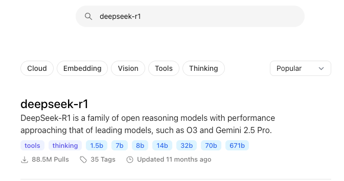
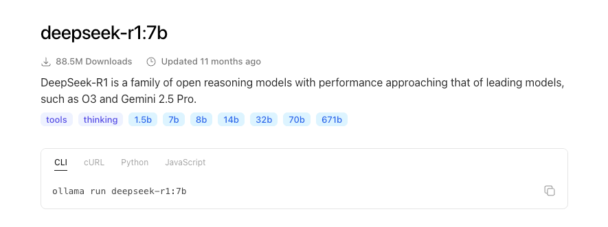

## 一、Ollama 是什么

[Ollama](https://ollama.com/) 是一个**开源的、用来在本地（自己的电脑或服务器）部署和运行大语言模型的框架。**

它主要有这些用处：

1. **本地运行 AI 模型**
   不一定要调用云端 API，可以在本机上聊天、写代码、总结文本、翻译、做问答等。Ollama 官方也强调可以“run entirely offline”，适合需要离线或隐私要求高的场景。

2. **快速下载和管理模型**
   例如安装后执行：

   ```bash
   ollama run qwen
   ```

   或类似命令，就能下载并启动对应模型。Ollama 的模型库支持多种模型，官方 README 也给出了运行 Gemma 等模型的示例。([GitHub](https://github.com/ollama/ollama))

3. **给应用提供本地 AI 接口**
   Ollama 自带 REST API，默认可以通过类似 `http://localhost:11434/api/chat` 的接口调用模型，所以开发者可以把它接到自己的脚本、网站、桌面应用、RAG 知识库或自动化工具里。([GitHub](https://github.com/ollama/ollama))

4. **开发和测试 AI 应用**
   对程序员很有用：可以本地测试提示词、Agent、代码助手、嵌入模型、知识库问答，而不必每次都花钱调用云 API。

5. **隐私和成本控制**
   文档、代码、内部资料可以尽量留在本地处理；模型下载后很多任务可以离线完成，长期使用成本也可能低于频繁调用云端 API。

一句话概括：**Ollama 就像“本地 AI 模型运行器”**。它不等于 ChatGPT 本身，而是一个让你方便地在本机跑开源大模型的工具。

适合你用 Ollama 的情况：你想在自己电脑上跑 AI、学习大模型部署、做本地知识库、保护隐私、或开发 AI 应用。
不太适合的情况：你电脑配置较低，或者你需要最强模型、最快速度、联网搜索和稳定生产级服务；这种时候云端模型通常更省事。

## 二、Ollama 怎么用

#### 1、本机（macOS）

###### 1.1 下载并安装 Ollma

* 下载地址：https://ollama.com/download/mac
* 下载完成后双击安装即可，默认会安装到应用程序目录。安装结束后在终端里输入 `ollama -v` 或 `ollama --version`，如果能看到版本号，代表安装成功

###### 1.2 Ollama 部署和运行大语言模型

* 首先要知道 Ollama 并不是支持所有大语言模型的本地部署，只有它们官方支持的大语言模型才行，在 https://ollama.com/search 这里可以看到 Ollama 官方支持那些大语言模型，这里以 deepseek-r1:7b 为例，v 系列模型动则几百个 G，电脑放不下

  * deepseek version 系列是**通用模型**，这类模型的目标是“什么都能做得比较好，写作、翻译、总结、问答、代码等覆盖面很广，速度快成本低，但是它不擅长特别复杂的数学、逻辑、多步骤推理。deepseek reasoning 系列是**推理模型**，这类模型的目标是“复杂问题想得更深”，它们通常会在回答前花更多 token 和计算资源进行内部推理以便最终答案更准确，所以更适合数学题、算法题、逻辑谜题、复杂代码等多步骤推理，没必要用它来进行简单聊天，因为容易想得太多。简单一句话总结：两个模型都能用来聊天，如果有的问题不用过多思考那就 v 系列，如果需要深入思考那就 r 系列。v3 就是第三个版本的通用模型，r1 就是第一个版本的推理模型。但其实从 v3.1 之后的 v 系列模型都支持开关思考模式了，相当于这个模型混合了之前的 v 系列和 r 系列模型，我们就不用在关心到底使用 v 系列还是 r 系列了，可以总是使用 v 系列，当需要深入思考时就开启**思考模式**——类似于之前用 r 系列，不需要深入思考时就关闭思考模式——类似于之前用 v 系列
  * **蒸馏：**满血版 r1 的参数是 671B——即 671 billion -> 671 十亿 -> 6710 亿参数，参数量大可以认为是某个人的脑容量大，如果用同样的训练数据和训练方法，那么脑容量大的模型肯定要比脑容量小的模型更聪明，它们吸收地东西更多更细，但是这个满血版有 404G，我们电脑上放不下。所以我们会用蒸馏版 r1:7b——即 70 亿参数，模型大小 4.7G，deepseek-r1:7b 和 deepseek-r1:671b 同属 deepseek-r1 系列模型，但是它俩是不同的模型。蒸馏是训练了一个小模型去模仿大模型，这个小模型的参数可能少了很多
  * **量化：**参数都是数字，可以用不同的格式存储，如 FP32（一个参数用 32 位浮点数存储、4 字节）、FP16（一个参数用 16 位浮点数存储、2 字节）、INT8（一个参数用 8 位整型存储、1 字节）、INT4（一个参数用 4 位整型存储、0.5 字节），精度越高能力越强，模型在训练的时候通常用浮点数，因为训练的时候追求学得准、学得稳，训练完部署的时候可以量化，因为部署的时候追求计算机得能存得下模型、得能跑得便宜跑得快，所谓量化就是把每个参数的浮点数存储改成整型存储，比如原来有个参数赌赢的值是 3.14，量化后可能就是 3 了，量化成整型存储主要是为了减小模型大小，当然这有可能使模型变笨
  * 所以决定模型大小的有两个因素：一共有多少参数、参数越大模型肯定越大，这里有个关键词是蒸馏；每个参数用几个字节存储、精度越高模型肯定越大，这里有个关键词是量化。**注意蒸馏和量化都可以让模型更小、更容易部署，但是两者的做法完全不一样，蒸馏是通过减少参数来减小模型的，量化则是通过降低参数精度来减小模型的**

* 搜索 deepseek-r1

  

* 点进来找到各个版本的蒸馏模型

  
  
* 选择并点击我们想要的 deepseek-r1:7b

  

* 复制 `ollama run deepseek-r1:7b` 命令去终端执行，我们就可以在终端里跟这个模型对话了

  * 如果本地没有 deepseek-r1:7b 模型，那么 run 命令会先下载并安装这个模型到本地（会把模型下载到这个目录下 `~/.ollama/models`。blobs 存真正的大模型文件，通常是 sha256-... 这种名字，manifests 存模型标签和元数据，比如 deepseek-r1:7b 指向哪些 blobs，我们可以在终端执行 `ollama list`  命令来查看 Ollama 本地部署了哪些模型），然后再在终端运行这个模型
  * 如果本地有 deepseek-r1:7b 模型，那么 run 命令会直接在终端运行这个模型

  

#### 2、服务器（Linux）

###### 1.1 下载并安装 Ollma

* 下载地址：https://ollama.com/download/linux