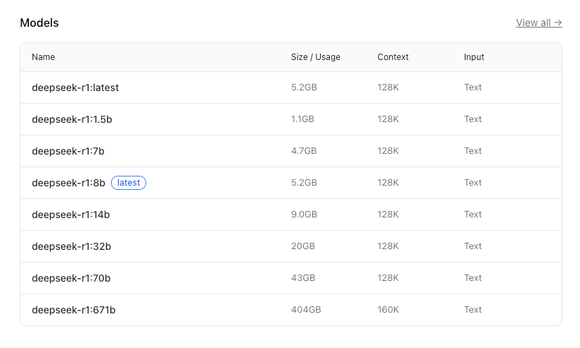
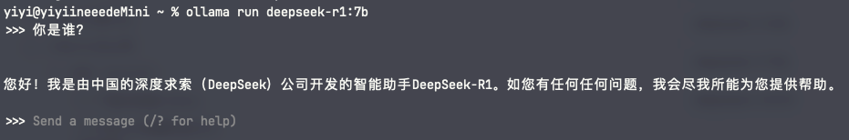
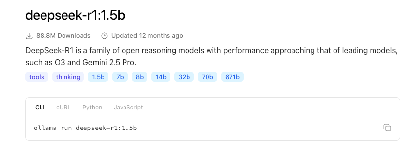
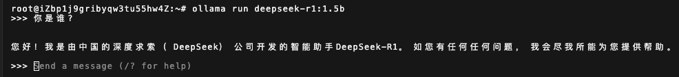
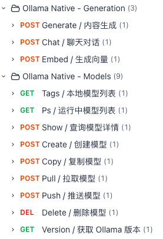

## 一、DeepSeek 简介

* **通用模型、推理模型**：DeepSeek 有两个模型系列，v 系列（version）和 r 系列（reasoning）。**v 系列是通用模型**，这系列模型的目标是“什么都能做得比较好”，写作、翻译、总结、问答、代码等覆盖面很广，速度快成本低，但是它不擅长特别复杂的数学、逻辑、多步骤推理。**r 系列是推理模型**，这系列模型的目标是“复杂问题想得更深”，它们通常会在回答前花更多 token 和计算资源进行内部推理以便最终答案更准确，所以更适合数学题、算法题、逻辑谜题、复杂代码等多步骤推理，没必要用它来进行简单聊天，因为容易想得太多。简单一句话总结：两个系列模型都能用来聊天，如果有的问题你感觉不用过多思考那就用 v 系列，如果需要深入思考那就用 r 系列，deepseek-v3 就是第三个版本的通用模型，deepseek-r1 就是第一个版本的推理模型

* **思考模式**：但其实从 deepseek-v3.1 之后的 v 系列模型都支持开关思考模式了，这些模型相当于是混合了之前的 v 系列模型和 r 系列模型的特点，所以我们就不用再关心到底是使用 v 系列还是 r 系列了，可以总是使用 v 系列，如果需要深入思考那就**开启思考模式——类似于之前用 r 系列**，不需要过多思考那就**关闭思考模式——类似于之前用 v 系列**
* **蒸馏：**满血版 deepseek-r1 的参数是 671b（即 671 billion、671 十亿、6710 亿参数），模型大小是 404GB，一般来说参数量越大模型也越大，模型就会越强。但是对于我们学习过程中的本地部署来说，设备根本放不下这么大的模型，所以我们一般都是用蒸馏版，比如 deepseek-r1:1.5b 的参数是 15 亿、模型大小是 1.1GB，deepseek-r1:7b 的参数是 70 亿、模型大小是 4.7GB，deepseek-r1:1.5b、deepseek-r1:7b 和 deepseek-r1 满血版同属 deepseek-r1 系列模型，但它们是完全不同的三个模型。**所谓蒸馏就是训练了一个小模型去模仿大模型，这个小模型的参数会少很多，所以就会弱很多**
* **量化：**模型的参数都是数字形式，可以用不同的格式存储，如 FP32（一个参数用 32 位浮点数存储、4 字节）、FP16（一个参数用 16 位浮点数存储、2 字节）、INT8（一个参数用 8 位整型存储、1 字节）、INT4（一个参数用 4 位整型存储、0.5 字节），精度越高能力越强。模型在训练的时候通常用浮点数，因为训练的时候追求学得准、学得稳，训练完部署的时候可以量化，因为部署的时候追求计算机得能存得下模型、得能跑得便宜跑得快。**所谓量化就是把每个参数的浮点型存储改成整型存储，比如原来有个参数存储的值是 3.1415926、占 4 字节，量化后就是 3 了、占 1 字节，量化成整型存储主要是为了减小模型大小，当然这有可能使模型变弱**

> 决定模型大小的因素有两个：
>
> * 一共有多少参数，参数越大模型肯定越大，这里有个关键词是蒸馏
> * 每个参数用几个字节存储，精度越高模型肯定越大，这里有个关键词是量化
>
> **注意蒸馏和量化都可以让模型更小、更容易部署，但是两者的做法完全不一样，蒸馏是通过减少参数来减小模型，量化则是通过降低参数精度来减小模型**

## 二、Ollama 是什么

[Ollama](https://ollama.com/) 是一个**开源的、用来在本地（自己的电脑或服务器）部署和运行大语言模型的框架。**它主要有以下用途：

* **本地部署模型**：安装 Ollama 后，只需要在终端执行 `ollama run 模型名称` 命令，就会自动下载和安装指定的模型到本机
* **本地运行模型**： `ollama run 模型名称` 命令用来运行模型，这样一来我们就可以不调用云端 API，而是在本机上聊天、写代码、总结文本、翻译、做问答等，适合需要离线或隐私要求高的场景，长期使用的成本也可能低于频繁调用云端 API
* **给应用提供本地 AI 接口**：Ollama 自带了很多 API，我们可以通过 `http://localhost:11434/api/chat` 之类的接口来调用大模型，所以开发者可以把它接到自己的脚本、网站、应用、RAG 知识库或自动化工具里

## 三、Ollama 怎么用

#### 1、本机（macOS）

###### 1.1 下载并安装 Ollama

* 下载地址：https://ollama.com/download/mac，下载完成后双击安装即可，默认会安装到应用程序目录下
* 此时在终端里输入 `ollama -v` 或 `ollama --version`，如果能看到版本号，代表安装成功

***

* 安装成功后打开 Ollama 这个软件，要保证它一直处于运行状态，后面才能跟大模型对话

###### 1.2 Ollama 部署和运行大语言模型

* 首先要知道 Ollama 并不是支持所有大语言模型的本地部署，只有它们官方支持的大语言模型才行，在 https://ollama.com/search 这里可以看到 Ollama 官方支持那些大语言模型，这里以 deepseek-r1:7b 为例

* 搜索 deepseek-r1

  

* 点进来找到各个蒸馏版模型

  

* 选择并点击我们想要的 deepseek-r1:7b

  

* 复制 `ollama run deepseek-r1:7b` 命令去终端执行，我们就可以在终端里跟这个模型对话了

  * 如果本地没有 deepseek-r1:7b 模型，那么 run 命令会先下载并安装这个模型到本地（会把模型下载到这个目录下 `~/.ollama/models`。blobs 存真正的大模型文件，通常是 sha256-... 这种名字，manifests 存模型标签和元数据，比如 deepseek-r1:7b 指向哪些 blobs，我们可以在终端执行 `ollama list`  命令来查看 Ollama 本地部署了哪些模型），然后再在终端运行这个模型
  * 如果本地有 deepseek-r1:7b 模型，那么 run 命令会直接在终端运行这个模型

  

#### 2、服务器（Linux）

###### 2.1 下载并安装 Ollama

* 在服务器远程连接的终端里执行如下命令即可自动下载并安装 Ollama：`curl -fsSL https://ollama.com/install.sh | sh`
  * 可执行文件默认会安装到 `/usr/local/bin/ollama` 目录下
  * 库文件默认会安装到 `/usr/local/lib/ollama` 目录下
* 此时在终端里输入 `ollama -v` 或 `ollama --version`，如果能看到版本号，代表安装成功

***

* 安装成功后安装脚本还会自动为 Ollama 创建系统服务、自动启动 Ollama、自动设置 Ollama 开机自启动
* 此时在终端里输入 `systemctl status ollama`，如果看到 active(running)，代表 Ollama 处于运行状态

***

* Ollama 默认监听 11434 端口，但是 Ollama 默认只监听 127.0.0.1 这个本机回环地址，而不监听当前服务器以外的其它 IP 地址，这就意味着我们只能在当前服务器上访问 Ollama，而无法在其它客户端访问这台服务器上的 Ollama。**实际开发中也确实就是这样的模式，客户端通过 https://api.xxx.com/chat 这样的业务 API 访问服务器，服务器上业务 API 内部再通过 http://localhost:11434/api/chat 来访问 Ollama，而不是将 Ollama 直接暴露给客户端访问。**终端里执行 `ss -lntp | grep 11434`，可以查看是哪个进程在监听 11434 端口、监听在哪个地址上

  ```ini
  root@iZbp1j9gribyqw3tu55hw4Z:~# ss -lntp | grep 11434
  LISTEN 0      4096       127.0.0.1:11434      0.0.0.0:*    users:(("ollama",pid=12632,fd=4))
  
  # 可见 ollama 的确默认监听 11434 端口、监听在 127.0.0.1 这个本地回环地址上
  # 0.0.0.0:* 是等待任意客户端来连接的意思，等待任意客户端来连接并不等于任意客户端都能连接通
  ```

* 此时在终端里输入 `curl http://127.0.0.1:11434/api/tags`，如果看到 {"models":[]}，代表 Ollama 服务的 API 是通的

* 当然在学习过程中，如果你非要将 Ollama 直接暴露给客户端访问也是可以的，只需要改一下配置文件即可（注意不要直接改 `/etc/systemd/system/ollama.service`，用 `systemctl edit ollama` 更规范，它会创建 override 配置，后续更新或重装 Ollama 时不容易被覆盖）

  * 终端里执行：

    ```shell
    mkdir -p /etc/systemd/system/ollama.service.d
    
    cat > /etc/systemd/system/ollama.service.d/override.conf <<'EOF'
    [Service]
    Environment="OLLAMA_HOST=0.0.0.0:11434"
    Environment="OLLAMA_ORIGINS=*"
    EOF
    
    # 第一项配置的作用：让 Ollama 从只监听 127.0.0.1:11434，改成监听 0.0.0.0:11434，也就是允许外部任意网络连到这个端口
    # 第二项配置的作用：处理浏览器跨域问题，如果你要在浏览器页面里直接访问 Ollama 那就得加这一项
    ```

  * 终端里执行 `systemctl daemon-reload` ，让 systemd 重新读取 Ollama 服务配置文件

  * 终端里执行 `systemctl restart ollama`，重启 Ollama 服务

  * 终端里执行 `ss -lntp | grep 11434`，确定 Ollama 监听的地址已变成任意公网地址

    ```ini
    root@iZbp1j9gribyqw3tu55hw4Z:~# ss -lntp | grep 11434
    LISTEN 0      4096       0.0.0.0:11434      0.0.0.0:*    users:(("ollama",pid=12632,fd=4))
    
    # 可见 ollama 的确默认监听 11434 端口、监听在 0.0.0.0 任意网络地址上
    # 0.0.0.0:* 是等待任意客户端来连接的意思，等待任意客户端来连接并不等于任意客户端都能连接通
    ```

  * 然后在服务器的网络与安全组里放行 11434 端口
  * 此时在浏览器里输入 `http://120.27.201.91:11434/api/tags`，如果看到 {"models":[]}，代表 Ollama 服务的 API 是通的

***

* 常用 systemctl 命令

```shell
systemctl status ollama   # 查看运行状态
systemctl start ollama    # 启动
systemctl stop ollama     # 停止
systemctl restart ollama  # 重启
```

###### 2.2 Ollama 部署和运行大语言模型

* 首先要知道 Ollama 并不是支持所有大语言模型的本地部署，只有它们官方支持的大语言模型才行，在 https://ollama.com/search 这里可以看到 Ollama 官方支持那些大语言模型，这里以 deepseek-r1:1.5b 为例

* 搜索 deepseek-r1

  

* 点进来找到各个蒸馏版模型

  

* 选择并点击我们想要的 deepseek-r1:1.5b

  

* 复制 `ollama run deepseek-r1:1.5b` 命令去终端执行，我们就可以在终端里跟这个模型对话了

  * 如果本地没有 deepseek-r1:1.5b 模型，那么 run 命令会先下载并安装这个模型到本地（会把模型下载到这个目录下 `/usr/share/ollama/.ollama/models`。blobs 存真正的大模型文件，通常是 sha256-... 这种名字，manifests 存模型标签和元数据，比如 deepseek-r1:1.5b 指向哪些 blobs，我们可以在终端执行 `ollama list`  命令来查看 Ollama 本地部署了哪些模型），然后再在终端运行这个模型
  * 如果本地有 deepseek-r1:1.5b 模型，那么 run 命令会直接在终端运行这个模型

  

#### 3、Ollama 提供的访问大模型的接口



* 接口的官方文档：https://docs.ollama.com/api/introduction
* AI 根据官方文档生成的中文版接口文档：[ollama_openapi.json](ollama_openapi.json)
* 中文版接口文档导入 Apifox：https://s.apifox.cn/0aced474-3fce-444d-a0ff-39473bdee79e


在 `/api/chat` 这类聊天对话接口里，模型每次接收到的信息并不仅仅是本轮对话用户发给它的那句话，而是一个完整的对话历史消息数组：

```json
{
  "messages": [
    // 这里是系统提示词
    {
      "role": "system",
      "content": "你是一个地理老师"
    },
    
    // 注意：这里是系统提示词的示例部分（严格来讲叫“少样本示例”），而不是用户提示词，用来让模型参考学习的
    {
      "role": "user",
      "content": "中国的首都是哪里？"
    },
    {
      "role": "assistant",
      "content": "北京"
    },
    
    // 这里是之前的对话历史
    {
      "role": "user",
      "content": "浙江的省会是哪里？"
    },
    {
      "role": "assistant",
      "content": "杭州"
    },
    
    // 这里是本轮对话的用户问题
    {
      "role": "user",
      "content": "西湖在哪个区？"
    }
  ]
}
```

这里的 role 就是在告诉模型，每段 content 是什么角色说的话：

* system：系统指令，一般用来对应系统提示词的非示例部分
* user：一般用来对应用户提示词
* assistant：一般用来对应模型的回复

但需要注意的是这里的 role 不是代表提示词类型，它只是代表某条消息类型，就像我们上面的例子那样系统提示词里可以包含 system、user、assistant 类型的消息

#### 4、Ollama 常用命令

| 系统命令                | 说明                                                         |
| ----------------------- | ------------------------------------------------------------ |
| ollama list             | 查看本地部署了哪些模型                                       |
| ollama show ${模型名字} | 查看某个模型的详细信息                                       |
| ollama rm ${模型名字}   | 移除某个模型                                                 |
| ollama run ${模型名字}  | 如果本地没部署该模型，则先下载后运行<br />如果本地部署了该模型，则直接运行 |
| ollama ps               | 查看正在运行的模型                                           |
| ollama stop ${模型名字} | 停止运行某个模型                                             |

| 交互式会话命令（会话内执行） | 说明                                 |
| ---------------------------- | ------------------------------------ |
| /load ${模型名字}            | 切换模型                             |
| /clear                       | 清空当前对话上下文，重新开始一次会话 |
| /bye                         | 退出当前聊天，回到命令行             |
