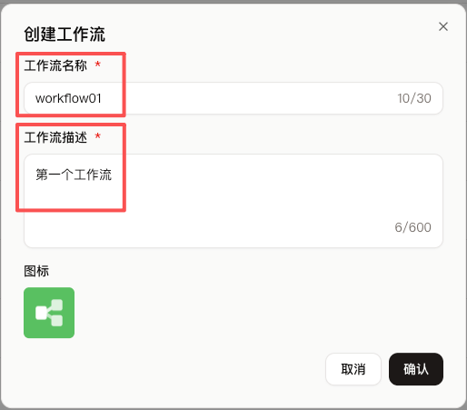

## 一、概念

```
【账号】
│
└─【项目】（独立交付单元）
     ├─ 智能体
     └─ 应用
└─【资源库】（全局共享资源）
     ├─ 插件
     ├─ 工作流
     ├─ 知识库
     ├─ 卡片
     ├─ 提示词
     ├─ 数据库
     ├─ 音色
     └─ 记忆库
```

* 一个账号下可以创建多个项目，项目的类型主要有**智能体**、应用
* 一个账号下只有一个资源库、但是这个资源库下可以创建多个资源，资源的类型主要有**插件**、**工作流**、**知识库**、卡片、提示词、数据库、音色、记忆库
* 每个项目都可以引用资源库里的资源

***

* **智能体：通常以对话框的形式存在，自主完成某项任务**
* 应用：通常以用户界面的形式存在，自主完成某项任务

***

* **插件**：插件是对工具的打包，换句话说一个插件里可以创建多个工具，而**一个工具则是对一个可复用能力的封装，它非常像代码世界里的工具函数、只写能力不写业务**。比方说我们创建了一个插件 gpt-image-2，它里面打包了两个工具 generations、edits，generations 工具封装的是生成图片（文生图）的能力、edits 工具封装的是编辑图片（图生图）的能力
* **工作流：一个工作流则是对一个可复用 SOP 的封装，它非常像代码世界里的业务函数、会写一大堆业务逻辑来真正完成某个业务。**比方说我们创建一个工作流 ai_zhengjianzhao，它封装的是接收参数、预处理参数、调用工具、结构化输出【根据一张图片生成证件照】的标准操作流程
* **知识库：知识库通常用来存放企业或个人的私有资料文档。**大模型虽然懂很多通用知识，但它通常不知道你们公司的产品说明、你们公司的员工手册、你们公司的客服话术等，于是你可以把这些资料上传到知识库，这样一来用户提问关于你们公司的问题后，智能体就会根据“自动调用知识库”或“按需调用知识库”的配置来访问知识库里的私有资料，回答会更准确
* 卡片、提示词、数据库、音色、记忆库：......

## 二、工作流的使用

#### 1、创建工作流


***



#### 2、工作流节点


* 工作流默认包含开始和结束两个节点
* 开始节点：工作流的入口，一般用来指定外界应该给工作流传哪些变量进来
* 结束节点：工作流的出口，一般用来指定工作流应该给外界返哪些变量出去（返回变量模式时，所有的变量会以 JSON 格式返回；返回文本模式时，所有的变量会以自定义格式返回

| 类型                             | 示例                                         |
| -------------------------------- | -------------------------------------------- |
| Boolean，布尔类型                | true、false                                  |
| Integer，整型                    | 18、0、-3                                    |
| Number，数值类型 = 整型 + 浮点型 | 18、19.9、-0.25                              |
| String，字符串类型               | "张三"                                       |
| Array，数组类型                  | ["张三", "李四"]                             |
| Object，对象类型、字典类型       | { "name": "张三", "age": 18 }                |
| File，文件类型                   | 图片、音频、视频、文档等需要从本地上传的文件 |
| Time，日期类型                   | 2026-07-30 17:30:00                          |

***


* 我们也可以根据需求添加节点
* 节点有很多类型，比如节点可以是一个大模型、可以是一个插件、可以是另外一个工作流、可以是一个知识库、可以是一段代码等等

***


* 我们这里添加一个大模型节点
* 模型：选择一个模型，还可以设置模型
* 技能：给模型添加工具