**工作流：一个工作流是对一个可复用 SOP 的封装，它非常像代码世界里的业务函数、会写一大堆业务逻辑来真正完成某个业务。**比方说我们创建一个工作流 ai_zhengjianzhao，它封装的是接收参数、预处理参数、调用工具、结构化输出【根据一张图片生成证件照】的标准操作流程

## 一、创建工作流

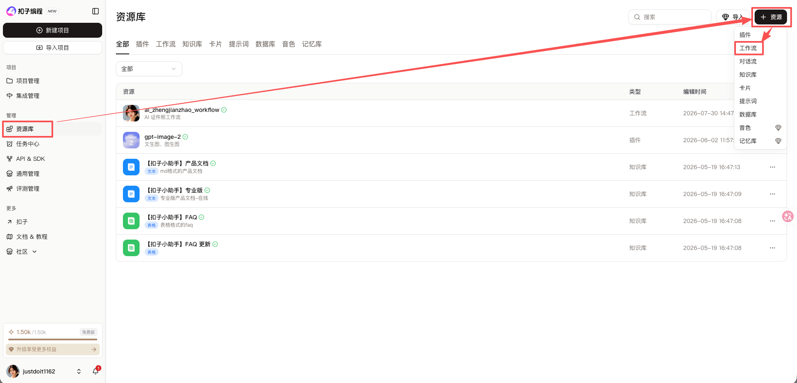

***

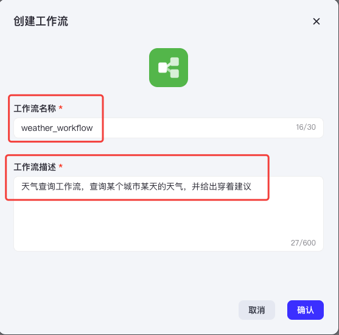

## 二、编辑工作流节点

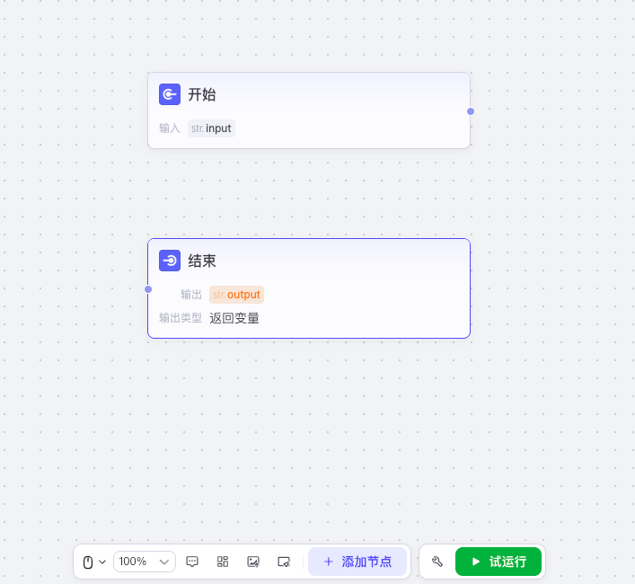

* 工作流默认包含开始和结束两个节点
* 开始节点：工作流的入口，一般用来指定外界应该给工作流传哪些变量进来，输入变量必须在用户提示词或系统提示词中使用
  * 我们这里的天气查询工作流，需要外界传递“城市 city”、“日期 date”这两个变量进来
* 结束节点：工作流的出口，一般用来指定工作流应该给外界返哪些变量出去（返回变量模式时，所有的变量会以 JSON 格式返回；返回文本模式时，所有的变量会以自定义格式返回）
  * 我们这里的天气查询工作流，会给外界返回 "🏙 城市：杭州\n📅 日期：2026-07-30\n☁️ 天气：晴热，最高气温38℃以上，发布高温橙色预警\n👕 穿着：建议穿着短袖、短裤等轻薄透气的夏季衣物，外出做好防晒、防暑措施"这样的文本出去

| 类型                             | 示例                                         |
| -------------------------------- | -------------------------------------------- |
| Boolean，布尔类型                | true、false                                  |
| Integer，整型                    | 18、0、-3                                    |
| Number，数值类型 = 整型 + 浮点型 | 18、19.9、-0.25                              |
| String，字符串类型               | "张三"                                       |
| Array，数组类型                  | ["张三", "李四"]                             |
| Object，对象类型、字典类型       | { "name": "张三", "age": 18 }                |
| File，文件类型                   | 图片、音频、视频、文档等需要从本地上传的文件 |
| Time，日期类型                   | 2026-07-30 17:30:00                          |

***

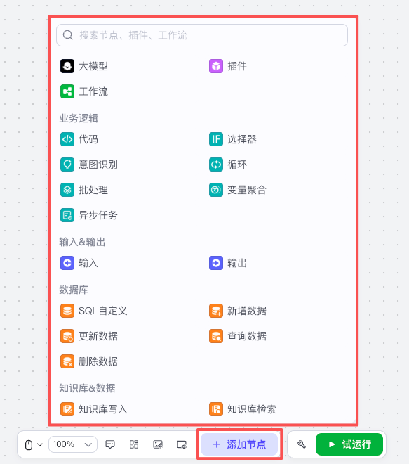

* 我们也可以根据需求添加节点
* 节点有很多类型，比如节点可以是一个大模型、可以是一个插件、可以是另外一个工作流、可以是一个知识库、可以是一段代码等等

***

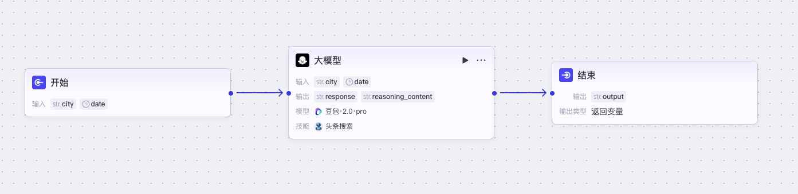

* 我们这里添加一个大模型节点，并通过拖线的方式把节点与节点连接起来，代表它们的数据流向
* 模型：选择一个模型，还可以设置模型
  * 我们这里选择“豆包 · 2.0 · pro”，模型设置全部采取默认
* 技能：给模型添加工具
  * 我们这里添加一下“头条搜索”的“search”工具，让大模型能去网上搜索天气
* 输入：大模型节点的入口，一般用来指定外界应该给大模型节点传哪些变量进来，这些变量一般会用在系统提示词或用户提示词里，最终发给大模型
  * 我们这里把开始节点的变量全都传进来
* 系统提示词：一般包含角色、背景、目标、约束、步骤、输出格式、示例、验收标准
  * 我们这里的系统提示词为“你是一个天气查询助手。你的目标是帮助用户查询某个城市某天的天气，并给出穿着建议。不要解释、不要长篇大论。严格按照如下格式输出：🏙 城市：xxx 📅 日期：xxx ☁️ 天气：xxx 👕 穿着：xxx”
* 用户提示词：用户本轮对话的输入
  * 我们这里的用户提示词为“城市：{{city}} 日期：{{date}}”
* 输出：大模型的出口，一般用来指定大模型节点应该给外界返哪些变量出去（返回文本模式时，所有的变量会以普通文本格式返回；返回 Markdown 模式时，所有的变量会以 Markdown 文本格式返回；返回 JSON 模式时，所有的变量会以 JSON 格式返回）
  * 我们这里把大模型的回答直接作为大模型节点的输出，并且以 Markdown 返回，这样后续的结束节点直接拿着这个结果返回给外界即可
* 异常处理：可以设置异常处理策略
  * 我们这里全部采取默认

***

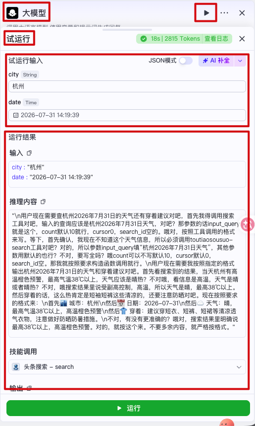

* 节点编写完毕后，我们可以试运行节点来看看节点是否满足我们的输入和输出期望，不满足的话就修复

## 三、试运行工作流

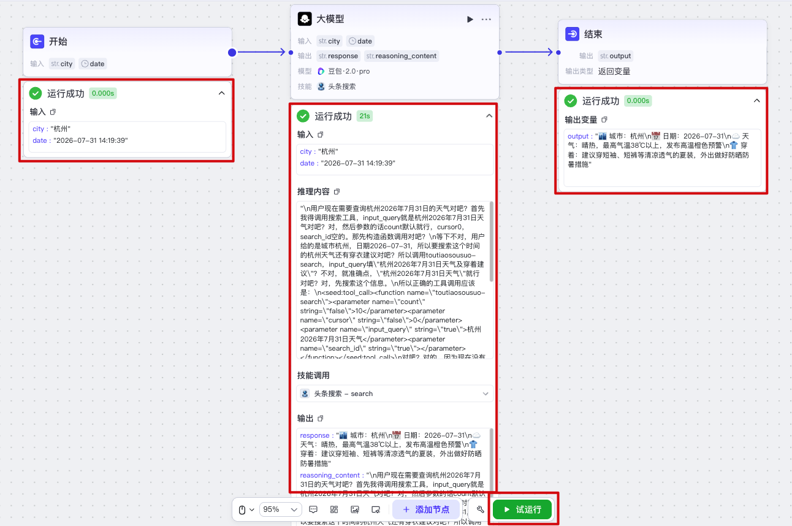

* 工作流编写完毕后，我们可以试运行工作流来看看工作流是否满足我们的输入和输出期望，不满足的话就修复

## 四、发布工作流

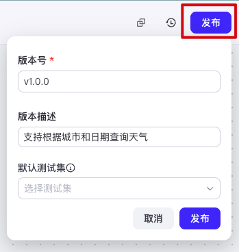

* 工作流试运行完毕后，我们需要发布工作流，只有发布了的工作流才能被智能体引用或以 API 的方式被调用。并且工作流发布了新版本后，使用了这个工作流的智能体或 API 会自动使用发布的最新版本

## 五、调用工作流 API（智能体里也能使用）

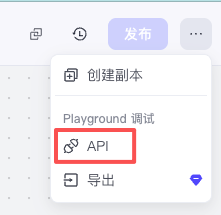

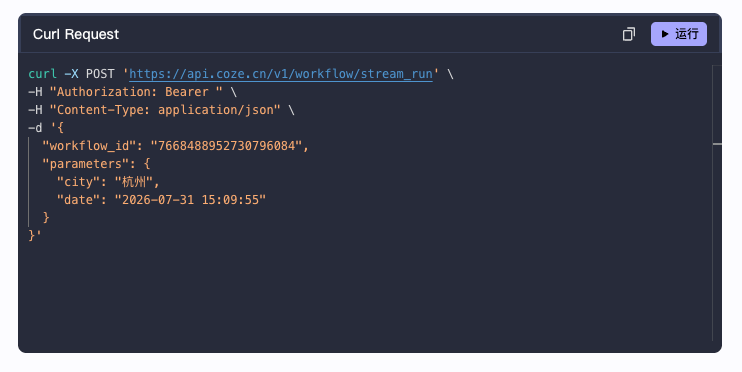

* 工作流发布后，我们还可以在代码里通过 API 的形式来调用工作流

## 六、其它常用节点

#### 1、代码节点

**代码节点类似于一个函数，一般用来通过代码的方式预处理参数，并输出预处理后的参数**

| 配置项 | 说明                                                         |
| ------ | ------------------------------------------------------------ |
| 输入   | 用来接收所有需要预处理的参数，将来在函数里可以通过 `params["输入变量名"]` 的方式获取到 |
| 代码   | * 仅支持 Python 和 JS 两种语言，仅支持编写一个函数 * 在函数内部可以通过 `params["输入变量名"]` 的方式来获取到所有需要预处理的参数 * 然后就是按需求编写函数来预处理参数 * 函数的返回值必须是一个对象，对象的属性名和下面“输出”的变量名必须完全一致 |
| 输出   | 用来输出预处理后的参数，会一一匹配读取函数返回对象的属性及其值 |

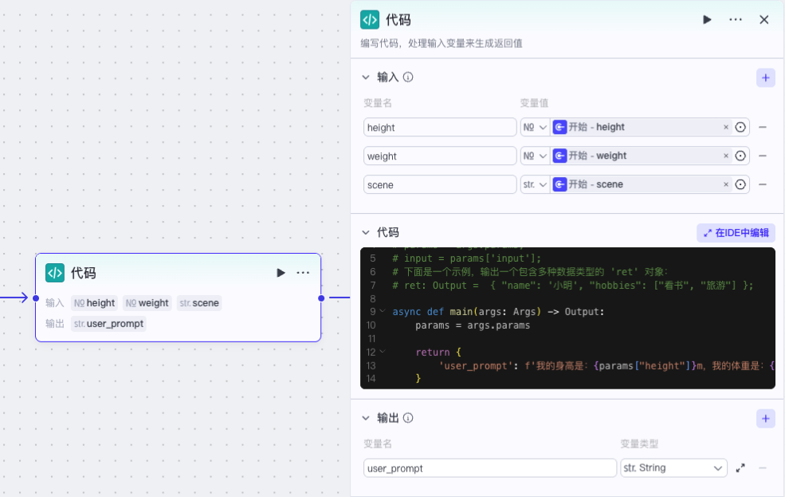

#### 2、选择器节点

**选择器节点类似于一个 if-else 语句，满足条件时走一条路径，否则走另外一条路径**（注意：选择器节点没有输入变量和输出变量，它只负责引用其它节点的变量来设定条件，并决定几个不同的输出路径）

| 配置项   | 说明           |
| -------- | -------------- |
| 条件分支 | 用来写判断条件 |

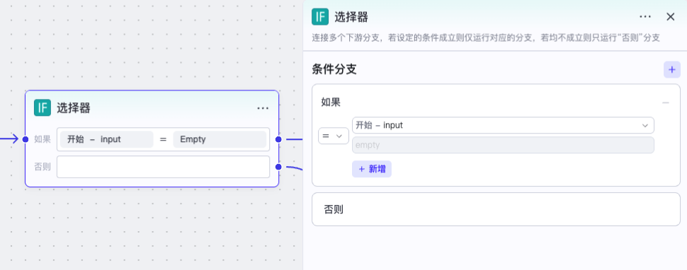

#### 3、意图识别节点

**意图识别节点 = 大模型节点 + 选择器节点，它合并了这两个节点的功能，可以使工作流运行更高效。简单地说意图识别节点就是通过大模型来理解用户所输入自然语言的意图，然后将不同的意图流转到不同的路径分支去处理。极速模式强调意图识别的速度，不支持设置系统提示词；完整模式强调意图识别的准确度，支持设置系统提示词。**典型的场景如下：

* 客户服务：识别用户问题的类型，并转交各类知识库处理，对于知识库中未匹配的问题，转交人工客服处理
* 医疗咨询：对用户咨询的医学问题进行归类，非医学问题的咨询则拒绝回复
* 综合类智能体：对于功能多样的智能体，可以先由意图识别节点对用户咨询进行初步分类，转交各个 Agent 分支处理

| 配置项     | 说明                                                         |
| ---------- | ------------------------------------------------------------ |
| 模型       | 选择执行意图识别的大模型                                     |
| 输入       | 需要被大模型理解的原内容，一般就是引用用户的自然语言输入     |
| 意图匹配   | 意图的枚举选项，最多支持 50 个意图 枚举选项的 ID 值从上往下从 1 依次往上累加，其他意图的 ID 值为 0 |
| 系统提示词 | Coze 默认已经指定了系统提示词，来指导大模型合理识别用户意图并分类 但是我们仍然可以在这里追加系统提示词，比如提供各个意图的示例，使模型分类更精准 |
| 输出       | 输出固定是两个参数： * classificationId：意图 ID * reason：分类的原因和依据，由模型自动生成 |

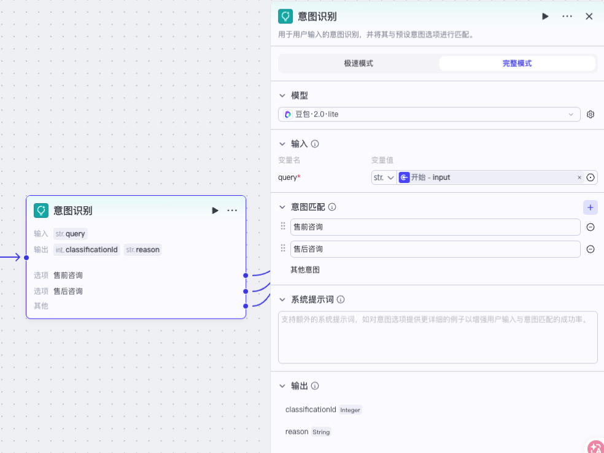

#### 4、循环节点

**循环节点类似于一个 for 语句或 while 语句，用来重复执行一系列任务，多次循环之间严格串行执行**

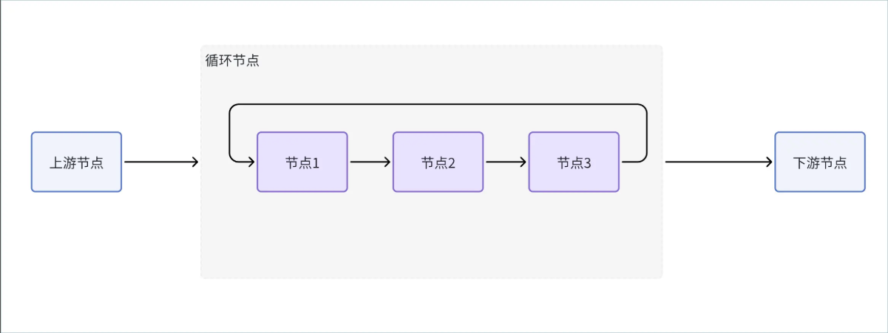

###### 4.1 使用数组循环

| 配置项   | 说明                                                         |
| -------- | ------------------------------------------------------------ |
| 循环类型 | * 使用数组循环类似一个 for 语句，循环次数为数组的长度 * 无限循环类似于一个 while 语句，必须配合“选择器”、“终止循环”节点提供一个终止循环条件 * 指定循环次数循环用 for 语句或 while 语句都能实现，循环次数为指定的次数 |
| 循环数组 | * 必须指定循环数组，并且该变量仅支持引用上游节点的输出，且必须是数组格式 * 循环节点会遍历数组中的每个元素，每次循环都会将当前循环到的元素和索引赋值给内置变量。内置变量有 item 和 index，仅供循环体内的节点使用 |
| 循环体   | 循环体每次循环只接收一个元素，也只输出本次循环的一个结果     |
| 输出     | 循环节点的输出参数可设置为循环体的执行结果集合，表示当数组中所有元素运行完毕之后，将所有循环的运行结果打包输出给下游 |
| 中间变量 | * 循环节点支持设置中间变量，此变量可作用于每一次循环 * 中间变量通常和循环体中的“设置变量”节点搭配使用，在每次循环结束后为中间变量设置一个新的值，并在下次循环中使用新值 |

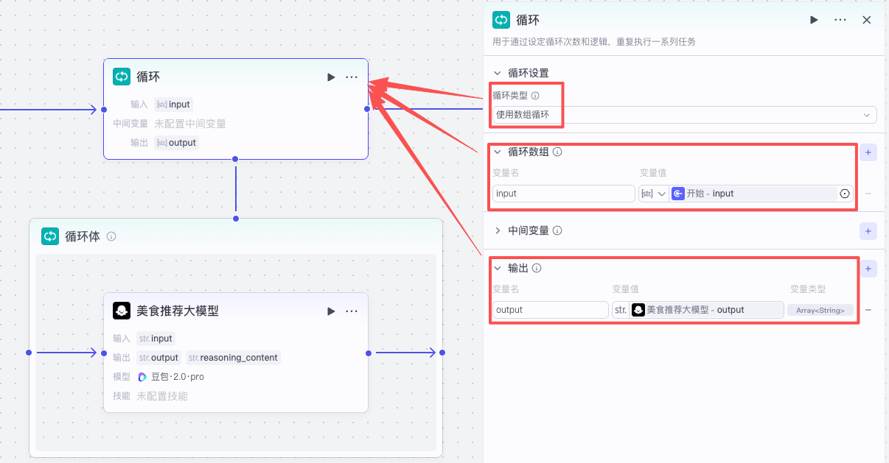

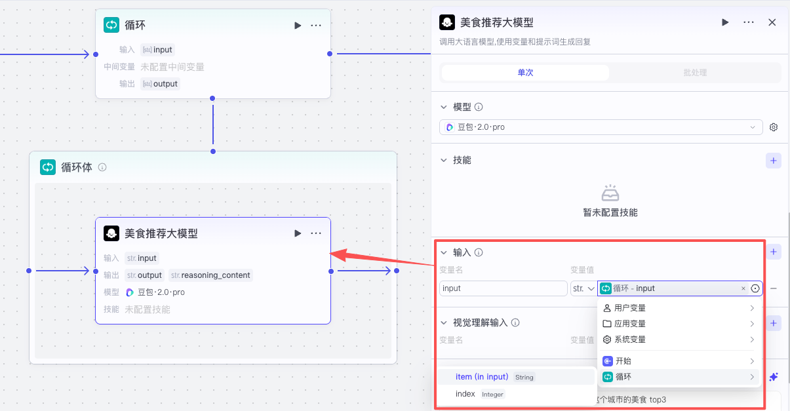

###### 4.2 无限循环、直到满足某个条件为止

| 配置项   | 说明                                                         |
| -------- | ------------------------------------------------------------ |
| 循环类型 | * 无限循环类似于一个 while 语句，必须配合“选择器”、“终止循环”节点提供一个终止循环条件 * 使用数组循环类似一个 for 语句，循环次数为数组的长度 * 指定循环次数循环用 for 语句或 while 语句都能实现，循环次数为指定的次数 |
| 循环体   | * 循环节点只会抛一个 index 给内置变量 * 循环体每次循环只能接收到 index，所以得我们自己处理元素，也只输出本次循环的一个结果 |
| 输出     | 循环节点的输出参数可设置为循环体的执行结果集合，表示当数组中所有元素运行完毕之后，将所有循环的运行结果打包输出给下游 |
| 中间变量 | * 循环节点支持设置中间变量，此变量可作用于每一次循环 * 中间变量通常和循环体中的“设置变量”节点搭配使用，在每次循环结束后为中间变量设置一个新的值，并在下次循环中使用新值 |

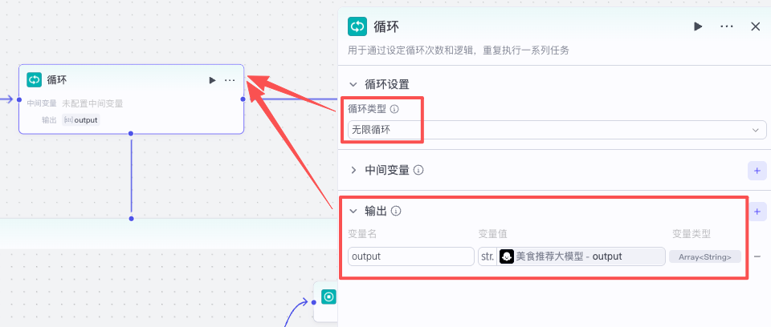

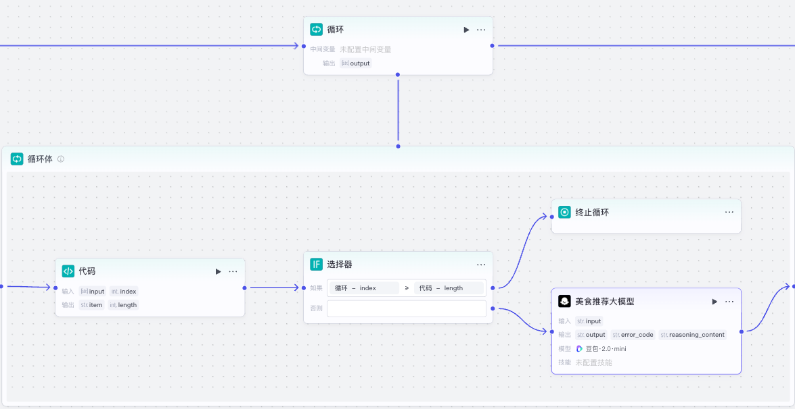

###### 4.3 指定循环次数循环

| 配置项   | 说明                                                         |
| -------- | ------------------------------------------------------------ |
| 循环类型 | * 指定循环次数循环用 for 语句或 while 语句都能实现，循环次数为指定的次数 * 使用数组循环类似一个 for 语句，循环次数为数组的长度 * 无限循环类似于一个 while 语句，必须配合“选择器”、“终止循环”节点提供一个终止循环条件 |
| 循环次数 | 循环次数默认为 10 次，支持设置为 1~1000 次，也可以引用上游节点数值类型的输出参数 |
| 循环体   | * 循环节点只会抛一个 index 给内置变量 * 循环体每次循环只能接收到 index，所以得我们自己处理元素，也只输出本次循环的一个结果 |
| 输出     | 循环节点的输出参数可设置为循环体的执行结果集合，表示当数组中所有元素运行完毕之后，将所有循环的运行结果打包输出给下游 |
| 中间变量 | * 循环节点支持设置中间变量，此变量可作用于每一次循环 * 中间变量通常和循环体中的“设置变量”节点搭配使用，在每次循环结束后为中间变量设置一个新的值，并在下次循环中使用新值 |

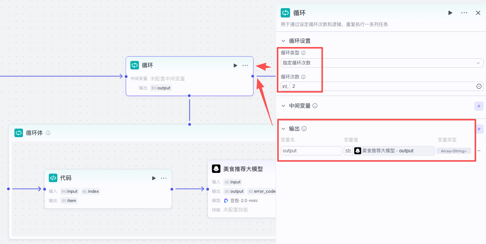

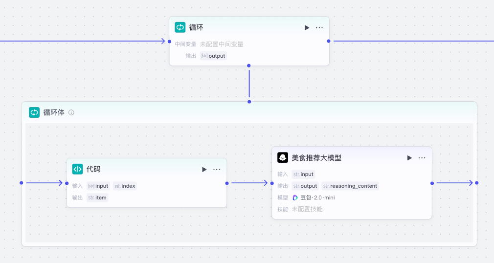

#### 5、输入节点

**输入节点用于在工作流运行期间收集用户输入。**在比较复杂的工作流场景中，我们可能无法在开始节点处就确定所有该让用户给工作流传进来的变量，有的变量只能在工作流运行期间才能确定，此时我们就可以**在任何需要新变量的节点前添加一个输入节点来主动收集用户输入**。工作流执行到输入节点时会暂时中断，直到此节点收集到必要的用户输入

| 配置项   | 说明                                                         |
| -------- | ------------------------------------------------------------ |
| 输入变量 | 需要向用户收集的变量 工作流在执行此节点时，只有收集到所有必选参数之后才会继续执行后续节点 |

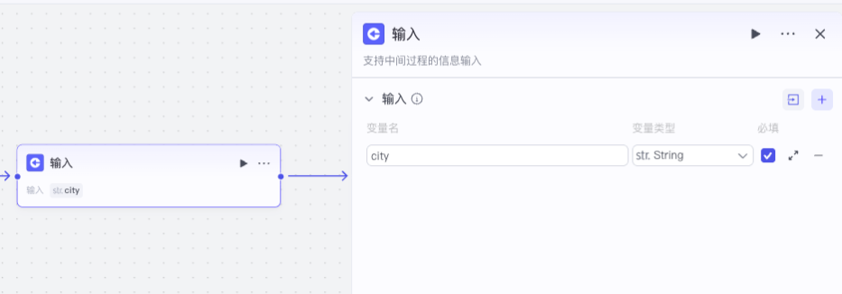

***

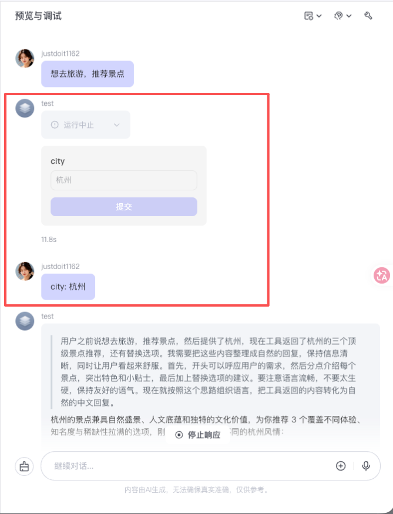

#### 6、输出节点

**输出节点用于在工作流运行期间输出指定的消息内容给用户看。**通常情况下，工作流会在执行完毕后通过结束节点输出最终的执行结果，但是当工作流处理流程较长、运行时间较久时，我们就可以**在耗时操作节点的前面添加一个输出节点**，临时输出一段消息，避免用户等待时间过长、放弃对话。例如提示用户“正在执行中...”等 Loading 状态展示或安抚语，建议用户耐心等待

| 配置项   | 说明                                                         |
| -------- | ------------------------------------------------------------ |
| 输出变量 | 输出变量用于定义输出内容中可引用的变量，支持添加多个变量 每个变量均需要设置参数名和参数值，其中参数值可指定为某个固定值，或引用上游节点的输出变量 |
| 输出内容 | 在工作流运行期间，智能体将直接使用这里指定的内容回复对话 注意是直接把这里的输出内容作为一轮对话的回复、而不是 placeholder 所以就算耗时操作执行完毕后，这个回复也不会被覆盖 我们可以在输出内容中使用`{{变量名}}`的方式引用输出变量中定义的变量 |

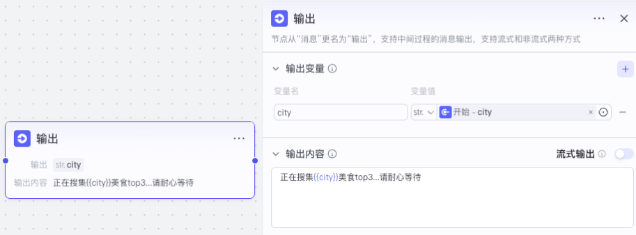

***

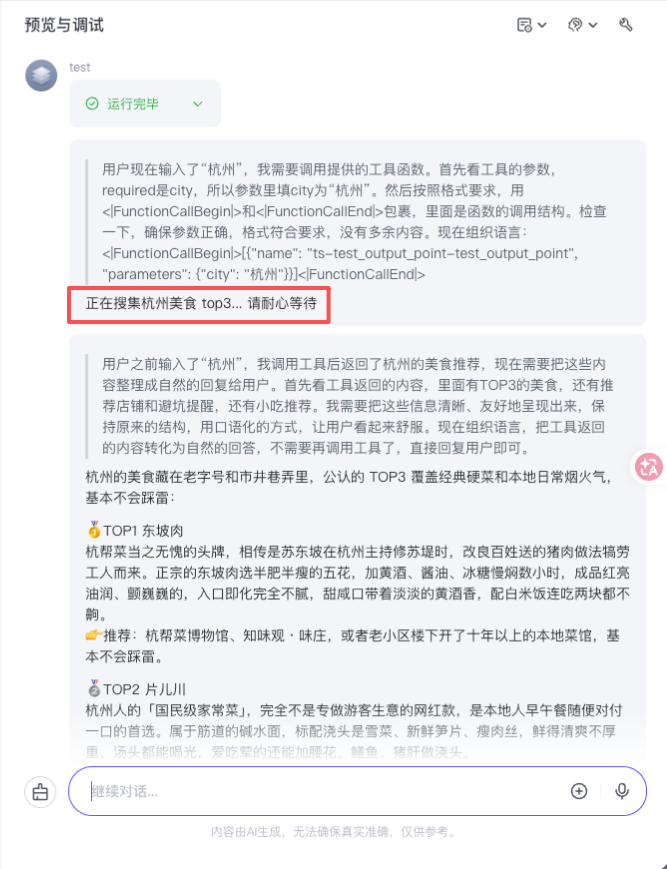
