**插件**：插件是对工具的打包，换句话说一个插件里可以创建多个工具，而**一个工具则是对一个可复用能力的封装，它非常像代码世界里的工具函数、只写能力不写业务**。比方说我们创建了一个插件 gpt-image，它里面打包了两个工具 text-to-image、image-to-image，text-to-image 工具封装的是生成图片（文生图）的能力、image-to-image 工具封装的是编辑图片（图生图）的能力

## 一、创建插件（基于已有 API 创建插件）

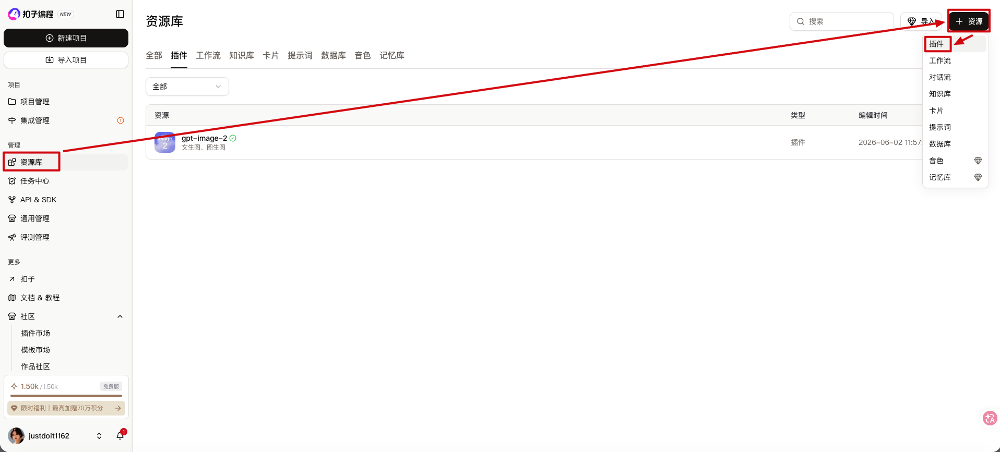

***

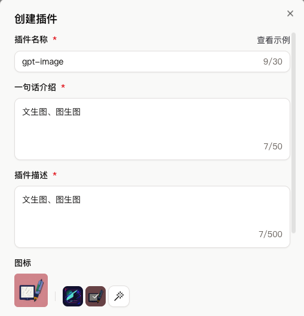

***

| 配置项             | 说明                                                         |
| ------------------ | ------------------------------------------------------------ |
| 类型               | 选择【云侧插件】                                             |
| 插件工具创建方式   | 选择【云侧插件 - 基于已有服务创建】                          |
| 配置为知识库连接器 | 选择【关闭】，默认即可                                       |
| 插件 URL           | 填写【已有 API 的 BaseUrl】 * Url 必须得是域名格式，暂不支持 IP 地址格式 * 同一个插件内的不同工具必须使用相同的域名 |
| Header 列表        | 填写【已有 API 的请求头列表】 * api_key 不放在这里填写，放在授权方式那里填写 |
| 授权方式           | 选择【Service - Service Token / API Key】 * 参数位置：选择【Header】 * 参数名称：填写【Authorization】 * 参数值：填写【Bearer <Your_API_Key>】 |

| 插件类型                                                    | 插件 API                                                    |
| ----------------------------------------------------------- | ----------------------------------------------------------- |
| 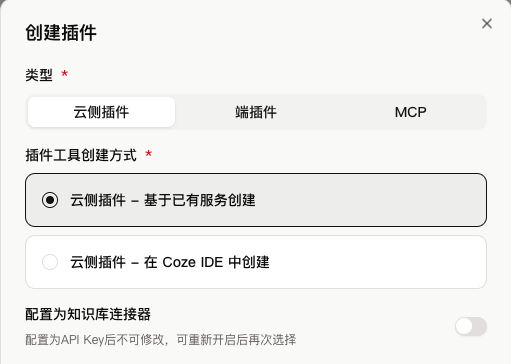 | 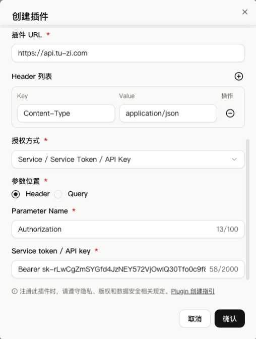 |

## 二、创建插件里的工具

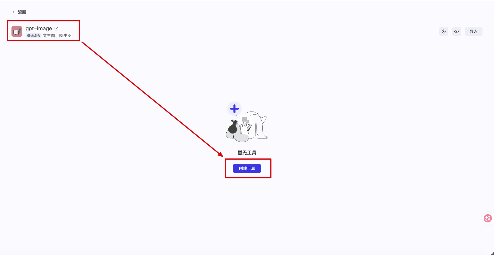

***

| 文生图                                                      | 图生图                                                      |
| ----------------------------------------------------------- | ----------------------------------------------------------- |
|  |  |

***

* 更多信息

| 配置项   | 说明                                                         |
| -------- | ------------------------------------------------------------ |
| 工具路径 | 填写【已有 API 的完整请求路径】 * 如果 API 没有请求路径，直接填写 `/` 即可 * 如果需要在 API 的请求路径里插入变量，可以使用大括号 `{}` 包裹变量名作为占位符，例如 `https://www.example.com/api/{id}/getTime` 然后在后续配置输入参数时，新增一个和变量名同名的输入参数，并将参数的传入方法设置为 Path |
| 请求方法 | 选择【选择已有 API 的请求方式】                              |

| 文生图                                                      | 图生图                                                      |
| ----------------------------------------------------------- | ----------------------------------------------------------- |
| 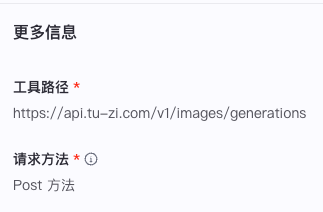 | 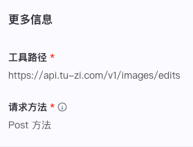 |

***

* 配置输入参数

| 配置项   | 说明                                                         |
| -------- | ------------------------------------------------------------ |
| 参数名   | 参数名称，支持字母、数字或下划线。                           |
| 参数描述 | 参数描述。准确的参数描述可以帮助用户或 LLM 理解当前参数的作用。 |
| 参数类型 | 参数的数据类型。                                             |
| 传入方法 | 参数传入方法。可选值： * Body：请求参数 * Path：路径参数 * Query：查询参数 * Header：请求头参数 |
| 是否必填 | 参数是否必填。 * 打开开关表示当前参数为必填参数。  * 关闭开关表示当前参数为选填参数。 |
| 默认值   | 设置参数的默认值。                                           |
| 开启     | 当参数设置为不可见时，插件的使用者和大模型将无法看到该参数。 如果该参数设置了默认值并且不可见，则在调用插件时，智能体会默认只使用这个设定值。 |

| 类型                             | 示例                                         |
| -------------------------------- | -------------------------------------------- |
| Boolean，布尔类型                | true、false                                  |
| Integer，整型                    | 18、0、-3                                    |
| Number，数值类型 = 整型 + 浮点型 | 18、19.9、-0.25                              |
| String，字符串类型               | "张三"                                       |
| Array，数组类型                  | ["张三", "李四"]                             |
| Object，对象类型、字典类型       | { "name": "张三", "age": 18 }                |
| File，文件类型                   | 图片、音频、视频、文档等需要从本地上传的文件 |
| Time，日期类型                   | 2026-07-30 17:30:00                          |

| 文生图                                                      | 图生图                                                      |
| ----------------------------------------------------------- | ----------------------------------------------------------- |
| 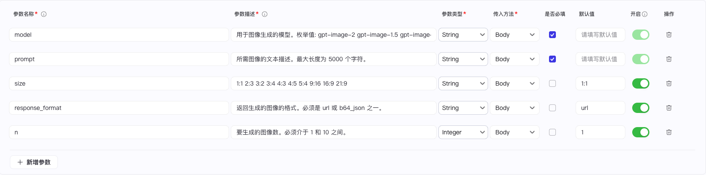 | 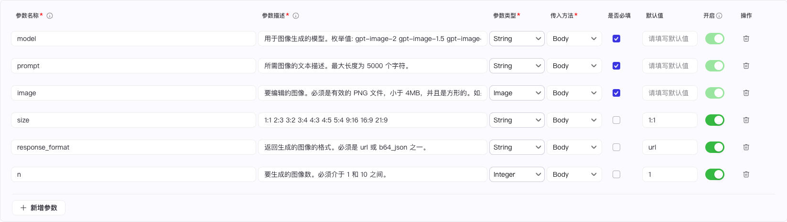 |

***

* 配置输出参数

我们可以单击自动解析，接口调用成功后，会将返回参数自动填充到输出参数列表，当然我们也可以手动设置输出参数

| 文生图                                                      | 图生图                                                      |
| ----------------------------------------------------------- | ----------------------------------------------------------- |
| 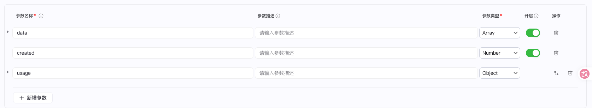 | 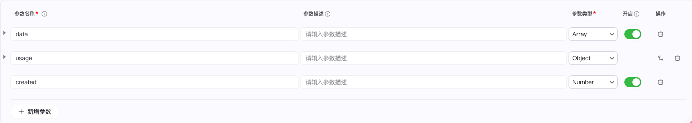 |

## 三、试运行插件

* 插件编写完毕后，我们可以试运行插件来看看插件是否满足我们的输入和输出期望，不满足的话就修复

| 文生图                                                       | 图生图                                                       |
| ------------------------------------------------------------ | ------------------------------------------------------------ |
| 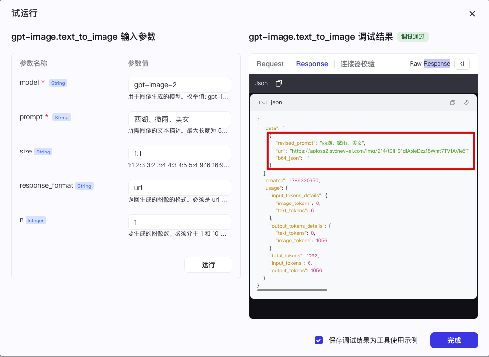  | 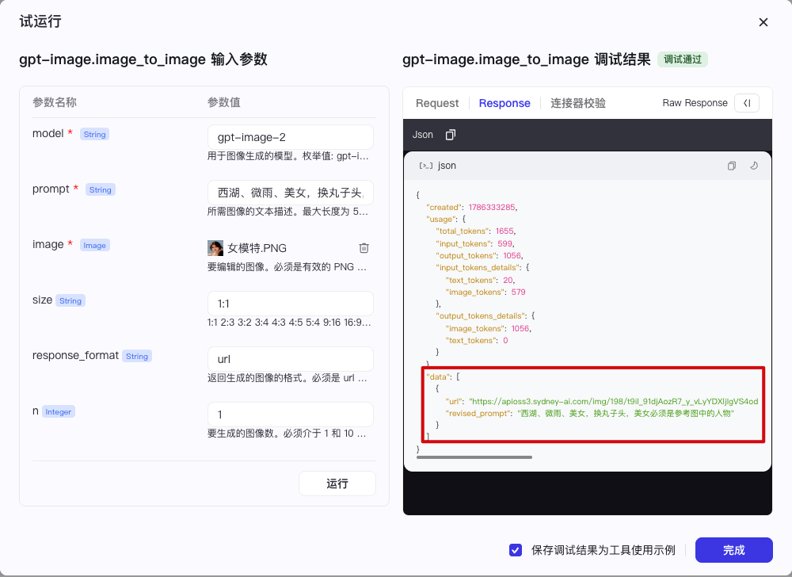  |
|  |  |

## 四、发布插件

* 试运行完毕后，我们需要发布插件，只有发布了的插件才能被智能体引用。并且插件发布了新版本后，使用了这个插件的智能体会自动使用发布的最新版本

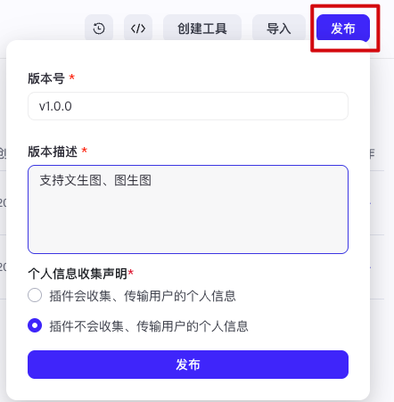

## 五、在工作流中使用插件（智能体里也能使用）

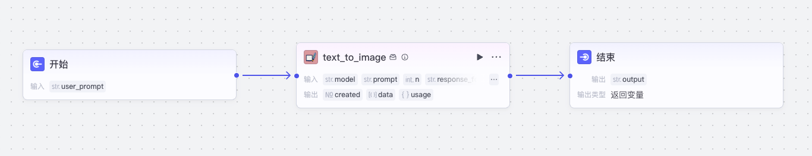

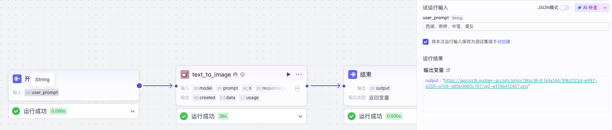