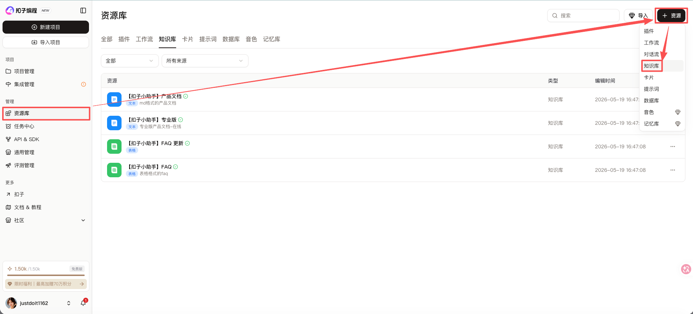
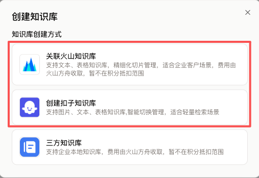
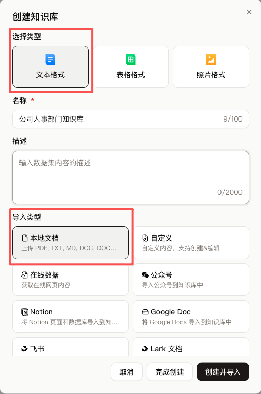
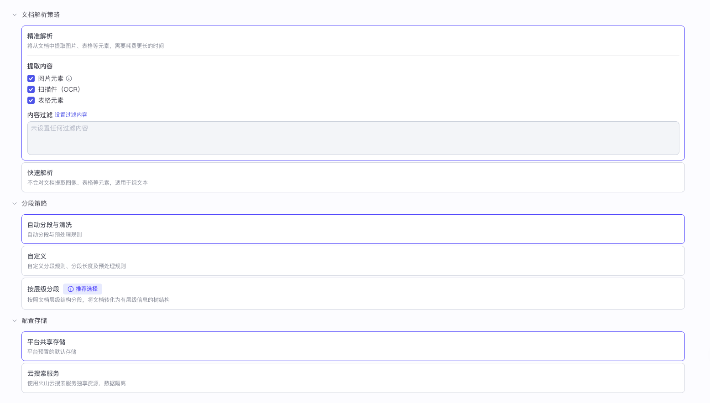
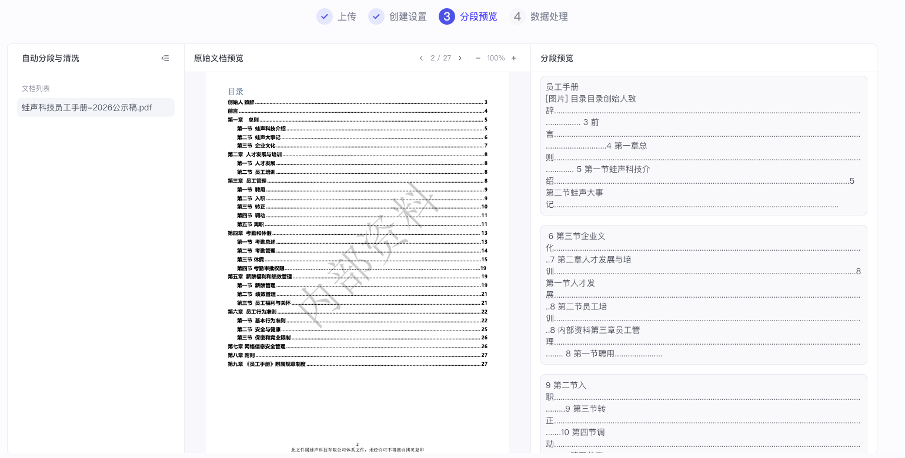
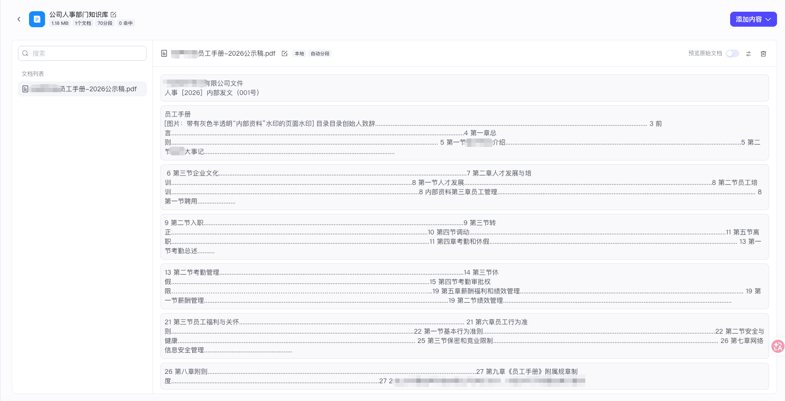
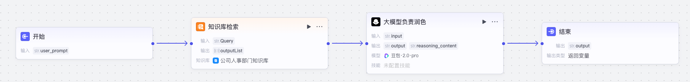
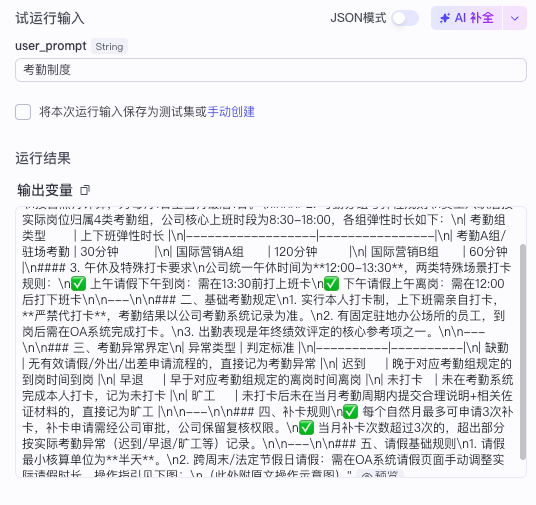
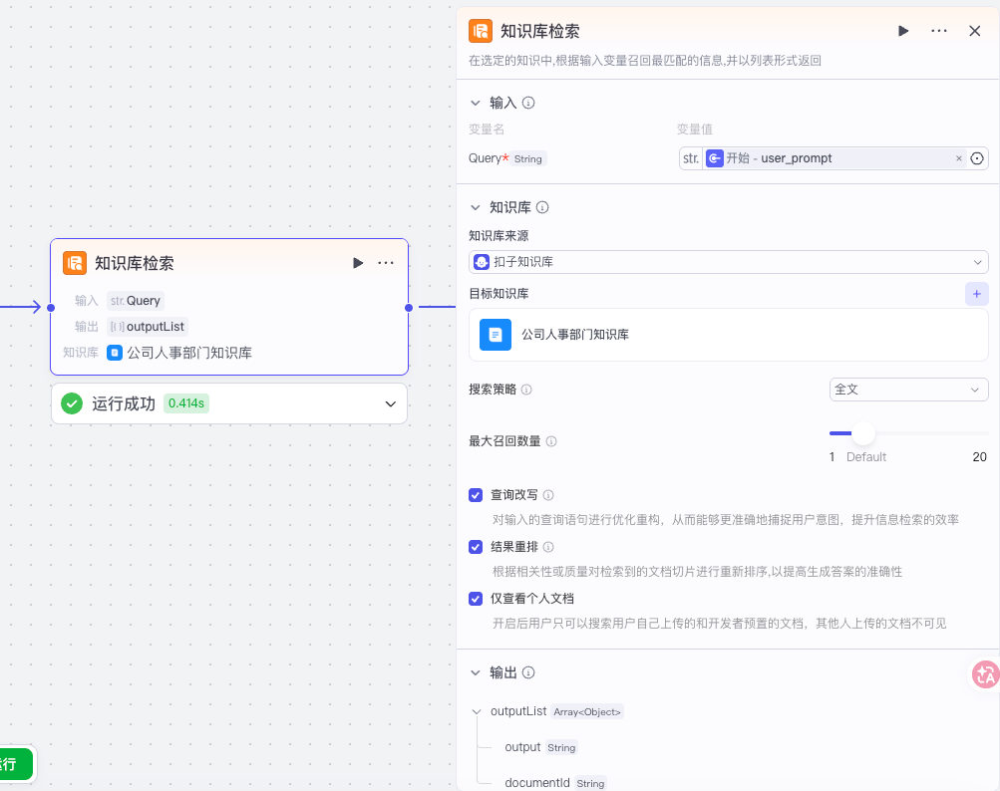
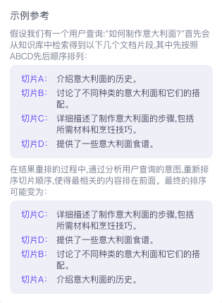

**知识库：简单来说知识库通常用来存放企业或个人的私有资料文档。**因为大模型虽然懂很多通用知识，但它通常不知道你们公司的产品说明、你们公司的员工手册、你们公司的客服话术等，于是你可以把这些资料上传到公司知识库，这样一来用户提问关于你们公司的问题后，智能体就会访问知识库里的私有资料，回答会更准确，减少幻觉

**RAG 知识库的概念：**RAG 的英文全称是 Retrieval-Augmented Generation，翻译过来是检索增强生成，**说白了就是用检索来增强生成效果**。检索增强生成知识库、即 RAG 知识库是一种结合信息检索与生成式人工智能的技术框架，旨在通过动态调用外部知识库提升大语言模型（LLM）回答的准确性、相关性和时效性。其核心在于将传统检索系统与生成模型结合，解决大模型自身训练数据局限性、知识过时及“幻觉”（虚构信息）等问题。

* 检索（Retrieval）：根据用户问题，**首先从预构建的知识库中检索相关文档或信息片段**。知识库通常通过离线处理将文本转换为向量（稠密向量和稀疏向量）存进向量数据库并建立索引，检索时会把检索内容也转换成稠密向量和稀疏向量，拿着要搜索内容的稠密向量去跟知识库里所有的稠密向量进行匹配、拿着要搜索内容的稀疏向量去跟知识库里所有的稀疏向量进行匹配，向量值越接近就代表语义越接近，这个检索速度是非常快的。例如，汽车客服系统可能存储车型参数手册作为知识库，检索时匹配用户问题中的关键词或语义
* 增强（Augmentation）：**然后将检索到的信息整合为上下文，与原始问题一同输入生成模型。**这一步骤通过补充外部知识，扩展模型的“记忆”范围，使其能基于最新或专有数据生成回答。例如，医疗诊断场景中，RAG 可调用最新医学论文数据辅助生成诊断建议
* 生成（Generation）：**最后大语言模型结合上下文与问题生成回答。**通过引入检索到的信息，模型输出的准确性显著提升，同时减少虚构内容。例如，企业客服系统利用内部文档生成合规性解答，避免泄露敏感数据

## 一、创建知识库

***

* 扣子知识库和火山知识库在功能上无明显差异，主要的区别是我们创建出来的知识库由哪个平台托管。如果我们创建的知识库是扣子知识库，那就直接由扣子平台托管；如果我们创建的知识库是火山知识库，那就由火山平台托管，然后再关联到扣子平台

* 扣子知识库提供一定的存储空间免费额度，适合初步体验知识库功能，帮助你快速上手。火山知识库从上传文档开始计费，虽然初期成本相对较高，但其在精细化内容管理、大规模数据存储以及高效检索方面表现更具优势，推荐在生产环境中使用火山知识库

* 这里我们选择扣子知识库

***

* 知识库类型，这里我们选择文本格式知识库 + 本地文档导入

| **对比项** | **文本格式知识库**                                           | **表格类型知识库**                                           | **照片类型知识库**                                           |
| ---------- | ------------------------------------------------------------ | ------------------------------------------------------------ | ------------------------------------------------------------ |
| 使用场景   | 文本知识库支持基于内容片段进行检索和召回，大模型结合召回的内容生成最终内容回复，**适用于知识问答等场景**。 | 表格知识库支持基于索引列的匹配（表格按行进行划分），同时也支持基于 NL2SQL 的查询和计算。 | 照片知识库支持基于标注信息的匹配，**适用于图像生成场景**。   |
| 导入方式   | 本地文档：从本地文件中导入文本内容，**支持`.txt`、`.pdf`、`doc`、`.docx` 文件格式**。  在线数据：通过自动和手动方式采集指定网页的内容。  第三方渠道：从飞书文档和 Notion 文档中导入内容。  自定义：手动输入要导入的文本内容。 | 本地文档：从本地文件中导入表格内容，**支持`.csv`和`.xlsx`文件格式**。  在线数据：通过 API 导入数据。  第三方渠道：支持从飞书表格中导入数据。  自定义：手动输入要导入的表格数据。 | 本地图片：从本地文件中导入图片，**支持`JPG`、`JPEG`和`PNG`图片格式**。 |
| 内容分段   | **支持自动内容分段和手动分段方式。**                         | 对于表格内容，**默认按行分片，一行就是一个内容片段，不需要再进行分段设置**。 | 不涉及。                                                     |
| 索引       | 不涉及。                                                     | 扣子编程支持设置索引字段。 用户输入的问题会与设置的索引字段内容对比，根据相似度匹配最相关的内容给大模型用于内容生成。 | 扣子编程支持设置图片的标注信息。 用户输入的问题会与设置的标注信息对比，根据相似度匹配最相关的图片给大模型用于内容生成。 |

## 二、编辑知识库

* 上传文档

***

* 设置文档解析策略：这里选择精准解析
  * 精准解析：支持从文档中提取图片元素、扫描件（OCR）、表格元素。对于 PDF 文件，还支持设置过滤策略，以文档页的粒度过滤掉当前文档中不需要导入的内容。精准解析通常耗时更久。
  * 快速解析：同样支持从文档中提取图像、表格等元素，但解析质量低于精准解析。

* 分段策略：这里选择默认的自动分段策略
  * 上传本地文档时，支持以自动分段与清洗、自定义分段和层级分段这三种方式对文本内容进行分段处理。
    内容分段可以更有效地召回与用户查询最相关的内容，从而提升回复的准确性。合理的内容分段对回复的效果有着直接影响。如果分块太大，可能包含太多不相关的信息，从而降低了检索的准确性。相反，分块太小可能会丢失必要的上下文信息，导致生成的响应缺乏连贯性或深度。
* 配置存储：这里选择平台共享存储
  * 平台共享存储：使用扣子编程预置的默认存储系统，存储文本知识库内容
  * 云搜索服务：使用火山引擎云搜索服务，存储文本知识库内容

***

* 分段预览：此时还没有把文档及分段策略存入知识库，如果对分段效果不满意可以返回上一步重新来一遍

***

* 数据处理：这一步代表采纳了上一步的分段策略等，正式处理数据并存储知识库

***

* 现在我们的【公司人事部门知识库】就创建完成了，里面目前只有一份文档，后续我们可以继续往里面追加人事部门相关文档

## 三、在工作流中使用知识库（智能体里也能使用）

***

| 配置项         | 说明                                                         |
| -------------- | ------------------------------------------------------------ |
| 输入           | 固定一个 Query 变量，用来接收关键词                          |
| 输出           | 固定一个 outputList 变量，其中 output 是内容，documentId 是召回的片段 id |
| 知识库来源     | 我们把知识库托管在哪里了就选哪个                             |
| 目标知识库     | 要关联的知识库，可以关联多个                                 |
| 搜索策略       | 从知识库中获取知识的所有方式，不同的搜索策略可以更有效地找到正确的信息 * 语义：像人类一样去理解词与词、句与句之间的关系，然后召回所有相关目标片段 推荐在需要理解语义关联度和跨语言查询的场景使用 * 全文：基于关键词进行全文搜索，召回所有相关目标片段 推荐查询内容包含特定名称、专业术语的场景使用 * 混合：结合全文搜索的和语义搜索的优势，并对结果进行综合排序，召回所有相关目标片段 |
| 最大召回数量   | 从知识库中返回给大模型的最大段落数，数值越大返回的内容越多。默认 5 |
| 最小匹配度     | 根据设置的匹配度选取跟输入 query 匹配的段落返回给大模型，低于设定匹配度的内容不会被召回。默认 0.5 |
| 查询改写       | 对输入的查询语句进行优化重构，从而能够更准确地捕捉用户意图，提升信息检索的效率  |
| 结果重排       | 根据相关性或质量对检索到的文档切片进行重新排序，以提高生成答案的准确性  |
| 仅查看个人文档 | 开启后用户只可以搜索用户自己上传的和开发者预置的文档，其他人上传的文档不可见 |

