**智能体：通常以对话框的形式存在，自主完成某项任务**

## 一、创建智能体

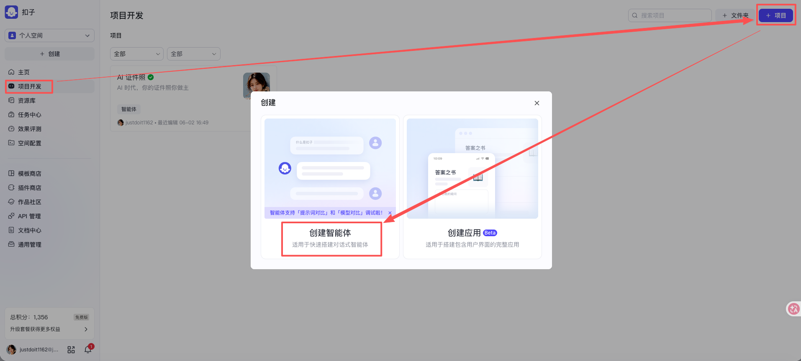

***

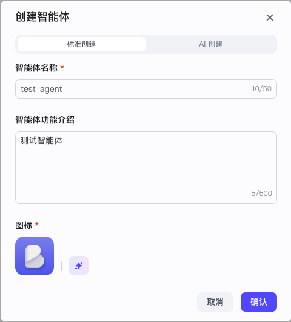

## 二、编排智能体

#### 1、系统提示词

按照提示词工程里的要求填写系统提示词即可

#### 2、模型

选择需要的模型并做好模型设置即可

#### 3、插件

这里以添加 gpt-image 插件里的 text_to_image 工具为例

我们知道工具是需要输入参数的，默认情况下 ①大模型会从用户提示词或者参数默认值里自动提取内容填充给相应的参数，如果实在提取不到大模型就会用自然语言提示用户输入，但这在某些场景下可能不是特别可靠；②所以我们也可以在系统提示词里明确告诉大模型该如何搜集参数、又该如何把参数传递给工具

这里以方案 2 为例

#### 4、工作流

这里以添加 test_weather_workflow 工作流为例

我们知道工作流是需要输入参数的，默认情况下 ①大模型会从用户提示词或者参数默认值里自动提取内容填充给相应的参数，如果实在提取不到大模型就会用自然语言提示用户输入，但这在某些场景下可能不是特别可靠；②所以我们也可以在系统提示词里明确告诉大模型该如何搜集参数、又该如何把参数传递给工作流

这里以方案 1 为例

#### 5、知识库

这里以添加 公司人事部门知识库 为例

知识库有自动调用和按需调用两大方式，自动调用的话每轮对话都会查询知识库，按需调用的话则只会在系统提示词里指定的调用时机才会查询知识库

这里以按需调用为例

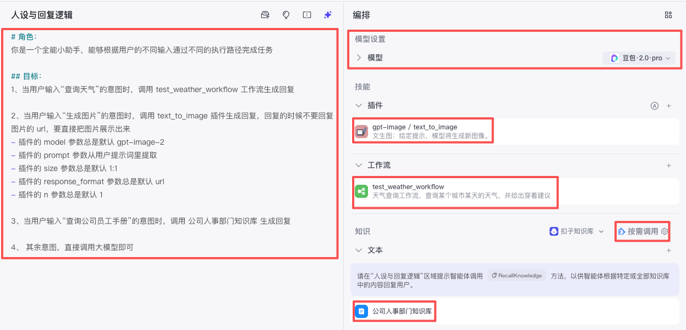

#### 6、对话体验

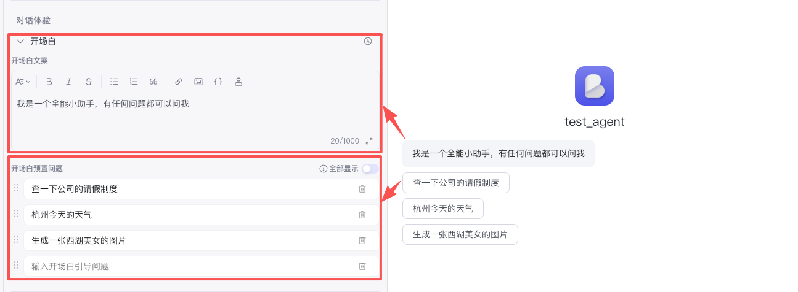

## 三、预览与调试智能体

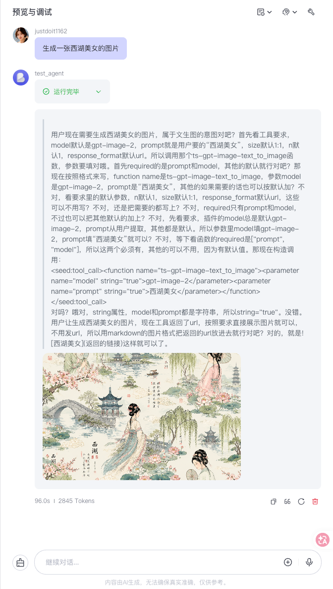

## 四、发布智能体

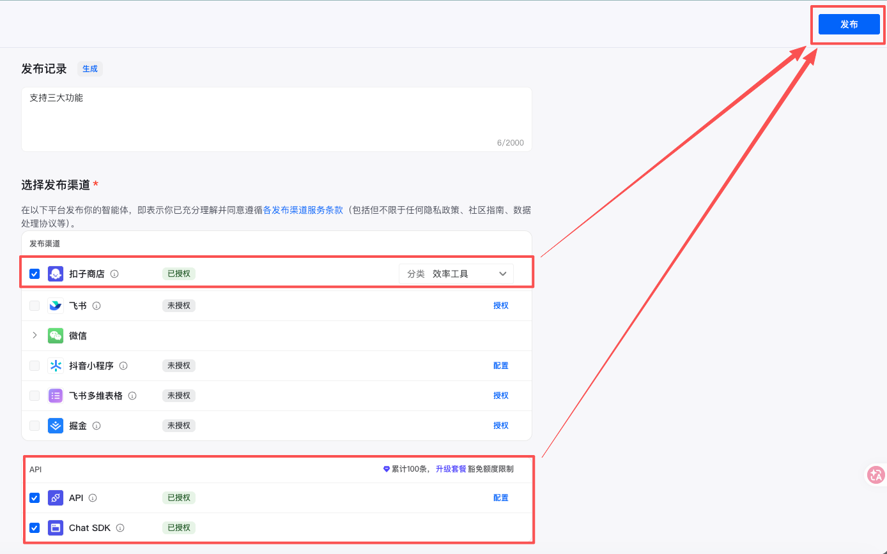

## 五、使用智能体

#### 1、对话形式使用

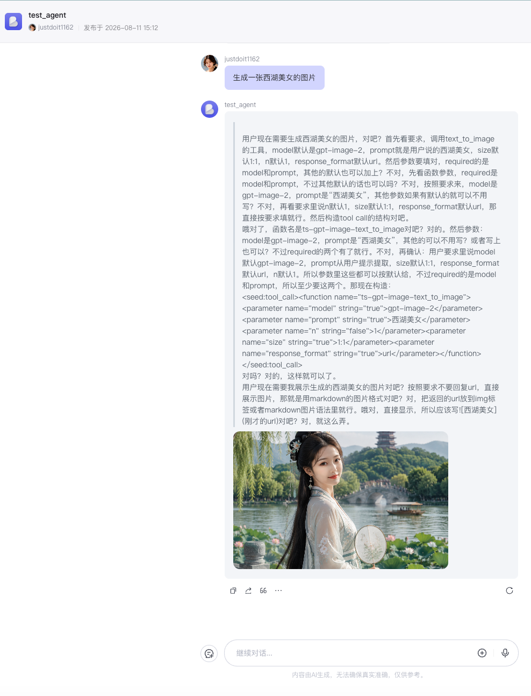

#### 2、API 形式使用

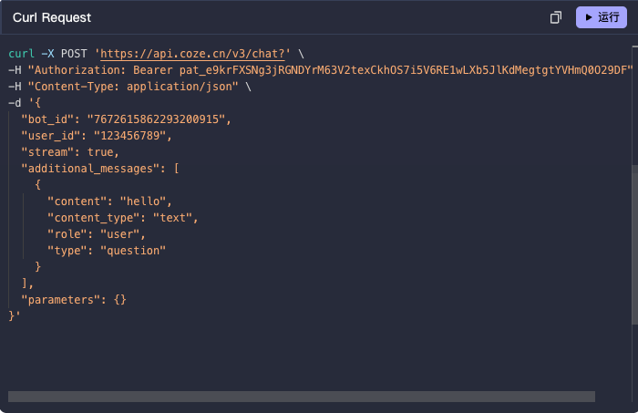

## 六、多 Agent 模式

在 Coze 中创建智能体后，智能体默认使用单 Agent 模式。**在单 Agent 模式下处理复杂任务时，你必须编写非常详细和冗长的提示词，而且你可能需要添加各种插件和工作流等，这增加了调试智能体的复杂性。调试时任何一处细节改动，都有可能影响到智能体的整体功能，实际处理用户任务时，处理结果可能与预期效果有较大出入。**

为了解决上述问题，**Coze 提供了多 Agent 模式，该模式下你可以为智能体添加多个 Agent，并连接、配置各个 Agent 节点，通过多节点之间的分工协作来高效解决复杂的用户任务。**

多 Agent 模式通过以下方式来简化复杂的任务场景：

- 你可以为不同的 Agent 配置独立的提示词，将复杂任务分解为一组简单任务，而不是在一个智能体的提示词中设置处理任务所需的所有判断条件和使用限制。
- 多 Agent 模式允许你为每个 Agent 节点配置独立的插件和工作流。这不仅降低了单个 Agent 的复杂性，还提高了测试智能体时 bug 修复的效率和准确性，你只需要修改发生错误的 Agent 配置即可。

比如我们上面的那个单智能体就负责了“查询天气”、“生成图片”、“查询公司员工手册”、“其它”四个任务，现在我们把它拆成多 Agent 模式。

#### 1、创建多智能体

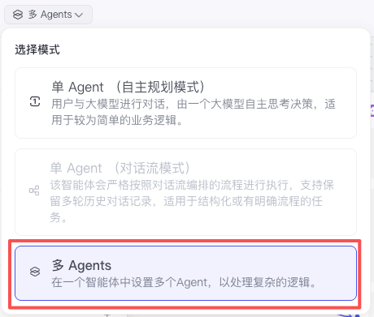

#### 2、编排多智能体

###### 2.1 父智能体的配置

左边的编排面板，用来为父智能体添加配置，如系统提示词、开场白等，父智能体的配置会附加到所有子智能体

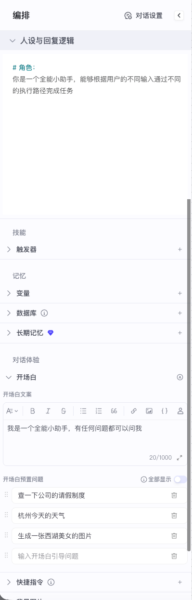

###### 2.2 开始节点

创建多智能体后，默认会有一个开始节点，开始节点是智能体处理新对话时的默认起始节点，我们可以在这里设置新一轮对话的起始节点（不一定总是发给开始节点）：

- **上一次回复用户的节点**：用户新的消息将继续发送给上次回复用户的那个子智能体节点。如果用户手动清除历史对话记录，则系统会把消息发送给开始节点。**该设置适用于连贯会话比较多的智能体，用户通常需要多轮对话才能完成某个任务，例如积分制游戏等。**
- **开始节点**：用户的所有消息都会发送给开始节点，该节点会根据 Agent 的适用场景，把用户消息移交给适用的 Agent 节点。**该设置适用于功能丰富且互相独立的智能体，上次回复用户的节点通常不适用于回答新一轮的用户问题，例如售后客服场景。**

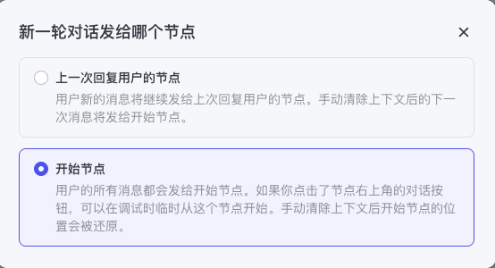

###### 2.3 任务分发智能体

创建多智能体后，默认会有一个子智能体节点，我们可以把这个子智能体改名成“任务分发智能体”，然后给它做如下配置：

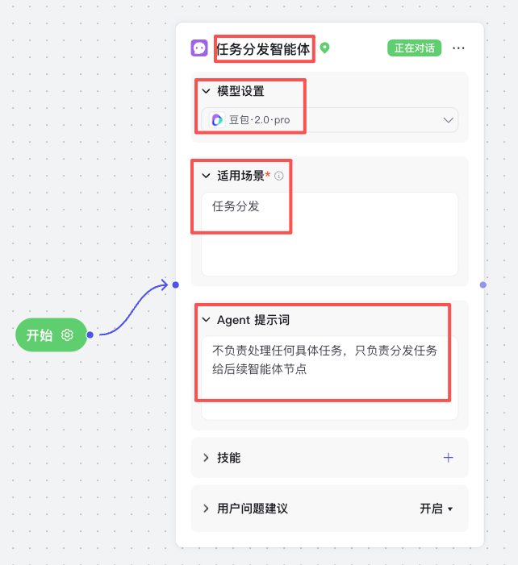

###### 2.4 添加子智能体

* 适用场景：任务分发智能体会根据这个内容决定该把任务分发给哪个节点
* Agent 提示词：就是系统提示词
* 技能：可以添加工作流、插件、知识库

| 查询天气智能体                                              | 生成图片智能体                                              | 查询公司员工手册智能体                                      | 通用智能体                                                  |
| ----------------------------------------------------------- | ----------------------------------------------------------- | ----------------------------------------------------------- | ----------------------------------------------------------- |
| 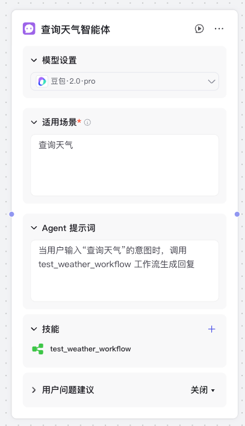 | 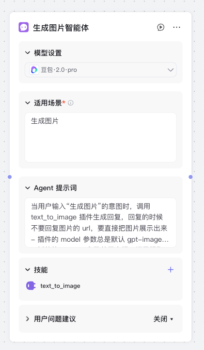 | 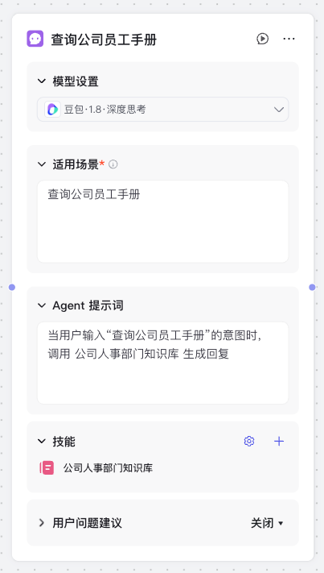 | 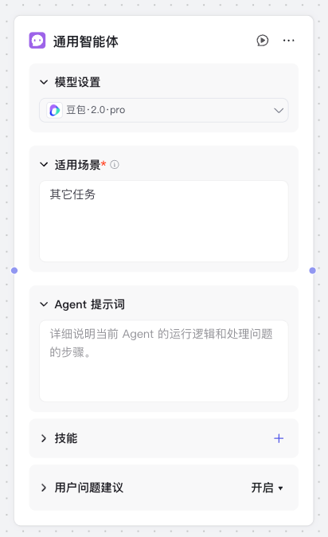 |

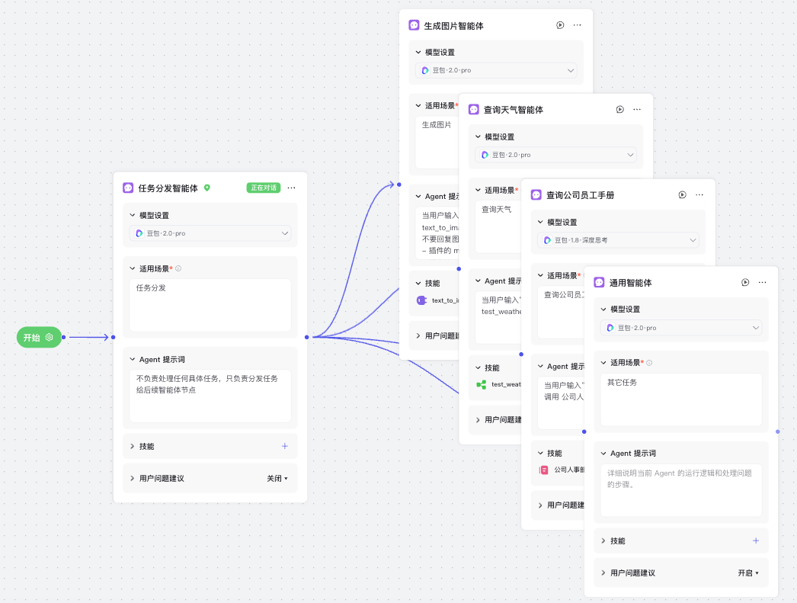

#### 3、预览与调试多智能体

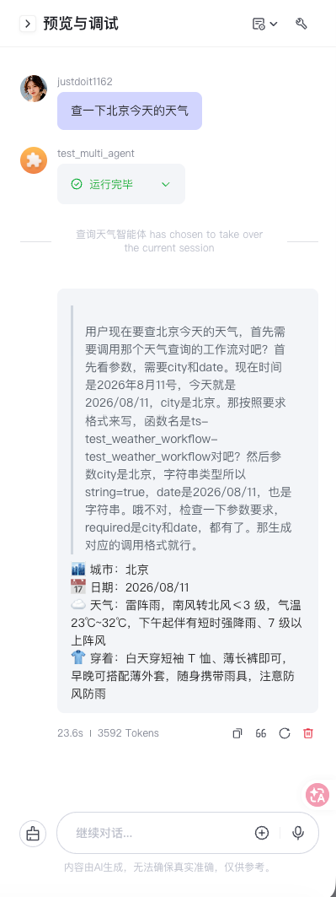

#### 4、发布多智能体

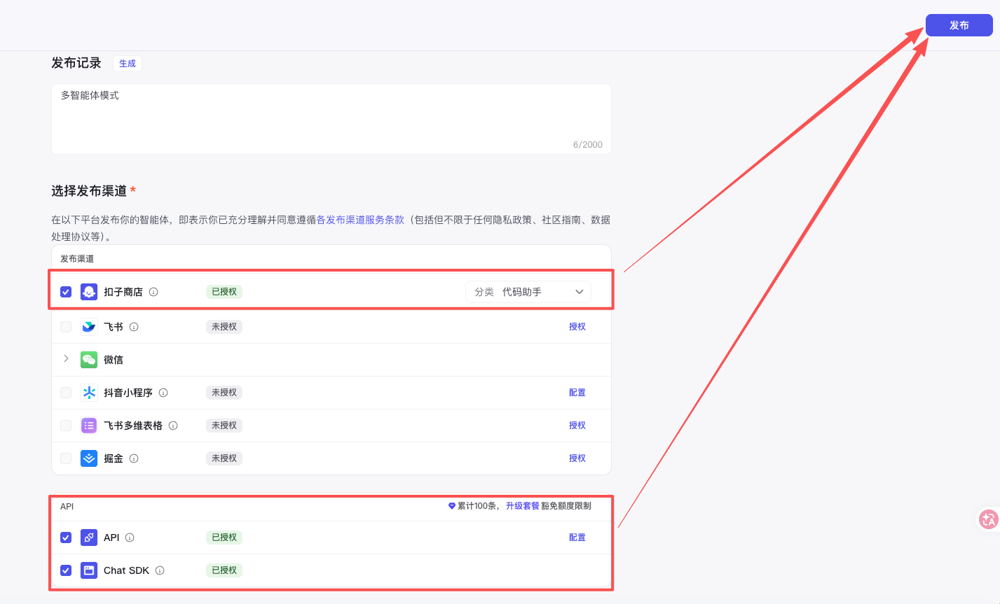

#### 5、使用多智能体

###### 5.1 对话形式使用

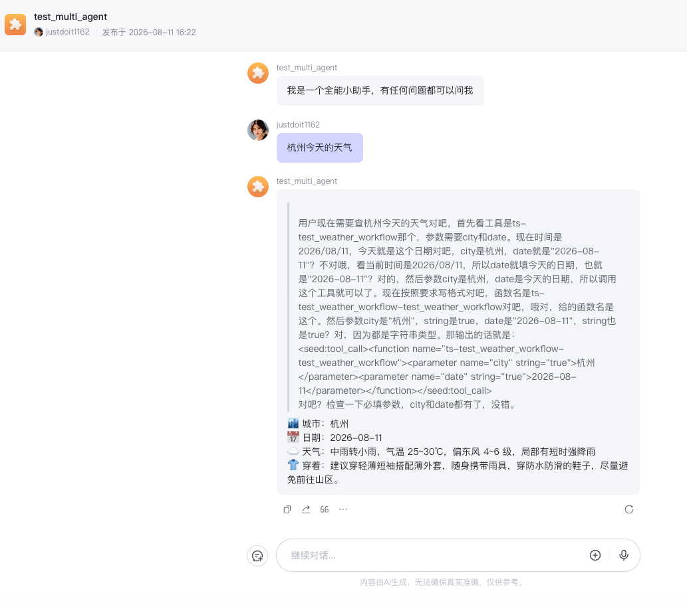

###### 5.2 API 形式使用

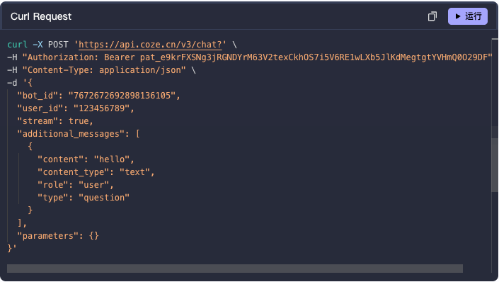