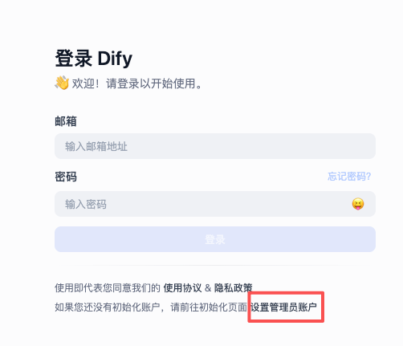
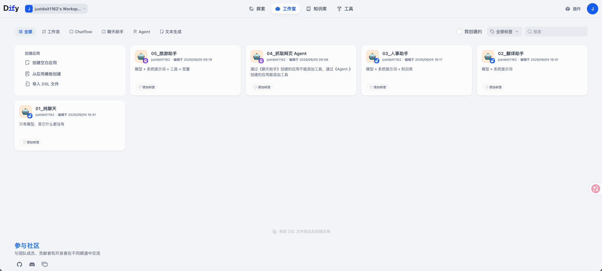

## 一、Dify 是什么

Dify 和 Coze 的功能类似，是一款开源的智能体开发平台。Dify 内置了构建 LLM 应用所需的关键技术栈，包括对数百个模型的支持、直观的 Prompt 编排界面、高质量的 RAG 引擎、稳健的 Agent 框架等，并同时提供了一套易用的界面和 API，它还融合了后端即服务（Backend as a Service、BaaS）的理念，可以帮助开发者快速搭建生产级的生成式 AI 应用。

> 拓展：什么是 BaaS？
>
> BaaS 是一种云计算服务模式，它为移动应用和 Web 应用的开发者提供预先构建好的后端基础设施和功能服务，让开发者无需从零开始搭建和维护复杂的服务器端系统。
>
> BaaS平台通过统一的应用程序编程接口（API）和软件开发工具包（SDK），将常见的后端功能封装成即插即用的服务。
>
> BaaS 就像是为应用开发准备的“标准化后端模块工具箱”。它通过将通用的后端功能服务化，让你能像搭积木一样快速构建应用的后端支撑，从而将宝贵的资源集中在创造独特的前端业务逻辑和用户体验上。

## 二、本机安装 Dify

#### 1、最低系统要求

* CPU >= 2 Core

* Ram >= 4 G

#### 2、安装 Docker Desktop（Dify 会安装在 Docker 里，Docker 会安装在本机里）

* Docker Desktop 下载地址：https://www.docker.com/products/docker-desktop
* 下载完成后双击安装即可，默认会安装到 Application 目录下
* 打开 Docker Desktop - 右上角设置 - Proxies - Docker Desktop proxy - 改成 System Proxy，这样后续拉依赖才能走代理

#### 3、安装 Dify 环境

* 去 GitHub 下载 Dify 源码：https://github.com/langgenius/dify

* 打开 Dify 项目根目录，找到 docker 目录

* 找到 .env.example 文件，复制一份并重命名为 .env，在 .env 文件的末尾添加如下配置

  ```shell
  # 启用自定义模型
  CUSTOM_MODEL_ENABLED=true
  # 指定 Ollama 的 API 地址（根据部署环境调整 IP）
  OLLAMA_API_BASE_URL=host.docker.internal:11434
  ```

#### 4、启动 Docker 环境

* 保持 Docker Desktop 处于运行状态

* 终端 cd 到 Dify 项目根目录里的 docker 目录，执行如下命令（一次不成功，可以多尝试几次，实在不行就一个一个拉取），所有东西都拉取成功后就可以退出终端了

  ```shell
  # docker-compose  使用 Docker Compose 工具
  # up              创建并启动 docker-compose.yml 里定义的服务
  # -d              detached，后台运行
  docker-compose up -d
  ```

#### 5、启动 Dify

* 在浏览器里输入：http://localhost/install，我们先去设置个管理员账户

  

* 然后登录即可

  

  


```
【账号】
│
└─【资源库】（全局共享资源）
     ├─ 工作流
     ├─ 插件
     ├─ 知识库
     ├─ 卡片
     ├─ 提示词
     ├─ 数据库
     ├─ 音色
     └─ 记忆库
└─【项目】（独立交付单元）
     ├─ 智能体
     └─ 应用
```

* 一个账号下只有一个资源库、但是这个资源库下可以创建多个资源，资源的类型主要有**工作流**、**插件**、**知识库**、卡片、提示词、数据库、音色、记忆库
* 一个账号下可以创建多个项目，项目的类型主要有**智能体**、应用
* 每个项目都可以引用资源库里的资源

***

* **工作流：一个工作流是对一个可复用 SOP 的封装，它非常像代码世界里的业务函数、会写一大堆业务逻辑来真正完成某个业务。**比方说我们创建一个工作流 ai_zhengjianzhao，它封装的是接收参数、预处理参数、调用工具、结构化输出【根据一张图片生成证件照】的标准操作流程

* **插件**：插件是对工具的打包，换句话说一个插件里可以创建多个工具，而**一个工具则是对一个可复用能力的封装，它非常像代码世界里的工具函数、只写能力不写业务**。比方说我们创建了一个插件 gpt-image，它里面打包了两个工具 text-to-image、image-to-image，text-to-image 工具封装的是生成图片（文生图）的能力、image-to-image 工具封装的是编辑图片（图生图）的能力
* **知识库：简单来说知识库通常用来存放企业或个人的私有资料文档。严格来说知识库 = 存储一堆私有资料文档 + 对这些文档的切片、索引、检索配置。**大模型虽然懂很多通用知识，但它通常不知道你们公司的产品说明、你们公司的员工手册、你们公司的客服话术等，于是你可以把这些资料上传到公司知识库，这样一来用户提问关于你们公司的问题后，智能体就会访问知识库里的私有资料，回答会更准确，减少幻觉
* 卡片、提示词、数据库、音色、记忆库：......

***

* **智能体：通常以对话框的形式存在，自主完成某项任务**
* 应用：通常以用户界面的形式存在，自主完成某项任务
