**工作流：一个工作流是对一个可复用 SOP 的封装，它非常像代码世界里的业务函数、会写一大堆业务逻辑来真正完成某个业务。**比方说我们创建一个工作流 ai_zhengjianzhao，它封装的是接收参数、预处理参数、调用工具、结构化输出【根据一张图片生成证件照】的标准操作流程

## 一、创建工作流

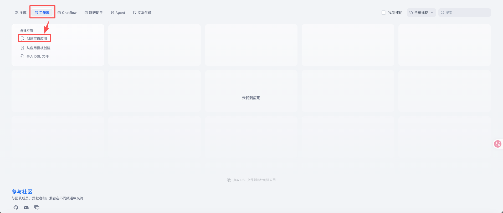

***

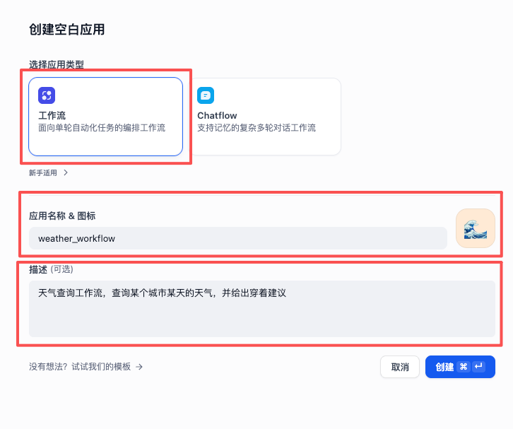

## 二、编辑工作流节点

* 开始节点：工作流的入口，一般用来指定外界应该给工作流传哪些变量进来，输入变量必须在用户提示词或系统提示词中使用
  * 我们这里的天气查询工作流，需要外界传递“城市 city”、“日期 date”这两个变量进来

* 结束节点：工作流的出口，一般用来指定工作流应该给外界返哪些变量出去
  * 我们这里的天气查询工作流，会给外界返回 {"output": "🏙 城市：杭州\n📅 日期：2026-07-30\n☁️ 天气：晴热，最高气温38℃以上，发布高温橙色预警\n👕 穿着：建议穿着短袖、短裤等轻薄透气的夏季衣物，外出做好防晒、防暑措施"} 这样的 JSON 出去

| 类型                                       | 示例                                                         |
| ------------------------------------------ | ------------------------------------------------------------ |
| Boolean，布尔类型 -> 复选框                | true、false                                                  |
| Number，数值类型 = 整型 + 浮点型 -> 数字   | 18、19.9、-0.25                                              |
| String，字符串类型 -> 文本、段落、下拉选项 | * 文本最多 256 字符 * 段落可设置为无上限 * 下拉选项类似搞枚举那种 |
| File，文件类型 -> 单文件                   | 图片、音频、视频、文档等需要从本地上传的文件                 |
| Array[File]，文件数组类型 -> 文件列表      | [图片 1, 图片 2]                                             |
| Object，对象类型、字典类型 -> JSON         | { "name": "张三", "age": 18 }                                |

***

| Dify 节点     | Coze 节点  |
| ------------- | ---------- |
| LLM           | 大模型     |
| 工具 - 插件   | 插件       |
| 工具 - 工作流 | 工作流     |
| 代码执行      | 代码       |
| 选择器        | 条件分支   |
| 意图识别      | 问题分类器 |
| 循环          | 循环、迭代 |
| 知识库检索    | 知识检索   |
| HTTP 请求     | HTTP 请求  |

* 我们也可以根据需求添加节点
* 节点有很多类型，比如节点可以是一个大模型、可以是一个插件、可以是另外一个工作流、可以是一个知识库、可以是一段代码等等

***

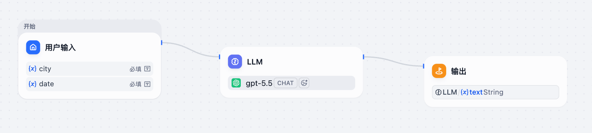

* 我们这里添加一个大模型节点，并通过拖线的方式把节点与节点连接起来，代表它们的数据流向
* 模型：选择一个模型，还可以设置模型
  * 我们这里选择“gpt-5.5”，模型设置全部采取默认
* SYSTEM：系统提示词，一般包含角色、背景、目标、约束、步骤、输出格式、示例、验收标准
  * 我们这里的系统提示词为“你是一个天气查询助手。你的目标是帮助用户查询某个城市某天的天气，并给出穿着建议。不要解释、不要长篇大论。严格按照如下格式输出：🏙 城市：xxx 📅 日期：xxx ☁️ 天气：xxx 👕 穿着：xxx”
* USER：用户提示词，用户本轮对话的输入
  * 我们这里的用户提示词为“城市：{{city}} 日期：{{date}}”

* 输出变量：大模型的出口，一般用来指定大模型节点应该给外界返哪些变量出去

## 三、试运行工作流

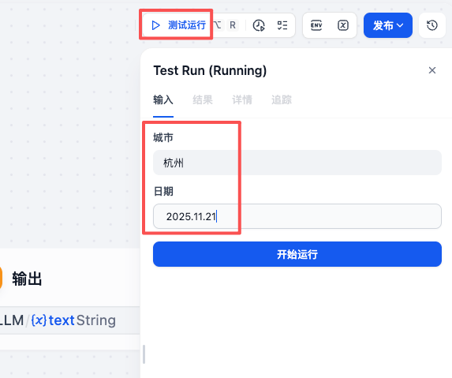

***

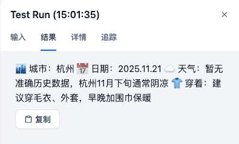

* 工作流编写完毕后，我们可以试运行工作流来看看工作流是否满足我们的输入和输出期望，不满足的话就修复

## 四、发布工作流

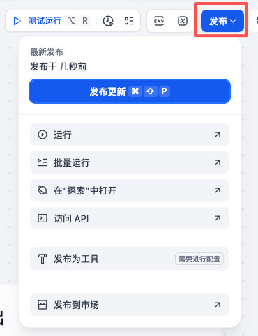

* 工作流试运行完毕后，我们需要发布工作流，只有发布了的工作流才能被智能体引用或以 API 的方式被调用。并且工作流发布了新版本后，使用了这个工作流的智能体或 API 会自动使用发布的最新版本

## 五、调用工作流 API（智能体里也能使用）

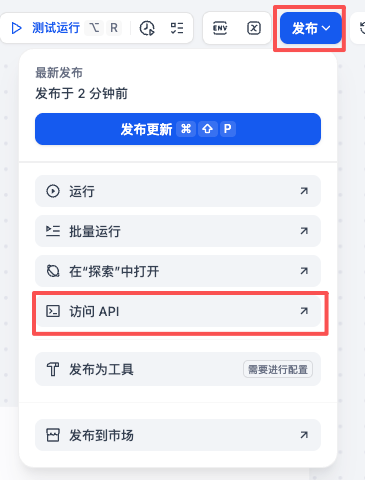

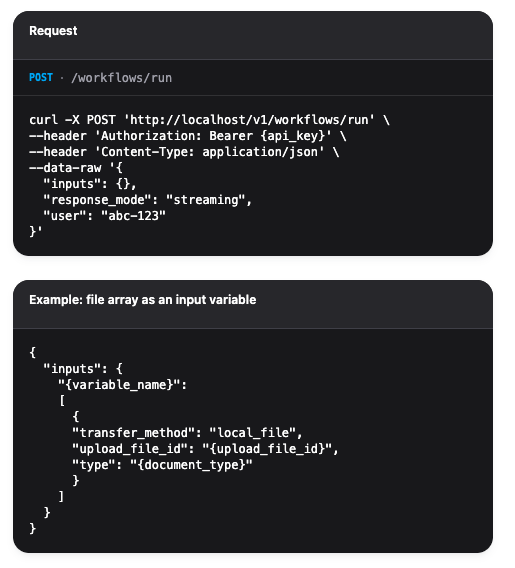

* 工作流发布后，我们还可以在代码里通过 API 的形式来调用工作流

## 六、其它常用节点

#### 1、代码节点

**代码节点类似于一个函数，一般用来通过代码的方式预处理参数，并输出预处理后的参数**

| 配置项 | 说明                                                         |
| ------ | ------------------------------------------------------------ |
| 输入   | 用来接收所有需要预处理的参数，将来在函数里可以通过 `输入变量名`  直接使用 |
| 代码   | * 仅支持 Python 和 JS 两种语言，仅支持编写一个函数 * 在函数内部可以通过 `输入变量名`  直接使用需要预处理的参数 * 然后就是按需求编写函数来预处理参数 * 函数的返回值必须是一个对象，对象的属性名和下面“输出”的变量名必须完全一致 |
| 输出   | 用来输出预处理后的参数，会一一匹配读取函数返回对象的属性及其值 |

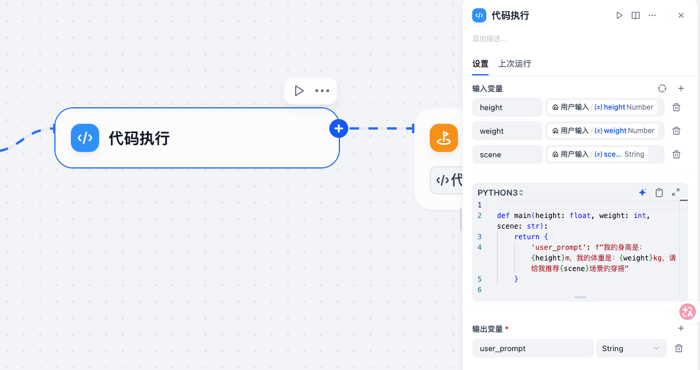

#### 2、选择器节点

**选择器节点类似于一个 if-else 语句，满足条件时走一条路径，否则走另外一条路径**（注意：选择器节点没有输入变量和输出变量，它只负责引用其它节点的变量来设定条件，并决定几个不同的输出路径）

| 配置项   | 说明           |
| -------- | -------------- |
| 条件分支 | 用来写判断条件 |

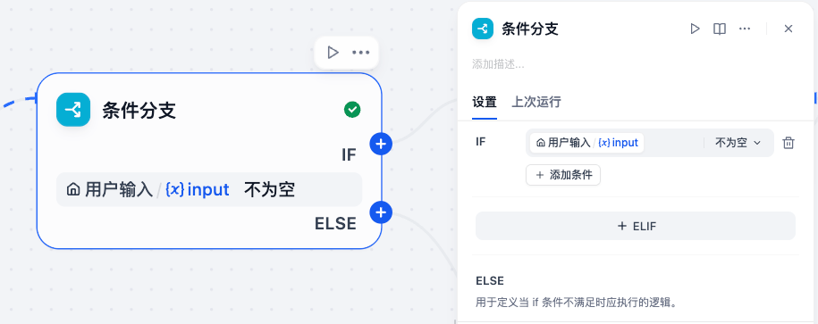

#### 3、意图识别节点

**意图识别节点 = 大模型节点 + 选择器节点，它合并了这两个节点的功能，可以使工作流运行更高效。简单地说意图识别节点就是通过大模型来理解用户所输入自然语言的意图，然后将不同的意图流转到不同的路径分支去处理。极速模式强调意图识别的速度，不支持设置系统提示词；完整模式强调意图识别的准确度，支持设置系统提示词。**典型的场景如下：

* 客户服务：识别用户问题的类型，并转交各类知识库处理，对于知识库中未匹配的问题，转交人工客服处理
* 医疗咨询：对用户咨询的医学问题进行归类，非医学问题的咨询则拒绝回复
* 综合类智能体：对于功能多样的智能体，可以先由意图识别节点对用户咨询进行初步分类，转交各个 Agent 分支处理

| 配置项          | 说明                                                         |
| --------------- | ------------------------------------------------------------ |
| 模型            | 选择执行意图识别的大模型                                     |
| 输入            | 需要被大模型理解的原内容，一般就是引用用户的自然语言输入     |
| 分类            | 意图的枚举选项，最多支持 50 个意图 枚举选项的 ID 值从上往下从 1 依次往上累加，其他意图的 ID 值为 0 |
| 高级设置 - 指令 | Dify 默认已经指定了系统提示词，来指导大模型合理识别用户意图并分类 但是我们仍然可以在这里追加系统提示词，比如提供各个意图的示例，使模型分类更精准 |
| 输出            | 输出固定是三个参数： * class_name：分类名称 * class_label：分类标签 * usage：模型用量信息 |

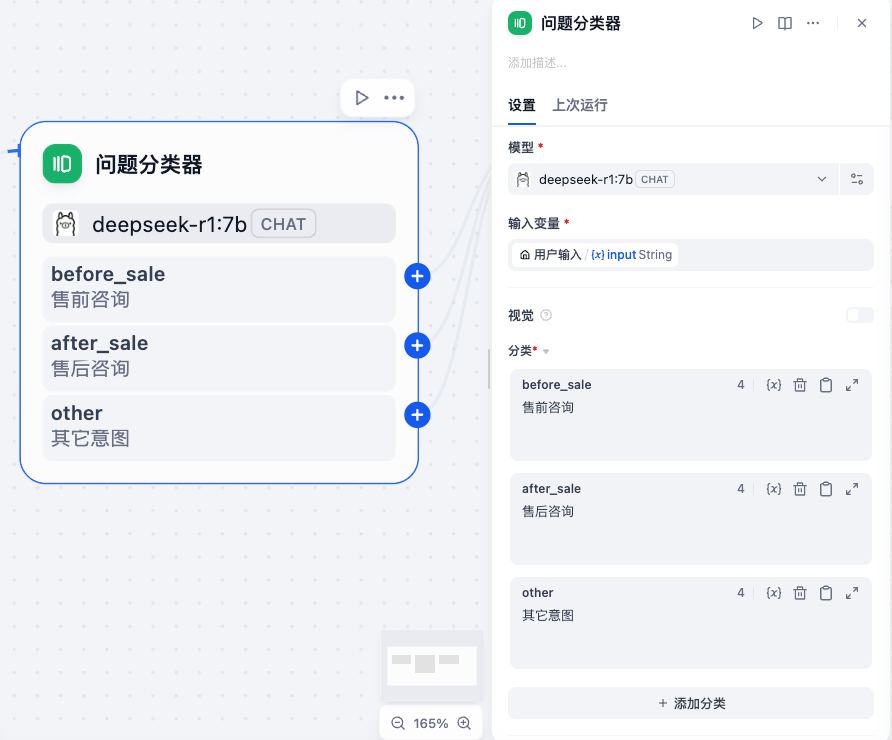

#### 4、循环节点

**循环节点类似于一个 for 语句或 while 语句，用来重复执行一系列任务，多次循环之间严格串行执行**

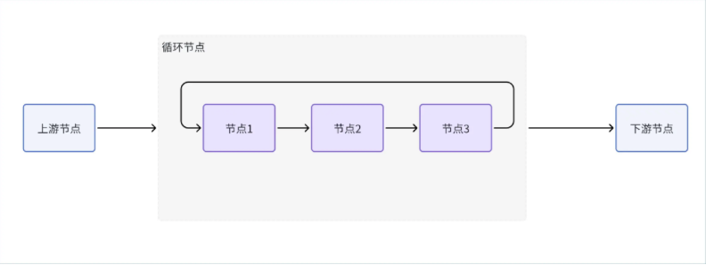

###### 4.1 使用数组循环 -> 迭代

| 配置项           | 说明                                                         |
| ---------------- | ------------------------------------------------------------ |
| 循环类型         | * 使用数组循环类似一个 for 语句，循环次数为数组的长度 * 无限循环类似于一个 while 语句，必须配合“循环变量”、“循环终止条件”、循环体里的“变量赋值”节点一起使用 * 指定循环次数循环用 for 语句或 while 语句都能实现，循环次数为指定的次数 |
| 输入 -> 循环数组 | * 必须指定循环数组，并且该变量仅支持引用上游节点的输出，且必须是数组格式 * 循环节点会遍历数组中的每个元素，每次循环都会将当前循环到的元素和索引赋值给内置变量。内置变量有 item 和 index，仅供循环体内的节点使用 |
| 循环体           | 循环体每次循环只接收一个元素（来自迭代节点），也只输出本次循环的一个结果（抛回给迭代节点） 注意：迭代节点通过输出变量引用循环体的执行结果就可以了，循环体内部的节点不一定非要有下游节点，就像美食推荐大模型节点就没有下游节点，但是它作为循环体的最后一个节点，它的执行结果会自动抛回给迭代节点 |
| 输出变量         | 循环节点的输出变量可设置为循环体的执行结果，迭代节点会等待所有迭代都完成后把执行结果搞成一个数组，将所有循环的运行结果打包输出给下游 |

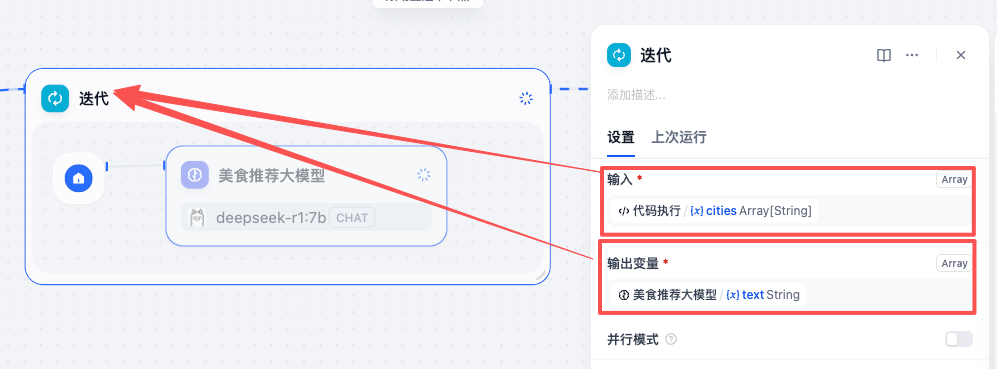

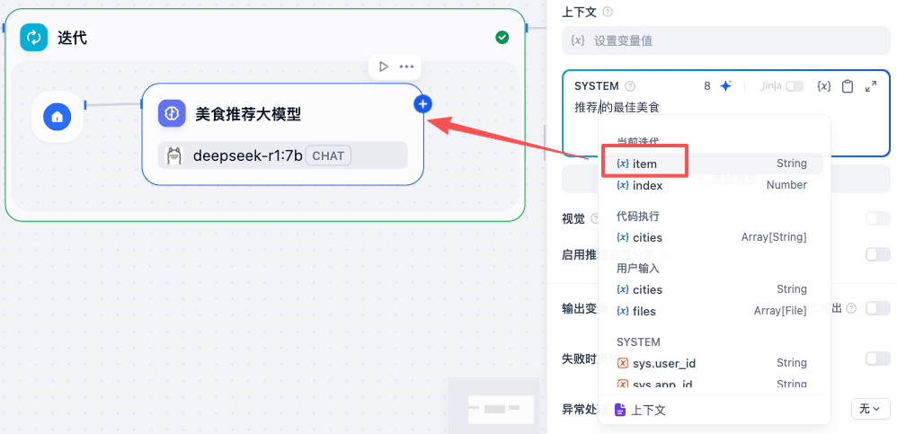

###### 4.2 无限循环、直到满足某个条件为止 -> 循环

| 配置项               | 说明                                                         |
| -------------------- | ------------------------------------------------------------ |
| 循环类型             | * 无限循环类似于一个 while 语句，必须配合“循环变量”、“循环终止条件”、循环体里的“变量赋值”节点一起使用 * 使用数组循环类似一个 for 语句，循环次数为数组的长度 * 指定循环次数循环用 for 语句或 while 语句都能实现，循环次数为指定的次数 |
| 循环变量 -> 中间变量 | * 循环节点支持设置中间变量，此变量可作用于每一次循环 * 中间变量通常和循环体中的“变量赋值”节点搭配使用，在每次循环结束后为中间变量设置一个新的值，并在下次循环中使用新值 |
| 循环终止条件         | 一般就是是循环变量满足某个条件时终止                         |
| 循环体               | * 循环节点只会把循环变量抛给循环体内的节点 * 循环体内可以改变循环变量的值，然后新的循环变量会被自动抛回给循环节点 |
| 输出                 | 循环节点没有显式的输出，但它最终会把我们定义的所有循环变量都输出给下游 |

> 比如我们这里的例子：
>
> * 输入节点要求用户输入一个整形的 num
> * 循环节点
>   * 添加了一个循环变量 num，引用了输入节点的 num
>   * 循环终止条件是循环变量 num >= 9
> * 循环体里的变量赋值节点是每次循环收到循环变量后都 +1，然后再抛回给循环节点，让循环节点判断
> * 循环节点终止后，我们在输出节点可以获取到最终的循环变量 num

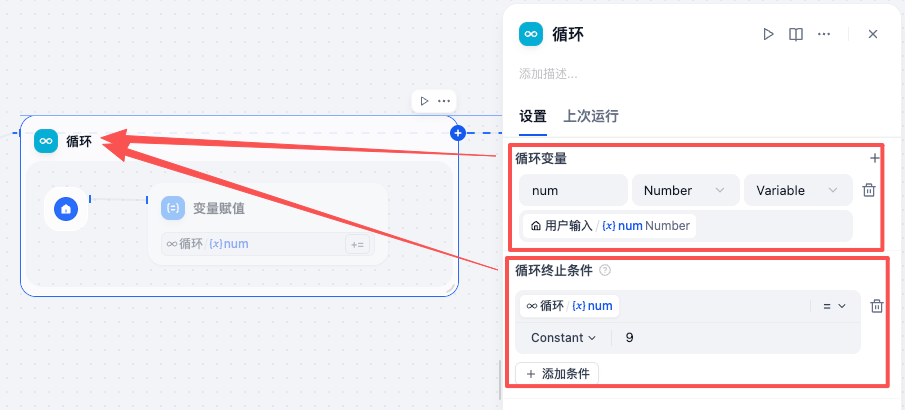

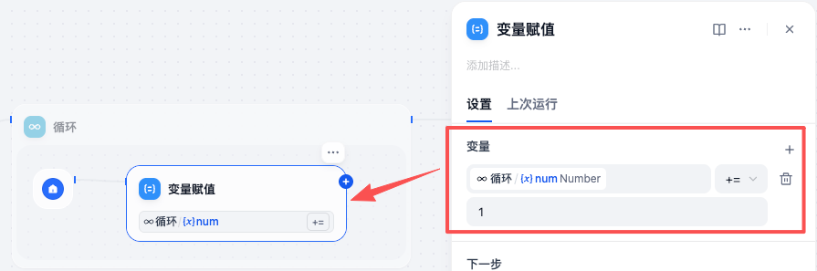

###### 4.3 指定循环次数循环 -> 循环

| 配置项               | 说明                                                         |
| -------------------- | ------------------------------------------------------------ |
| 循环类型             | * 指定循环次数循环用 for 语句或 while 语句都能实现，循环次数为指定的次数 * 使用数组循环类似一个 for 语句，循环次数为数组的长度 * 无限循环类似于一个 while 语句，必须配合“循环变量”、“循环终止条件”、循环体里的“变量赋值”节点一起使用 |
| 循环变量 -> 中间变量 | * 循环节点支持设置中间变量，此变量可作用于每一次循环 * 中间变量通常和循环体中的“变量赋值”节点搭配使用，在每次循环结束后为中间变量设置一个新的值，并在下次循环中使用新值 |
| 最大循环次数         | 循环次数默认为 10 次，支持设置为 1~100 次                    |
| 循环体               | * 循环节点只会把循环变量抛给循环体内的节点 * 循环体内可以改变循环变量的值，然后新的循环变量会被自动抛回给循环节点 |
| 输出                 | 循环节点没有显式的输出，但它最终会把我们定义的所有循环变量都输出给下游 |

> 比如我们这里的例子：
>
> * 输入节点要求用户输入一个整形的 num
> * 循环节点
>   * 添加了一个循环变量 num，引用了输入节点的 num
>   * 最大循环次数设置为 3
> * 循环体里的变量赋值节点是每次循环收到循环变量后都 +1，然后再抛回给循环节点
> * 循环节点终止后，我们在输出节点可以获取到最终的循环变量 num

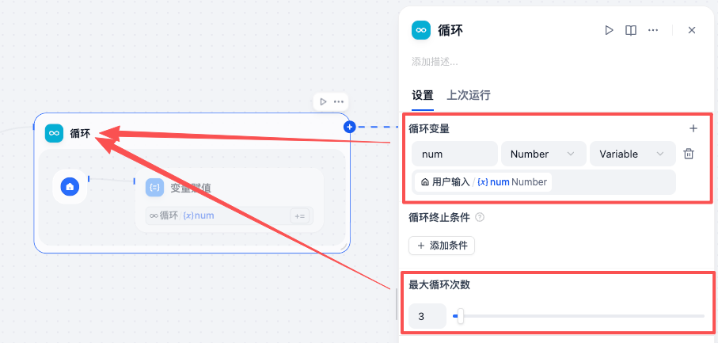

