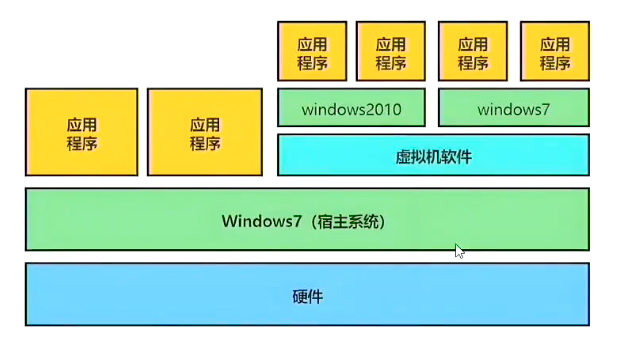

上一篇我们已经在本机上安装了 Docker

## 一、环境配置的难题

在软件开发领域，环境配置的一致性一直是一个挑战。因为目标计算机和开发计算机的运行环境存在差异，所以开发者无法确保软件能在各种目标机器上正常运行。

目标机器成功运行软件需要满足两个关键条件：第一是正确的操作系统设置，第二是正确的依赖安装。以 Python 应用为例，目标机器不仅需要安装指定版本的 Python 引擎，还必须安装指定版本的所有依赖，并且还可能需要给电脑进行特定的环境变量配置。

环境配置过程繁琐复杂，每次更换机器都需要重复进行，耗时费力。于是很多人就想能不能从根本上解决问题：软件可以带环境安装吗？也就是说，安装软件的时候，能不能把原始环境也一模一样地复制过来？

## 二、虚拟机

**解决思路就是把软件运行所需的操作系统片段、依赖库、配置文件全部打包成一个“独立盒子”（容器/镜像），这个独立盒子能在任何支持该技术的机器上“开箱即用”，彻底避免“软件在我的机器上能跑，在你的机器上不能跑”的问题。**最早的解决方案，就是虚拟机。

####  1、什么是虚拟机

虚拟机（Virtual Machine）就是带环境安装的一种解决方案，它可以在一种操作系统里面运行另一种操作系统，比如在同一个宿主 Windows 系统里面运行多个 Linux 系统，这多个 Linux 系统之间相互隔绝、独享资源。所以我们可以把操作系统、依赖、配置和我们的软件打包成一个**虚拟机镜像文件**交付出去，用户就可以用他们目标机器上的**虚拟机软件**打开这个虚拟机镜像文件并运行我们的软件了。对于目标机器来说，虚拟机镜像文件就是一个普通文件，不需要了就删掉，对其他部分毫无影响。

#### 2、虚拟机的缺点

虽然用户可以通过虚拟机还原软件的原始运行环境，但是这个方案有几个缺点：

* 资源占用多：虚拟机会独占一部分宿主设备的内存和硬盘空间。它运行的时候，其它程序就不能使用这些资源了，哪怕虚拟机里面的应用程序真正使用的内存只有 1MB，虚拟机依然需要几百 MB 的内存才能运行
* 冗余步骤多：虚拟机是完整的操作系统，一些系统级别的操作步骤，往往无法跳过，比如用户登录
* 启动慢：启动操作系统需要多久，启动虚拟机就需要多久，可能要等几分钟，应用程序才能真正运行

