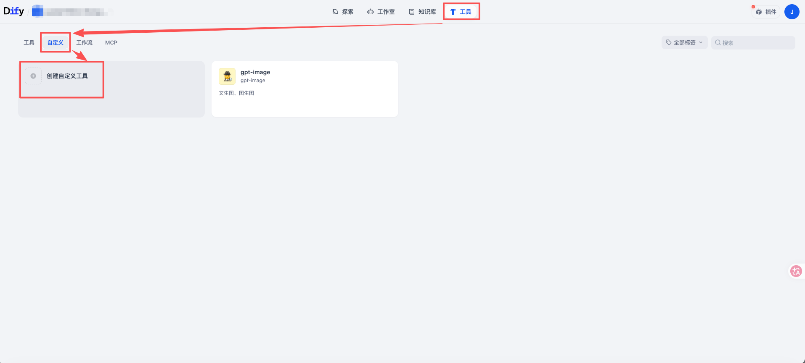
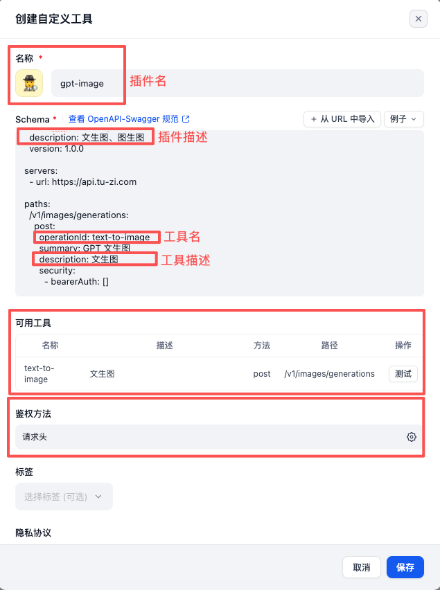
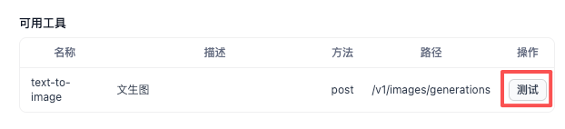
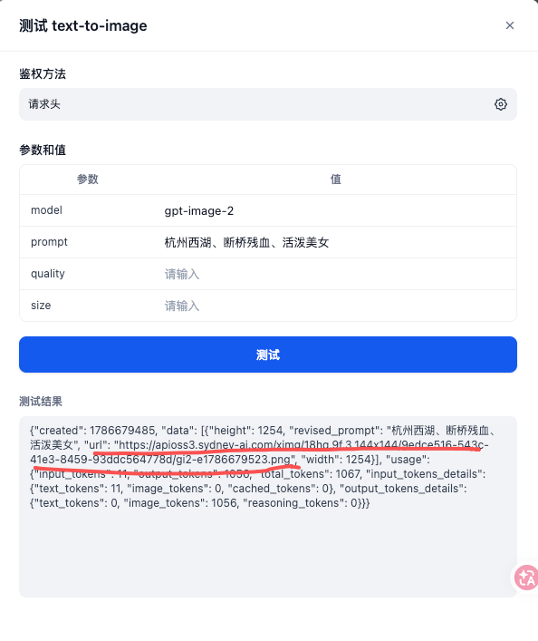
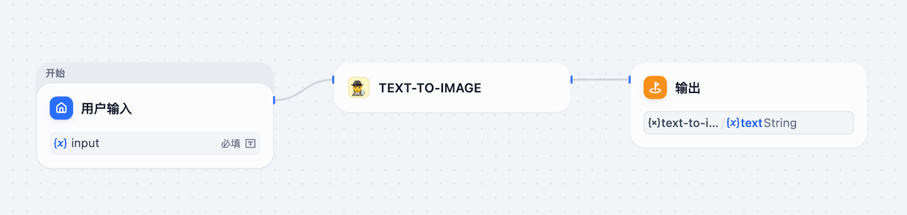
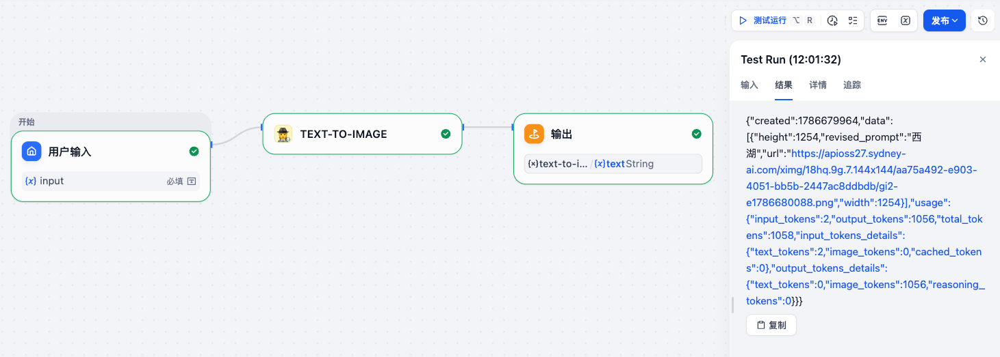

**插件**：插件是对工具的打包，换句话说一个插件里可以创建多个工具，而**一个工具则是对一个可复用能力的封装，它非常像代码世界里的工具函数、只写能力不写业务**。比方说我们创建了一个插件 gpt-image，它里面打包了一个工具 text-to-image，text-to-image 工具封装的是生成图片（文生图）的能力

## 一、创建插件和工具（基于已有 API）

***

Dify 里是通过 API 的 Schema 创建插件和工具的，我们可以把接口文档扔给 AI，让 AI 生成相应的 Schema，然后我们调整调整，复制进来就创建好插件和工具了 

## 二、试运行插件

* 插件编写完毕后，我们可以试运行插件来看看插件是否满足我们的输入和输出期望，不满足的话就修复

| 文生图                                                      |
| ----------------------------------------------------------- |
|  |
|  |
|                  |

## 三、在工作流中使用插件（智能体里也能使用）

