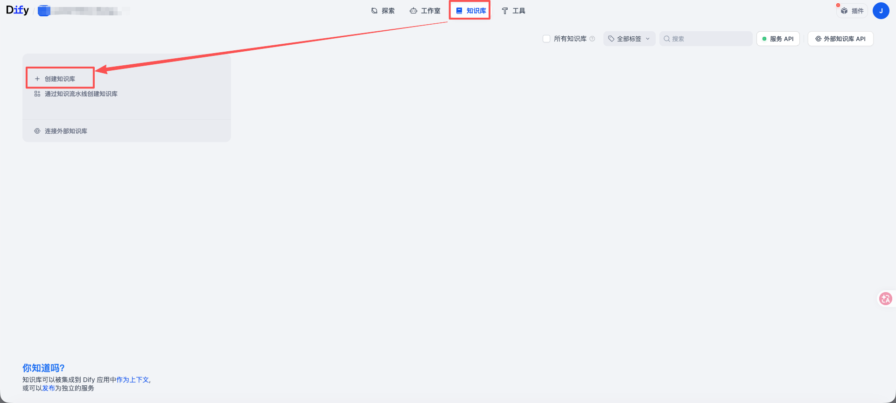
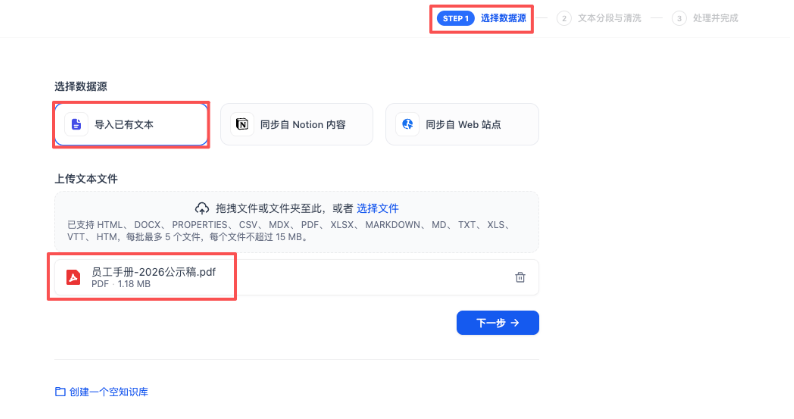
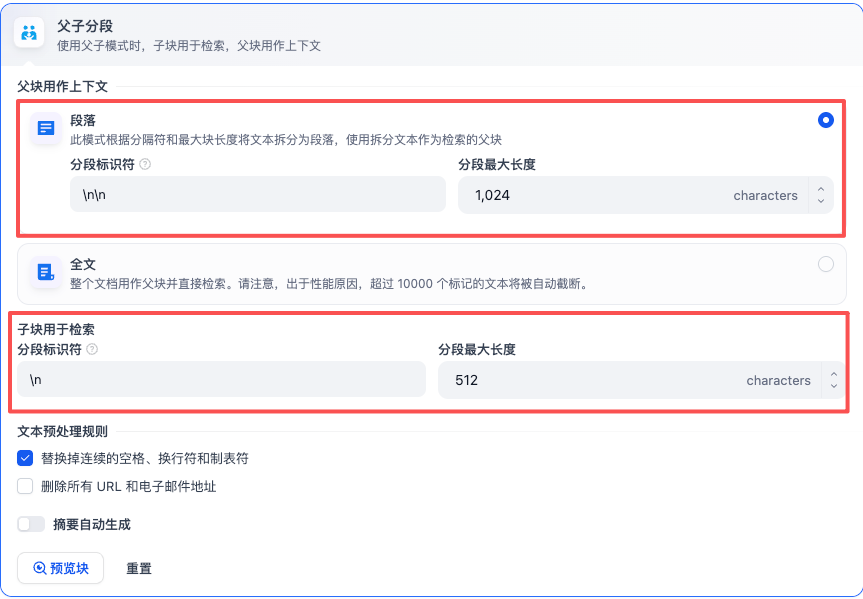
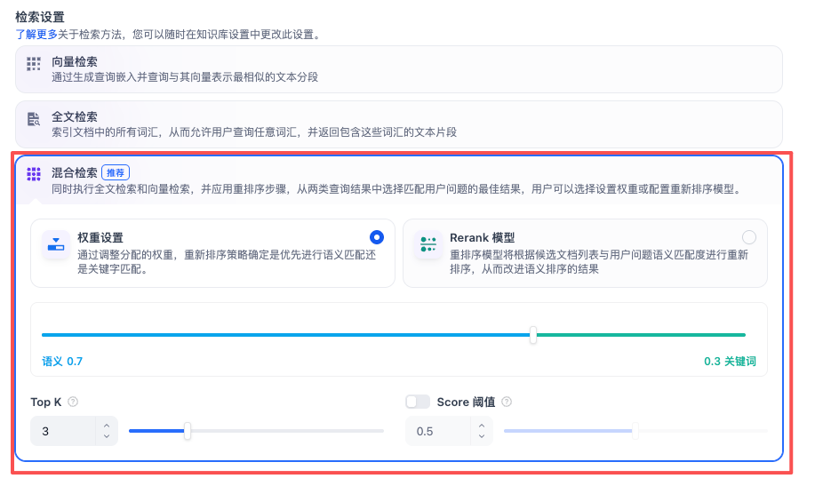
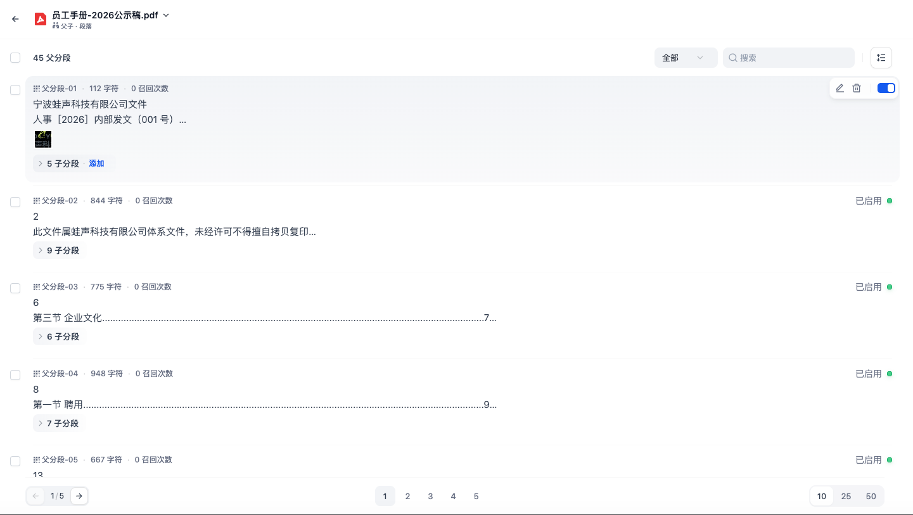
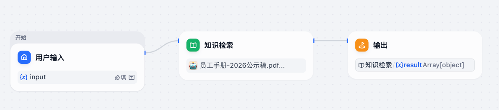
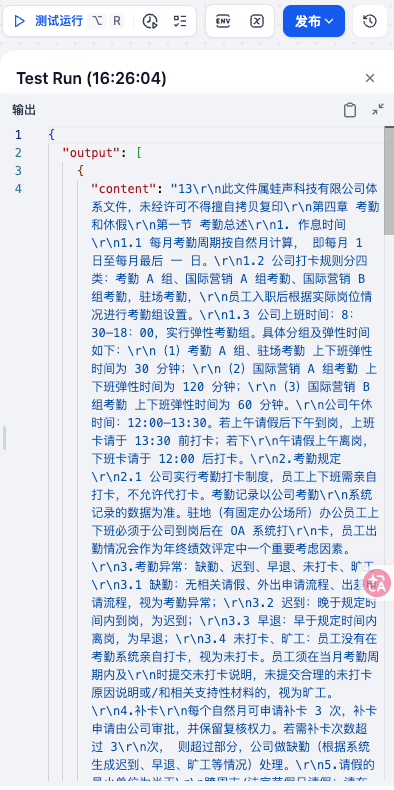
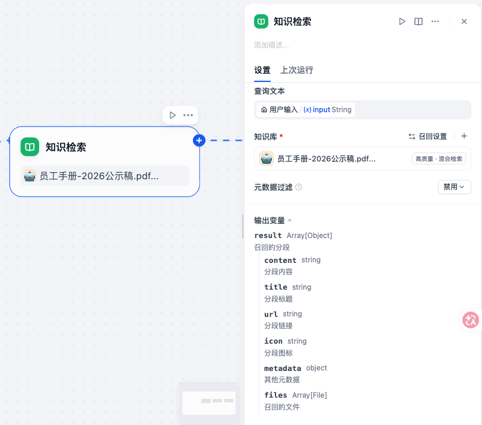

**知识库：简单来说知识库通常用来存放企业或个人的私有资料文档。严格来说知识库 = 存储一堆私有资料文档 + 对这些文档的切片、索引、检索配置。**大模型虽然懂很多通用知识，但它通常不知道你们公司的产品说明、你们公司的员工手册、你们公司的客服话术等，于是你可以把这些资料上传到公司知识库，这样一来用户提问关于你们公司的问题后，智能体就会访问知识库里的私有资料，回答会更准确，减少幻觉

**知识库包含两个能力，一是上传、存储和管理外部知识数据的能力，二是增强检索的能力**

* 上传、存储和管理外部知识数据

  Coze 支持从多种数据源渠道上传文本数据和表格数据，例如本地文档、在线数据、Notion、飞书文档等；上传后 Coze 可将知识数据自动切分为一个个**内容片段**进行存储（默认通过句号、分号、问号、感叹号等标点符号作为分段依据，将文档分割成一个个独立的句子或段落，无其他配置项来分割）；同时支持用户自定义分片规则，例如通过分段标识符（如 `\n` 换行符）、每段最大字符长度（如 800 个字符）方式进行内容分割；还支持按层级分段，例如大标题、二级标题、三级标题这种方式进行内容分割

- 增强检索

  Coze 的知识库还提供了多种检索方式来对存储的内容片段进行检索，例如使用关键词在全文里检索，然后召回关键词匹配到的所有内容片段，大模型就会把召回的**内容片段**加入本轮对话上下文来生成最终的回复内容

**RAG 知识库的概念：**RAG 的英文全称是 Retrieval-Augmented Generation，翻译过来是检索增强生成，**说白了就是用检索来增强生成效果**。检索增强生成知识库、即 RAG 知识库是一种结合信息检索与生成式人工智能的技术框架，旨在通过动态调用外部知识库提升大语言模型（LLM）回答的准确性、相关性和时效性。其核心在于将传统检索系统与生成模型结合，解决大模型自身训练数据局限性、知识过时及“幻觉”（虚构信息）等问题。

* 检索（Retrieval）：根据用户问题，**首先从预构建的知识库（如向量数据库）中检索相关文档或信息片段**。知识库通常通过离线处理将文本转换为向量表示并建立索引，支持快速相似度匹配。例如，汽车客服系统可能存储车型参数手册作为知识库，检索时匹配用户问题中的关键词或语义
* 增强（Augmentation）：**然后将检索到的信息整合为上下文，与原始问题一同输入生成模型。**这一步骤通过补充外部知识，扩展模型的“记忆”范围，使其能基于最新或专有数据生成回答。例如，医疗诊断场景中，RAG 可调用最新医学论文数据辅助生成诊断建议
* 生成（Generation）：**最后大语言模型结合上下文与问题生成回答。**通过引入检索到的信息，模型输出的准确性显著提升，同时减少虚构内容。例如，企业客服系统利用内部文档生成合规性解答，避免泄露敏感数据

## 一、创建知识库



## 二、编辑知识库

#### 1、数据源

> 数据源就是完整的源文档，就是完整的原始知识

知识库的数据源可以来自本地文档、Notion 文档或指定网页，这里我们选择本地文档



***

#### 2、分段

> 但是我们问大模型问题时，总没必要每次都把完整的原始知识都发给大模型吧！一来这有可能超出对话上下文长度，二来我们提问的问题很可能只跟原始知识里的某一部分知识相关、把完整知识发给大模型反倒干扰会多很多噪音上下文
>
> 所以我们需要把源文档给分段，到时候我们问大模型问题，就只会命中若干段高关联度的分段知识发给大模型了，而非完整的原始知识，大模型的回答会更准确

知识库支持两种分段模式：通用分段和父子分段。简单地说，通用分段是检索到哪个分段就把哪个分段发给大模型，而父子分段是检索到哪个分段就把该分段的父分段发给大模型，推荐使用父子分段。

举个例子，假设有一份产品说明书：

```
VM46 使用说明

1. 产品简介
VM46 是一款……

2. 网络设置
连接设备后进入设置页面……
DHCP 默认开启……
如果需要固定 IP……

3. 固件升级
进入系统设置……
上传固件……
升级过程中不要断电……
```

如果使用通用分段，可能会切割成：

```
Chunk 1：产品简介……
Chunk 2：网络设置……
Chunk 3：固件升级……
```

用户问：

```
VM46 怎么设置固定 IP？
```

检索命中：

```
Chunk 2
```

然后 Chunk 2 就会被发给大模型了

通用分段这种单层分段模式的优点是：简单、成本低、配置直观；缺点是如果 Chunk 切得太小，虽然检索准，却可能缺上下文，如果 Chunk 切得太大，又容易降低检索精度。父子分段就是用来解决这个问题的，它的核心就是“小段容易搜准，大块才有完整上下文”。

如果使用父子分段，可能会切割成：

```
父 Chunk 1：产品简介……
	子 Chunk 1：……
	子 Chunk 2：……
父 Chunk 2：网络设置……
	子 Chunk 1：VM46 默认使用 DHCP……
	子 Chunk 2：固定 IP 的设置步骤是……
	子 Chunk 3：DNS 可以在……
	子 Chunk 4：无法联网时检查……
父 Chunk 3：固件升级……
	子 Chunk 1：……
	子 Chunk 2：……
```

用户问：

```
VM46 怎么设置固定 IP？
```

检索命中：

```
子 Chunk 2
```

因为子 Chunk 很小，所以跟用户问题的语义更容易精准匹配，避免 chunk 太大搜索不准。但是 子 Chunk 2 并不会被发给大模型，而是会把它所在的父 Chunk 2 发给大模型，避免 chunk 太小缺失上下文。

| 配置项                           | 说明                                                         |
| -------------------------------- | ------------------------------------------------------------ |
| 分段标识符                       | 用来指定按什么标识符来切割分段<br />* \n\n 代表按段落切割分段<br />* \n 代表按行切割分段<br />* 如果要指定多个标识符，用英文逗号隔开（如 \n\n,\n）<br />* 也可以使用自定义的特殊分割符（如 \*\*\*） |
| 分段最大长度                     | 用来指定每个分段最长多少个字符<br />* 优先按分段标识符分段<br />* 但是当分段超过最大长度时，会强制分段 |
| 分段重叠长度                     | 用来指定分段之间的重叠长度，可以保留分段之间的语义关系，提升召回效果<br />* 建议设置为最大分段长度的 10%-25% |
| 替换掉连续的空格、换行符和制表符 | 按需勾选                                                     |
| 删除所有 URL 和电子邮件地址      | 按需勾选                                                     |
| 使用 Q&A 分段                    | 如果文档是一问一答的形式，那勾选这个效果可能会很好           |



#### 3、索引

> 分段倒是分好了，但是怎么判定用户问的问题和某些片段知识的关联度较高呢？毕竟用户问的问题是语义，而不是片段知识的原文。
>
> 这就要建立索引了，所谓建立索引就是指把分段内容用 Embedding 模型给搞成向量——成百上千维度的一大串数字，建立起向量跟分段内容的映射关系。到时候我们问大模型问题，系统会把我们的问题也向量化，然后拿着向量化后的问题跟向量索引去对比，两个向量间的距离越接近就代表语义越相似，于是命中某个向量，就可以拿到该向量对应的原始分段内容了


#### 4、检索

> 不同的检索方式都是在解决同一个问题：用户提问以后，Dify 用什么方法从知识库里找到最相关的 Chunk

* 向量检索：我们问大模型问题，系统会把我们的问题也向量化，然后拿着向量化后的问题跟向量索引去对比，两个向量间的距离越接近就代表语义越相似，于是命中某个向量，就可以拿到该向量对应的原始分段内容了

  * Rerank 重排

    * 假设第一次检索找出了如下片段，这只是第一次召回

      ```
      Chunk A  0.88
      Chunk B  0.86
      Chunk C  0.82
      Chunk D  0.80
      Chunk E  0.78
      ```

    * 可以再用一个 Rerank Model 重新判断对于用户这个具体问题，这几个 Chunk 到底谁最有用？做个关联度最强排序

      ```
      第一次召回：
      A
      B
      C
      D
      E
      
            ↓ Rerank
      
      真正相关度：
      
      C   ← 最相关
      A
      E
      B
      D
      ```

  * Top K：检索到的片段可能有多个，这里用于设置只保留前几个

  * Score 阈值：用来设置文本片段筛选的相似度阈值，大于等于阈值的片段才会召回

* 全文检索：类似于关键词匹配

* 混合检索：两个都跑，但有权重



#### 5、数据处理

这一步代表采纳了上一步的分段策略等，正式处理数据并存储知识库


#### 6、知识库搞定

现在我们的【公司人事部门知识库】就创建完成了，里面目前只有一份文档，后续我们可以继续往里面追加人事部门相关文档



## 三、在工作流中使用知识库（智能体里也能使用）





***



| 配置项   | 说明                                       |
| -------- | ------------------------------------------ |
| 查询文本 | 固定一个变量，只能引用上游节点输入的关键词 |
| 输出     | 固定一个 result 变量                       |
| 知识库   | 要关联的知识库，可以关联多个               |


