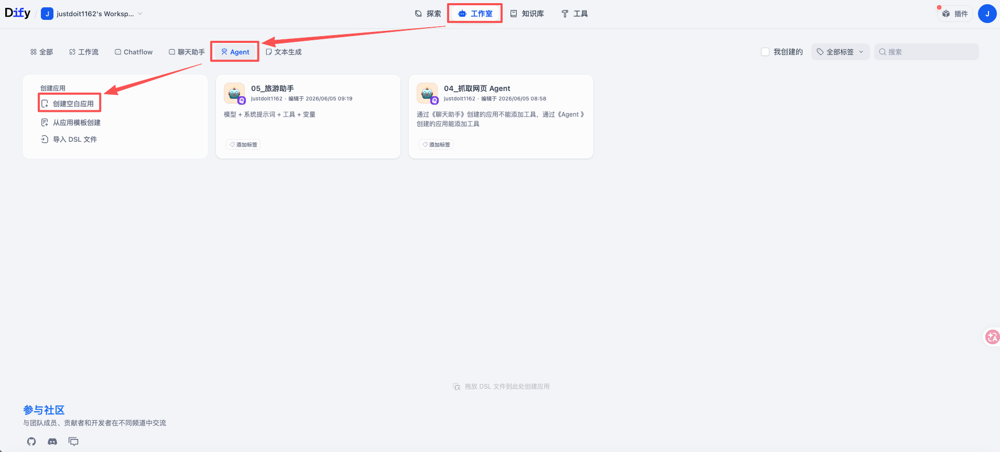
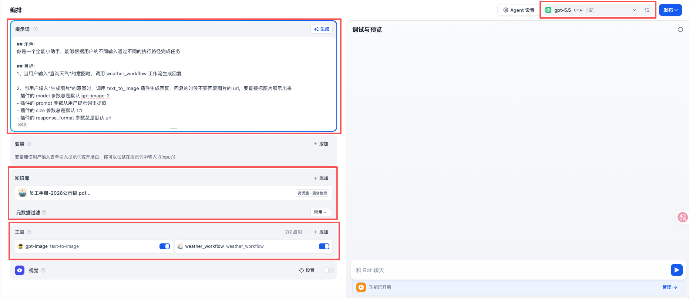
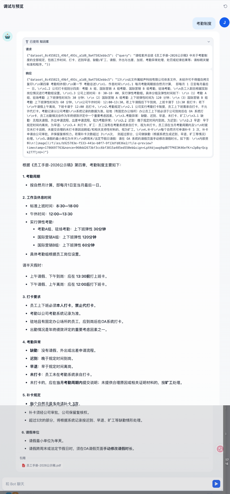
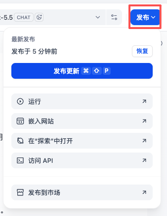
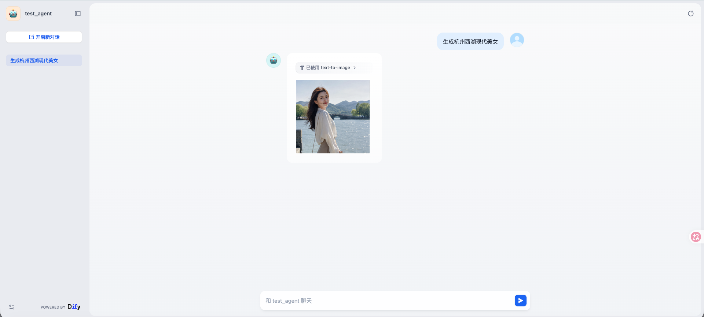
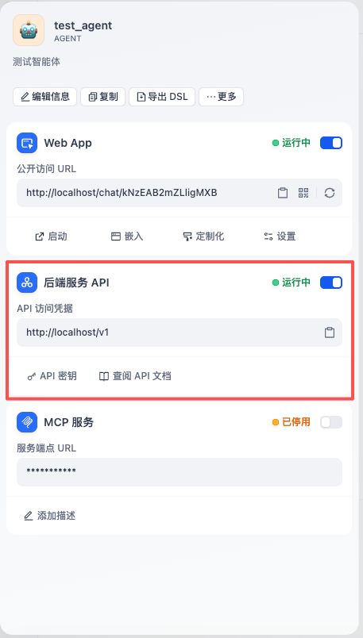
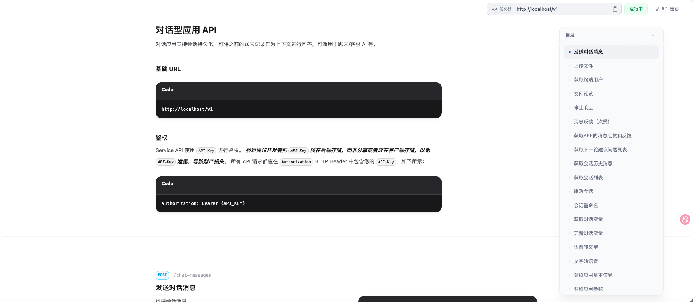

**智能体：通常以对话框的形式存在，自主完成某项任务**

## 一、创建智能体



***


## 二、编排智能体

#### 1、系统提示词

按照提示词工程里的要求填写系统提示词即可

```markdown
## 角色：
你是一个全能小助手，能够根据用户的不同输入通过不同的执行路径完成任务

## 目标：
1、当用户输入“查询天气”的意图时，调用 weather_workflow 工作流生成回复

2、当用户输入“生成图片”的意图时，调用 text_to_image 插件生成回复，回复的时候不要回复图片的 url，要直接把图片展示出来
- 插件的 model 参数总是默认 gpt-image-2
- 插件的 prompt 参数从用户提示词里提取
- 插件的 size 参数总是默认 1:1
- 插件的 response_format 参数总是默认 url

3、当用户输入“查询公司员工手册”的意图时，调用《员工手册-2026公示稿》知识库生成回复

4、其余意图，直接调用大模型即可
```

#### 2、模型

选择需要的模型并做好模型设置即可

#### 3、插件

这里以添加 gpt-image 插件里的 text_to_image 工具为例

我们知道工具是需要输入参数的，默认情况下 ①大模型会从用户提示词或者参数默认值里自动提取内容填充给相应的参数，如果实在提取不到大模型就会用自然语言提示用户输入，但这在某些场景下可能不是特别可靠；②所以我们也可以在系统提示词里明确告诉大模型该如何搜集参数、又该如何把参数传递给工具

这里以方案 2 为例

#### 4、工作流

这里以添加 test_weather_workflow 工作流为例

我们知道工作流是需要输入参数的，默认情况下 ①大模型会从用户提示词或者参数默认值里自动提取内容填充给相应的参数，如果实在提取不到大模型就会用自然语言提示用户输入，但这在某些场景下可能不是特别可靠；②所以我们也可以在系统提示词里明确告诉大模型该如何搜集参数、又该如何把参数传递给工作流

这里以方案 1 为例

#### 5、知识库

这里以添加 公司人事部门知识库 为例

按需调用



## 三、预览与调试智能体



## 四、发布智能体



## 五、使用智能体

#### 1、对话形式使用




#### 2、API 形式使用




